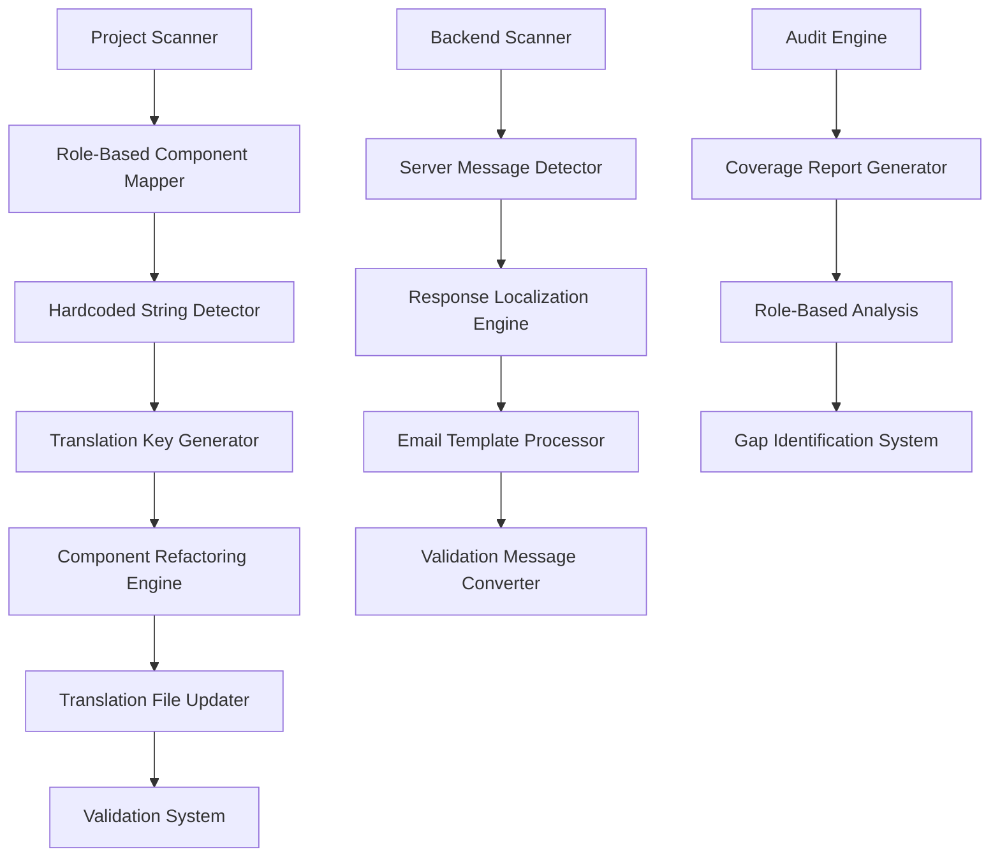
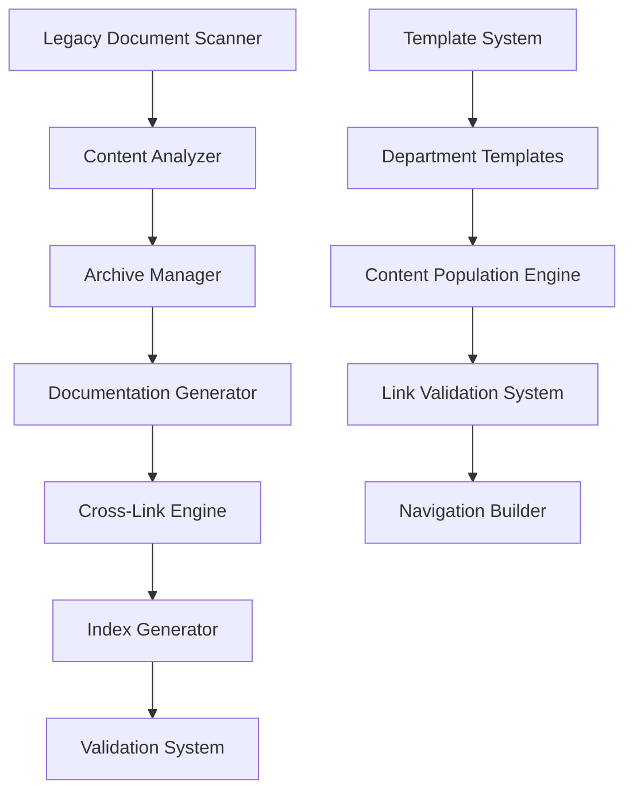
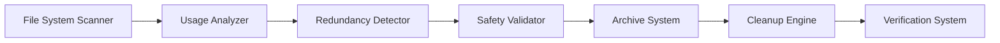

# Design Document

## Overview

This design outlines a comprehensive solution for achieving complete project-wide internationalization (i18n) coverage, redundant file cleanup, and structured documentation reorganization. The solution implements automated auditing systems, systematic refactoring processes, and a hierarchical documentation structure with cross-linking navigation to create a maintainable, multilingual, and well-documented codebase.

The design leverages the existing React i18n framework, builds upon current translation infrastructure, and establishes new documentation standards while ensuring zero functionality regression during the transformation process.

## Architecture

### I18n Conversion Architecture



### Documentation Restructuring Architecture



### Project Cleanup Architecture



## Components and Interfaces

### I18n Conversion System

#### Hardcoded String Detector

**Location**: `scripts/i18n/HardcodedStringDetector.js`

```javascript
interface HardcodedStringDetector {
  scanComponents(directory: string): ComponentScanResult[]
  identifyUserFacingStrings(content: string): HardcodedString[]
  categorizeByRole(strings: HardcodedString[]): RoleCategorizedStrings
  generateTranslationKeys(strings: HardcodedString[]): TranslationKeyMapping[]
}

interface HardcodedString {
  content: string
  location: FileLocation
  context: StringContext
  userRoles: UserRole[]
  type: 'label' | 'button' | 'message' | 'tooltip' | 'placeholder' | 'notification'
}

interface TranslationKeyMapping {
  originalString: string
  translationKey: string
  namespace: string
  defaultValue: string
  context: string
}
```

#### Component Refactoring Engine

**Location**: `scripts/i18n/ComponentRefactoring.js`

```javascript
interface ComponentRefactoringEngine {
  refactorComponent(filePath: string, mappings: TranslationKeyMapping[]): RefactoringResult
  addTranslationImports(content: string): string
  replaceHardcodedStrings(content: string, mappings: TranslationKeyMapping[]): string
  validateRefactoredComponent(content: string): ValidationResult
}

interface RefactoringResult {
  success: boolean
  modifiedContent: string
  addedKeys: string[]
  errors: RefactoringError[]
  warnings: string[]
}
```

#### Backend Localization Engine

**Location**: `scripts/i18n/BackendLocalization.js`

```javascript
interface BackendLocalizationEngine {
  scanServerResponses(directory: string): ServerMessageScanResult[]
  localizeResponseMessages(messages: ServerMessage[]): LocalizationResult
  updateEmailTemplates(templates: EmailTemplate[]): TemplateUpdateResult
  refactorValidationMessages(validators: ValidationRule[]): ValidationUpdateResult
}

interface ServerMessage {
  message: string
  location: FileLocation
  type: 'success' | 'error' | 'warning' | 'info'
  context: string
  userRoles: UserRole[]
}
```

### Documentation System

#### Documentation Structure Generator

**Location**: `scripts/docs/DocumentationGenerator.js`

```javascript
interface DocumentationGenerator {
  createDocumentationStructure(): StructureCreationResult
  generateDepartmentContent(department: Department): ContentGenerationResult
  createIndexFiles(structure: DocumentationStructure): IndexCreationResult
  implementCrossLinking(documents: Document[]): CrossLinkingResult
}

interface DocumentationStructure {
  departments: Department[]
  crossReferences: CrossReference[]
  navigationMap: NavigationMap
}

interface Department {
  name: string
  path: string
  documents: DocumentTemplate[]
  indexTemplate: IndexTemplate
  crossLinks: CrossLink[]
}
```

#### Cross-Linking Engine

**Location**: `scripts/docs/CrossLinkingEngine.js`

```javascript
interface CrossLinkingEngine {
  analyzeDependencies(documents: Document[]): DependencyMap
  generateCrossReferences(dependencies: DependencyMap): CrossReference[]
  validateLinks(documents: Document[]): LinkValidationResult[]
  updateNavigationIndexes(structure: DocumentationStructure): NavigationUpdateResult
}

interface CrossReference {
  sourceDocument: string
  targetDocument: string
  relationship: 'related' | 'prerequisite' | 'continuation' | 'reference'
  description: string
}
```

### Project Cleanup System

#### Redundancy Analyzer

**Location**: `scripts/cleanup/RedundancyAnalyzer.js`

```javascript
interface RedundancyAnalyzer {
  scanProjectFiles(rootPath: string): FileScanResult
  identifyRedundantFiles(files: ProjectFile[]): RedundantFile[]
  analyzeScriptUsage(scriptPath: string): ScriptUsageAnalysis
  validateSafetyForRemoval(files: RedundantFile[]): SafetyValidationResult
}

interface RedundantFile {
  path: string
  type: 'markdown' | 'script' | 'config' | 'other'
  reason: 'duplicate' | 'outdated' | 'unused' | 'superseded'
  safeToRemove: boolean
  archiveLocation: string
}
```

#### Archive Manager

**Location**: `scripts/cleanup/ArchiveManager.js`

```javascript
interface ArchiveManager {
  createArchiveStructure(targetPath: string): ArchiveStructureResult
  moveFilesToArchive(files: RedundantFile[]): ArchiveMoveResult
  generateArchiveIndex(archivedFiles: ArchivedFile[]): IndexGenerationResult
  validateArchiveIntegrity(archivePath: string): IntegrityValidationResult
}

interface ArchivedFile {
  originalPath: string
  archivePath: string
  archiveReason: string
  archiveDate: string
  originalSize: number
}
```

## Data Models

### I18n Audit Data Model

```typescript
interface I18nAuditReport {
  timestamp: string
  projectSummary: ProjectSummary
  roleBasedAnalysis: RoleAnalysis[]
  translationCoverage: TranslationCoverage
  conversionResults: ConversionResult[]
  validationResults: ValidationResult[]
}

interface RoleAnalysis {
  role: UserRole
  accessibleComponents: ComponentAnalysis[]
  translationStatus: TranslationStatus
  conversionSummary: ConversionSummary
}

interface ComponentAnalysis {
  filePath: string
  componentName: string
  hardcodedStrings: HardcodedString[]
  existingTranslationKeys: string[]
  newTranslationKeys: TranslationKeyMapping[]
  conversionStatus: 'pending' | 'completed' | 'failed'
}

interface TranslationCoverage {
  totalStrings: number
  convertedStrings: number
  coveragePercentage: number
  languageFiles: LanguageFileCoverage[]
  missingTranslations: MissingTranslation[]
}
```

### Documentation Structure Model

```typescript
interface DocumentationProject {
  structure: DocumentationStructure
  departments: DepartmentConfiguration[]
  crossReferences: CrossReferenceMap
  navigationHierarchy: NavigationHierarchy
}

interface DepartmentConfiguration {
  name: string
  path: string
  description: string
  documents: DocumentConfiguration[]
  indexConfiguration: IndexConfiguration
  crossLinkTargets: string[]
}

interface DocumentConfiguration {
  filename: string
  title: string
  description: string
  template: string
  requiredSections: string[]
  crossLinks: CrossLinkConfiguration[]
}

interface CrossLinkConfiguration {
  targetDepartment: string
  targetDocument: string
  linkText: string
  relationship: CrossLinkRelationship
}
```

### Cleanup Project Model

```typescript
interface CleanupProject {
  scanResults: FileScanResults
  redundantFiles: RedundantFileAnalysis[]
  archiveStructure: ArchiveStructure
  cleanupPlan: CleanupPlan
  validationResults: CleanupValidationResults
}

interface RedundantFileAnalysis {
  file: ProjectFile
  redundancyReason: RedundancyReason
  usageAnalysis: UsageAnalysis
  safetyAssessment: SafetyAssessment
  archiveDestination: string
}

interface CleanupPlan {
  filesToRemove: string[]
  filesToArchive: ArchiveOperation[]
  scriptsToConsolidate: ScriptConsolidation[]
  validationSteps: ValidationStep[]
}
```

## Error Handling

### I18n Conversion Error Management

1. **Component Parsing Errors**:
   - Graceful handling of syntax errors in React components
   - Partial conversion with error reporting
   - Backup creation before modification
   - Rollback capability for failed conversions

2. **Translation Key Conflicts**:
   - Duplicate key detection and resolution
   - Namespace collision handling
   - Automatic key generation with conflict avoidance
   - Manual resolution prompts for complex conflicts

3. **Backend Localization Errors**:
   - Server response format validation
   - Email template syntax checking
   - Validation rule compatibility verification
   - Fallback message preservation

### Documentation Generation Error Handling

1. **Content Generation Failures**:
   - Template processing error recovery
   - Partial content generation with warnings
   - Missing content placeholder insertion
   - Manual intervention prompts

2. **Cross-Linking Errors**:
   - Broken link detection and reporting
   - Circular reference prevention
   - Missing target document handling
   - Link validation and correction

### Cleanup Process Error Handling

1. **File Safety Validation**:
   - Dependency analysis before removal
   - Active usage detection
   - Backup creation for all operations
   - Rollback procedures for accidental deletions

2. **Archive Operation Errors**:
   - File permission handling
   - Disk space validation
   - Archive integrity verification
   - Recovery procedures for failed operations

## Testing Strategy

### I18n Conversion Testing

1. **Unit Testing**:
   - Hardcoded string detection accuracy
   - Translation key generation logic
   - Component refactoring algorithms
   - Backend message localization

2. **Integration Testing**:
   - End-to-end conversion workflows
   - Multi-language file consistency
   - Role-based UI rendering validation
   - Server response localization verification

3. **Validation Testing**:
   - Translation coverage completeness
   - UI functionality preservation
   - Language switching behavior
   - Fallback mechanism testing

### Documentation System Testing

1. **Structure Testing**:
   - Documentation hierarchy creation
   - Index file generation accuracy
   - Cross-link validation
   - Navigation functionality

2. **Content Testing**:
   - Template processing accuracy
   - Content population completeness
   - Link integrity verification
   - Rendering compatibility testing

### Cleanup Process Testing

1. **Safety Testing**:
   - Redundancy detection accuracy
   - Usage analysis validation
   - Safety assessment verification
   - Archive operation integrity

2. **Recovery Testing**:
   - Rollback procedure validation
   - Archive restoration testing
   - Backup integrity verification
   - Error recovery scenarios

## Implementation Phases

### Phase 1: I18n Audit and Analysis
- Implement role-based component mapping
- Scan all frontend and backend components for hardcoded strings
- Analyze current translation coverage and identify gaps
- Generate comprehensive audit reports

### Phase 2: Translation Key Conversion
- Replace hardcoded strings with translation keys in React components
- Localize server responses, email templates, and validation messages
- Update translation files for all supported languages
- Validate conversion accuracy and functionality

### Phase 3: Project Cleanup
- Identify and analyze redundant files and scripts
- Create archive structure for legacy documentation
- Safely remove or archive outdated files
- Validate cleanup operations and system integrity

### Phase 4: Documentation Restructuring
- Create new documentation hierarchy under /docs
- Generate comprehensive content for all departments
- Implement cross-linking system between related documents
- Create navigation indexes and validation systems

### Phase 5: Integration and Validation
- Perform comprehensive system testing
- Validate all conversions and documentation
- Create maintenance procedures and guidelines
- Generate final project reports and documentation

## Performance Considerations

### I18n Conversion Performance
- Batch processing for large component sets
- Incremental conversion with progress tracking
- Memory-efficient file processing
- Parallel processing for independent operations

### Documentation Generation Performance
- Template caching for repeated operations
- Lazy loading for large documentation sets
- Efficient cross-reference indexing
- Optimized link validation algorithms

### Cleanup Process Performance
- Efficient file system scanning
- Parallel analysis for independent files
- Optimized redundancy detection algorithms
- Batch archive operations

## Security Considerations

### I18n Security
- Secure handling of sensitive strings during conversion
- Validation of translation key injection safety
- Protection against XSS in localized content
- Secure backup and rollback procedures

### Documentation Security
- Access control for sensitive documentation
- Secure handling of configuration examples
- Protection of internal system information
- Version control security for documentation changes

### Cleanup Security
- Safe file deletion with proper validation
- Secure archive creation and access
- Protection against accidental system file removal
- Audit trail for all cleanup operations

## Monitoring and Observability

### Conversion Monitoring
- Progress tracking for all conversion operations
- Error rate monitoring and alerting
- Performance metrics for conversion processes
- Quality metrics for translation coverage

### Documentation Monitoring
- Link health monitoring and validation
- Content freshness tracking
- Usage analytics for documentation sections
- Update notification systems

### Cleanup Monitoring
- File system change tracking
- Archive integrity monitoring
- Cleanup operation audit trails
- Recovery operation tracking