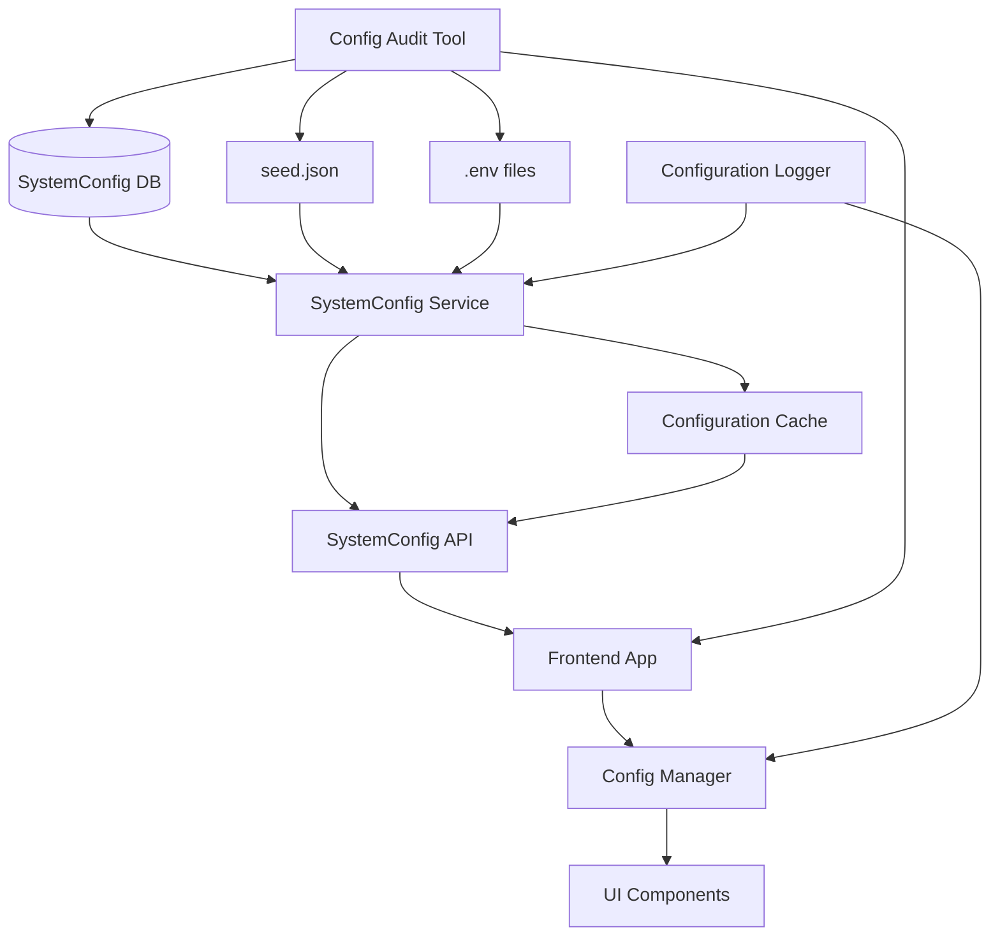

# Design Document

## Overview

The SystemConfig Integrity Audit system will implement a comprehensive solution to ensure database-driven configuration values are properly propagated to the frontend without silent fallbacks to defaults. The design focuses on creating a robust configuration pipeline with proper error handling, logging, and centralized management across the React frontend and Node.js backend.

## Architecture

### High-Level Architecture



### Configuration Flow Priority

1. **Primary Source**: Database SystemConfig table (isActive = true)
2. **Secondary Source**: seed.json (with logging)
3. **Tertiary Source**: Environment variables (emergency fallback with warnings)

### Key Components

- **SystemConfig Service**: Backend service managing configuration retrieval and caching
- **Configuration API**: RESTful endpoint delivering config to frontend
- **Frontend Config Manager**: Centralized configuration utility for React components
- **Configuration Logger**: Structured logging for all config operations
- **Config Audit Tool**: Analysis tool for identifying configuration inconsistencies

## Components and Interfaces

### Backend Components

#### SystemConfig Service Enhanced

```typescript
interface SystemConfigService {
  // Core configuration retrieval
  getConfig(key?: string): Promise<ConfigValue | ConfigObject>
  getAllConfig(): Promise<ConfigObject>
  refreshCache(): Promise<void>
  
  // Audit and validation
  validateConfigIntegrity(): Promise<ConfigAuditResult>
  getConfigSource(key: string): ConfigSource
  
  // Fallback management
  getFallbackChain(): ConfigSource[]
  logFallbackUsage(key: string, source: ConfigSource): void
}

interface ConfigValue {
  key: string
  value: any
  source: 'database' | 'seed' | 'environment'
  isActive: boolean
  lastUpdated: Date
}

interface ConfigAuditResult {
  duplicateKeys: string[]
  missingKeys: string[]
  unusedEnvVars: string[]
  silentFallbacks: FallbackEvent[]
  canonicalKeyMapping: Record<string, string>
}
```

#### Configuration API Controller

```typescript
interface SystemConfigController {
  // Public endpoints
  getPublicConfig(req: Request, res: Response): Promise<void>
  getAdminConfig(req: Request, res: Response): Promise<void>
  
  // Admin endpoints
  updateConfig(req: Request, res: Response): Promise<void>
  auditConfig(req: Request, res: Response): Promise<void>
  validateConfig(req: Request, res: Response): Promise<void>
}

interface ConfigResponse {
  config: ConfigObject
  metadata: {
    source: ConfigSource
    lastUpdated: Date
    fallbacksUsed: string[]
  }
}
```

#### Configuration Logger

```typescript
interface ConfigurationLogger {
  logFallback(key: string, source: ConfigSource, reason: string): void
  logConfigLoad(keys: string[], source: ConfigSource): void
  logSilentFallback(key: string, component: string): void
  logConfigMismatch(key: string, expected: any, actual: any): void
  
  // Audit logging
  logDuplicateKey(key: string, locations: string[]): void
  logUnusedEnvVar(key: string): void
  logCanonicalMapping(oldKey: string, newKey: string): void
}
```

### Frontend Components

#### Configuration Manager

```typescript
interface ConfigManager {
  // Configuration access
  getConfig(key: string): any
  getAppName(): string
  getApiBaseUrl(): string
  getBrandingConfig(): BrandingConfig
  
  // Initialization and updates
  initialize(): Promise<void>
  refreshConfig(): Promise<void>
  
  // Validation and debugging
  validateConfigIntegrity(): ConfigValidationResult
  getConfigSource(key: string): ConfigSource
  logMissingConfig(key: string, component: string): void
}

interface BrandingConfig {
  appName: string
  logoUrl: string
  primaryColor: string
  complaintPrefix: string
}

interface ConfigValidationResult {
  isValid: boolean
  missingKeys: string[]
  fallbacksUsed: string[]
  hardcodedValues: HardcodedValue[]
}
```

#### Configuration Context Provider

```typescript
interface ConfigContextValue {
  config: ConfigObject
  isLoading: boolean
  error: Error | null
  
  // Actions
  refreshConfig: () => Promise<void>
  getConfig: (key: string) => any
  
  // Debugging
  debugInfo: ConfigDebugInfo
}

interface ConfigDebugInfo {
  loadTime: Date
  source: ConfigSource
  fallbacksUsed: string[]
  apiResponseTime: number
}
```

### Audit and Analysis Components

#### Configuration Audit Tool

```typescript
interface ConfigAuditTool {
  // Analysis methods
  scanCodebase(): Promise<CodebaseAuditResult>
  analyzeDuplicateKeys(): Promise<DuplicateKeyReport>
  validateEnvironmentFiles(): Promise<EnvValidationResult>
  checkBuildTimeInjection(): Promise<BuildInjectionReport>
  
  // Remediation
  generateRemediationPlan(): Promise<RemediationPlan>
  createCanonicalKeyMapping(): Promise<KeyMapping>
}

interface CodebaseAuditResult {
  hardcodedValues: HardcodedValue[]
  configUsagePatterns: ConfigUsagePattern[]
  componentConfigSources: ComponentConfigSource[]
  silentFallbackLocations: SilentFallbackLocation[]
}

interface RemediationPlan {
  backendPatches: CodePatch[]
  frontendPatches: CodePatch[]
  migrationSteps: MigrationStep[]
  testingPlan: TestPlan
}
```

## Data Models

### SystemConfig Database Schema

```sql
-- Enhanced SystemConfig table
CREATE TABLE system_config (
  id SERIAL PRIMARY KEY,
  key VARCHAR(255) UNIQUE NOT NULL,
  value TEXT NOT NULL,
  value_type VARCHAR(50) DEFAULT 'string',
  is_active BOOLEAN DEFAULT true,
  is_public BOOLEAN DEFAULT true,
  category VARCHAR(100),
  description TEXT,
  created_at TIMESTAMP DEFAULT CURRENT_TIMESTAMP,
  updated_at TIMESTAMP DEFAULT CURRENT_TIMESTAMP,
  
  -- Audit fields
  source VARCHAR(50) DEFAULT 'manual',
  last_fallback_used TIMESTAMP,
  fallback_count INTEGER DEFAULT 0
);

-- Index for performance
CREATE INDEX idx_system_config_active_public ON system_config (is_active, is_public);
CREATE INDEX idx_system_config_category ON system_config (category);
```

### Configuration Cache Structure

```typescript
interface ConfigCache {
  data: ConfigObject
  metadata: {
    lastUpdated: Date
    source: ConfigSource
    ttl: number
    fallbacksUsed: string[]
  }
  
  // Cache management
  invalidate(): void
  refresh(): Promise<void>
  isExpired(): boolean
}
```

### Audit Data Models

```typescript
interface ConfigAuditEntry {
  timestamp: Date
  type: 'fallback' | 'missing' | 'duplicate' | 'silent_fallback'
  key: string
  component?: string
  source: ConfigSource
  details: Record<string, any>
}

interface DuplicateKeyEntry {
  key: string
  locations: ConfigLocation[]
  canonicalKey: string
  migrationRequired: boolean
}

interface ConfigLocation {
  file: string
  line: number
  type: 'database' | 'seed' | 'env' | 'hardcoded'
  value: any
}
```

## Error Handling

### Configuration Loading Errors

```typescript
class ConfigurationError extends Error {
  constructor(
    message: string,
    public key: string,
    public source: ConfigSource,
    public fallbackUsed: boolean = false
  ) {
    super(message)
    this.name = 'ConfigurationError'
  }
}

class ConfigurationFallbackError extends ConfigurationError {
  constructor(key: string, primarySource: ConfigSource, fallbackSource: ConfigSource) {
    super(
      `Configuration key '${key}' not found in ${primarySource}, using ${fallbackSource}`,
      key,
      fallbackSource,
      true
    )
  }
}
```

### Error Recovery Strategies

1. **Database Unavailable**: Fall back to seed.json with warning logs
2. **API Timeout**: Use cached values with staleness indicators
3. **Invalid Configuration**: Use defaults with error notifications
4. **Missing Keys**: Log missing keys and use fallback chain
5. **Build-time Injection Conflicts**: Prioritize runtime values with warnings

### Frontend Error Handling

```typescript
interface ConfigErrorBoundary {
  handleConfigError(error: ConfigurationError): void
  displayFallbackUI(missingConfig: string[]): ReactNode
  logConfigError(error: ConfigurationError): void
}
```

## Testing Strategy

### Backend Testing

#### Unit Tests
- SystemConfig Service configuration retrieval
- Fallback chain logic and logging
- Configuration cache invalidation
- API endpoint response formatting
- Error handling for database failures

#### Integration Tests
- Database to API configuration flow
- Cache refresh mechanisms
- Fallback behavior under various failure scenarios
- Configuration audit tool accuracy
- Environment variable loading

### Frontend Testing

#### Unit Tests
- Configuration Manager initialization
- Config Context Provider state management
- Component configuration consumption
- Error boundary behavior
- Configuration validation logic

#### Integration Tests
- End-to-end configuration loading from API
- UI component display of database values
- Configuration refresh mechanisms
- Error handling and fallback UI
- Build-time vs runtime configuration

### Audit Testing

#### Configuration Audit Tests
- Duplicate key detection accuracy
- Hardcoded value identification
- Silent fallback detection
- Environment file validation
- Canonical key mapping generation

#### Remediation Testing
- Patch application verification
- Migration step execution
- Backward compatibility maintenance
- Performance impact assessment
- Configuration integrity validation

### Performance Testing

#### Load Testing
- SystemConfig API under concurrent requests
- Configuration cache performance
- Database query optimization
- Frontend configuration loading times
- Memory usage of configuration cache

#### Stress Testing
- High-frequency configuration updates
- Large configuration datasets
- Multiple environment file loading
- Concurrent audit tool execution
- Cache invalidation under load

## Implementation Phases

### Phase 1: Analysis and Audit
1. Implement configuration audit tool
2. Scan codebase for hardcoded values and config usage
3. Identify duplicate keys and silent fallbacks
4. Generate comprehensive audit report
5. Create canonical key mapping

### Phase 2: Backend Infrastructure
1. Enhance SystemConfig Service with proper error handling
2. Implement configuration cache with invalidation
3. Add comprehensive logging for all config operations
4. Create configuration audit API endpoints
5. Update database schema with audit fields

### Phase 3: Frontend Centralization
1. Create centralized Configuration Manager
2. Implement Configuration Context Provider
3. Refactor components to use centralized config
4. Remove hardcoded values and direct process.env access
5. Add configuration error boundaries

### Phase 4: Integration and Testing
1. Implement end-to-end configuration flow
2. Add comprehensive test coverage
3. Validate configuration integrity across environments
4. Performance testing and optimization
5. Documentation and deployment guides

### Phase 5: Migration and Cleanup
1. Apply remediation patches
2. Migrate to canonical keys
3. Remove redundant configuration sources
4. Update build processes
5. Final validation and monitoring setup