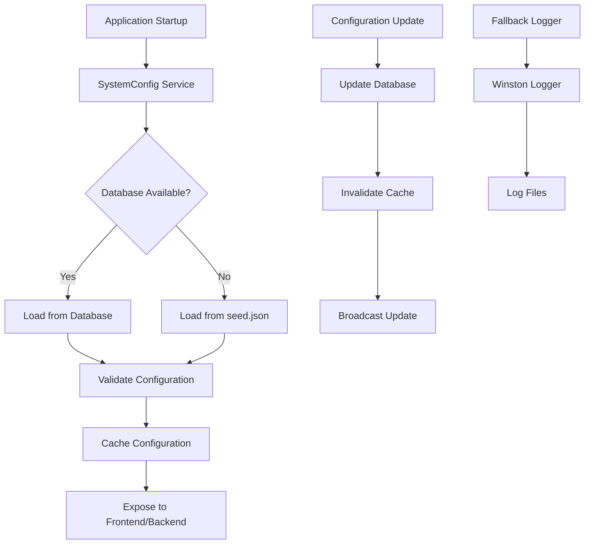
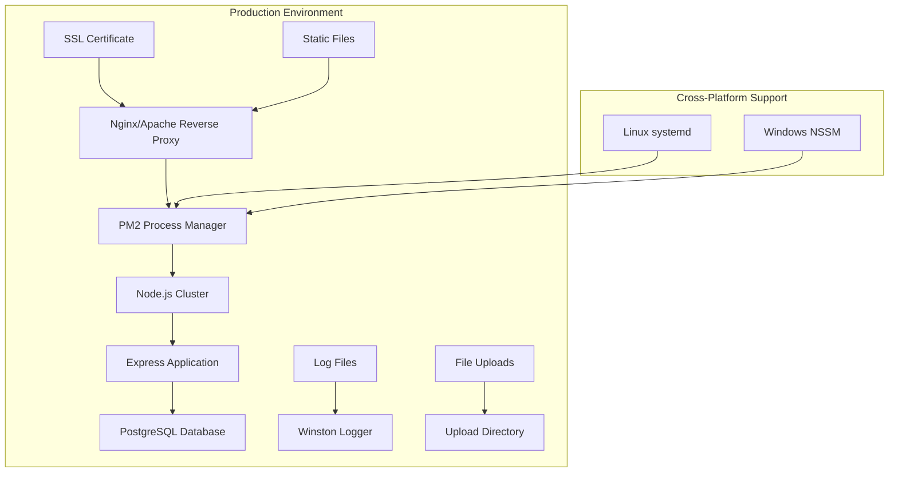

# Design Document

## Overview

This design outlines a comprehensive system stabilization and documentation reorganization initiative for the NLC-CMS complaint management system. The solution addresses critical production readiness requirements including robust SystemConfig fallback logic, cross-platform deployment capabilities, centralized configuration management, and structured documentation organization.

The design leverages the existing Node.js/Express backend with PostgreSQL database, React frontend architecture, and PM2 process management while introducing enhanced reliability patterns and comprehensive documentation structure.

## Architecture

### System Configuration Architecture



### Deployment Architecture



### Documentation Structure

```mermaid
graph TD
    A[docs/] --> B[deployment/]
    A --> C[database/]
    A --> D[client/]
    A --> E[server/]
    A --> F[onboarding/]
    A --> G[release/]
    
    B --> B1[README.md]
    B --> B2[server_deployment.md]
    B --> B3[reverse_proxy_setup.md]
    B --> B4[pm2_and_services.md]
    
    C --> C1[README.md]
    C --> C2[architecture.md]
    C --> C3[seeding_and_fallback.md]
    
    D --> D1[README.md]
    D --> D2[structure.md]
    D --> D3[api_integration.md]
    
    E --> E1[README.md]
    E --> E2[middleware.md]
    E --> E3[logging_config.md]
    
    F --> F1[README.md]
    F --> F2[setup_local_env.md]
    F --> F3[best_practices.md]
    
    G --> G1[README.md]
    G --> G2[v1_initial_release.md]
```



## Components and Interfaces

### Enhanced SystemConfig Service

**Location**: `server/services/SystemConfigService.js`

```javascript
interface SystemConfigService {
  // Core configuration methods
  getConfig(key: string, fallback?: any): Promise<any>
  getAllConfig(): Promise<Record<string, any>>
  updateConfig(key: string, value: any): Promise<void>
  
  // Fallback management
  loadFromDatabase(): Promise<Record<string, any>>
  loadFromSeed(): Promise<Record<string, any>>
  validateConfiguration(config: Record<string, any>): boolean
  
  // Cache management
  invalidateCache(): void
  refreshCache(): Promise<void>
  
  // Logging
  logFallbackUsage(reason: string): void
}
```

**Key Features**:
- Database-first configuration loading with automatic seed.json fallback
- Configuration caching with TTL and invalidation
- Structured logging for fallback occurrences
- Type-safe configuration access
- Runtime configuration validation

### Environment Validation Service

**Location**: `server/services/EnvironmentValidator.js`

```javascript
interface EnvironmentValidator {
  validateStartup(): Promise<ValidationResult>
  checkRequiredVariables(): string[]
  checkUnusedVariables(): string[]
  validateDatabaseConnection(): Promise<boolean>
  generateEnvironmentReport(): EnvironmentReport
}

interface ValidationResult {
  valid: boolean
  errors: string[]
  warnings: string[]
  missing: string[]
  unused: string[]
}
```

### Cross-Platform Deployment Manager

**Location**: `scripts/deployment/DeploymentManager.js`

```javascript
interface DeploymentManager {
  // Platform detection
  detectPlatform(): 'linux' | 'windows'
  
  // Service management
  installService(): Promise<void>
  uninstallService(): Promise<void>
  startService(): Promise<void>
  stopService(): Promise<void>
  
  // Configuration generation
  generateNginxConfig(): string
  generateApacheConfig(): string
  generateSystemdService(): string
  generateNSSMConfig(): string
}
```

### Documentation Generator

**Location**: `scripts/docs/DocumentationGenerator.js`

```javascript
interface DocumentationGenerator {
  generateIndex(): void
  validateLinks(): Promise<LinkValidationResult[]>
  generateTOC(directory: string): string
  cleanupLegacyDocs(): Promise<string[]>
  createDocumentationStructure(): Promise<void>
}
```

## Data Models

### Enhanced SystemConfig Model

The existing Prisma SystemConfig model will be extended with additional metadata:

```prisma
model SystemConfig {
  id          String   @id @default(cuid())
  key         String   @unique
  value       String
  type        String?  // 'app', 'complaint', 'contact', 'system'
  description String?
  isActive    Boolean  @default(true)
  category    String?  // New: grouping category
  priority    Int?     // New: loading priority
  validation  String?  // New: validation rules
  updatedAt   DateTime @updatedAt
  createdAt   DateTime @default(now())

  @@index([key, isActive])
  @@index([type, category])
  @@map("system_config")
}
```

### Environment Configuration Schema

```typescript
interface EnvironmentConfig {
  // Application
  NODE_ENV: 'development' | 'production' | 'staging'
  PORT: number
  HOST: string
  
  // Database
  DATABASE_URL: string
  DATABASE_POOL_MIN?: number
  DATABASE_POOL_MAX?: number
  
  // Security
  JWT_SECRET: string
  JWT_EXPIRE: string
  TRUST_PROXY: boolean
  
  // File Upload
  MAX_FILE_SIZE: number
  UPLOAD_PATH: string
  
  // Email
  EMAIL_SERVICE: string
  EMAIL_USER: string
  EMAIL_PASS: string
  EMAIL_PORT: number
  
  // Logging
  LOG_LEVEL: 'error' | 'warn' | 'info' | 'debug'
  LOG_FILE: string
}
```

## Error Handling

### SystemConfig Error Handling Strategy

1. **Database Connection Failures**:
   - Automatic fallback to seed.json
   - Graceful degradation with default values
   - Retry mechanism with exponential backoff
   - Health check endpoint for monitoring

2. **Configuration Validation Errors**:
   - Schema validation for critical settings
   - Type coercion with warnings
   - Default value substitution
   - Admin notification for invalid configurations

3. **Fallback Logging**:
   - Structured logging with context
   - Fallback reason categorization
   - Performance impact tracking
   - Alert thresholds for excessive fallbacks

### Deployment Error Handling

1. **Service Installation Failures**:
   - Platform-specific error messages
   - Rollback mechanisms
   - Dependency validation
   - Permission checks

2. **Configuration Generation Errors**:
   - Template validation
   - Syntax checking
   - Backup creation
   - Recovery procedures

## Testing Strategy

### SystemConfig Testing

1. **Unit Tests**:
   - Configuration loading from database
   - Fallback to seed.json when database unavailable
   - Cache invalidation and refresh
   - Type conversion and validation

2. **Integration Tests**:
   - Database connectivity scenarios
   - Frontend configuration consumption
   - Configuration update propagation
   - Fallback logging verification

3. **End-to-End Tests**:
   - Complete application startup with various database states
   - Configuration changes through admin interface
   - Cross-platform deployment scenarios

### Deployment Testing

1. **Platform Tests**:
   - Linux systemd service installation
   - Windows NSSM service configuration
   - Nginx/Apache reverse proxy setup
   - SSL certificate integration

2. **Load Tests**:
   - PM2 cluster performance
   - Configuration caching under load
   - Database connection pooling
   - File upload handling

### Documentation Testing

1. **Link Validation**:
   - Internal link verification
   - External resource availability
   - Image and asset references
   - Cross-reference accuracy

2. **Content Validation**:
   - Code example syntax checking
   - Command execution verification
   - Step-by-step procedure testing
   - Version compatibility checks

## Implementation Phases

### Phase 1: SystemConfig Stabilization
- Implement enhanced SystemConfig service with fallback logic
- Add structured logging for configuration events
- Create environment validation service
- Update frontend configuration consumption

### Phase 2: Cross-Platform Deployment
- Develop deployment manager with platform detection
- Create service configuration templates
- Implement reverse proxy configuration generation
- Add PM2 ecosystem optimization

### Phase 3: Documentation Restructure
- Create new documentation structure under `/docs`
- Generate comprehensive documentation content
- Implement link validation and maintenance tools
- Clean up legacy documentation files

### Phase 4: Validation and Testing
- Comprehensive testing across all platforms
- Performance optimization and monitoring
- Security audit and hardening
- Production deployment validation

## Security Considerations

### Configuration Security
- Sensitive configuration encryption at rest
- Secure configuration transmission
- Access control for configuration management
- Audit logging for configuration changes

### Deployment Security
- SSL/TLS enforcement through reverse proxy
- Secure service account configuration
- File permission hardening
- Network security configuration

### Documentation Security
- Sensitive information redaction
- Access control for internal documentation
- Version control security
- Backup and recovery procedures

## Performance Considerations

### Configuration Performance
- In-memory caching with TTL
- Lazy loading for non-critical configurations
- Batch configuration updates
- Connection pooling optimization

### Deployment Performance
- PM2 cluster optimization
- Static file caching
- Database connection pooling
- Log rotation and management

### Documentation Performance
- Static site generation for documentation
- CDN integration for assets
- Search indexing optimization
- Mobile-responsive design

## Monitoring and Observability

### SystemConfig Monitoring
- Configuration fallback frequency tracking
- Database connectivity monitoring
- Cache hit/miss ratios
- Configuration update audit trails

### Deployment Monitoring
- Service health checks
- Resource utilization tracking
- Error rate monitoring
- Performance metrics collection

### Documentation Monitoring
- Link health monitoring
- Content freshness tracking
- User engagement analytics
- Search effectiveness metrics