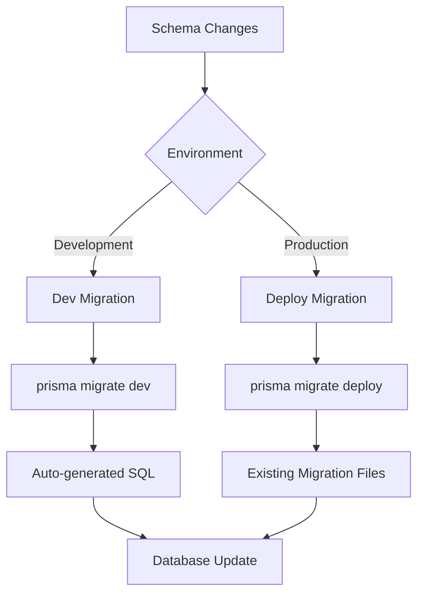
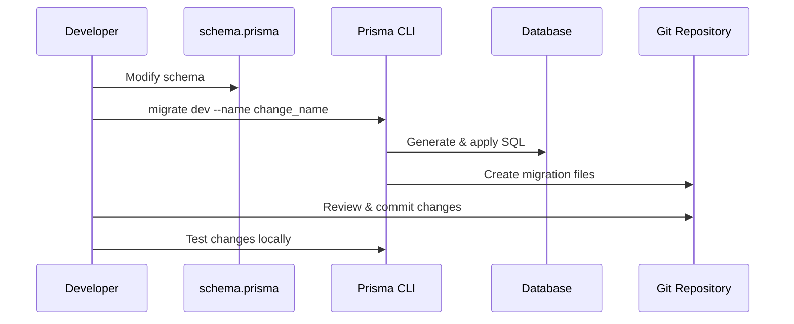

# Database Migration Guidelines

Comprehensive guide for managing database schema changes, migrations, and rollback strategies in the NLC-CMS system.

## 📋 Table of Contents

- [Migration Overview](#migration-overview)
- [Migration Workflow](#migration-workflow)
- [Development Migrations](#development-migrations)
- [Production Migrations](#production-migrations)
- [Rollback Strategies](#rollback-strategies)
- [Best Practices](#best-practices)
- [Common Scenarios](#common-scenarios)
- [Troubleshooting](#troubleshooting)

## 🔄 Migration Overview

The NLC-CMS uses Prisma's migration system to manage database schema changes. Migrations are version-controlled SQL files that transform the database schema from one state to another.

### Key Concepts

- **Migration Files** - SQL scripts that modify database schema
- **Migration History** - Tracking of applied migrations in `_prisma_migrations` table
- **Schema Drift** - Differences between Prisma schema and actual database
- **Shadow Database** - Temporary database used for migration validation

### Migration Types



## 🛠️ Migration Workflow

### 1. Development Workflow

```bash
# 1. Modify schema.prisma
# 2. Create and apply migration
npx prisma migrate dev --name descriptive_name

# 3. Review generated migration
# 4. Test changes locally
# 5. Commit migration files
```

### 2. Production Workflow

```bash
# 1. Deploy migration files to production
# 2. Run migration deployment
npx prisma migrate deploy

# 3. Verify migration success
# 4. Update application code if needed
```

### 3. Complete Development Cycle



## 🔧 Development Migrations

### Creating Development Migrations

```bash
# Create migration with descriptive name
npx prisma migrate dev --name add_user_avatar_field

# Create migration and reset database
npx prisma migrate dev --name major_schema_refactor --create-only
npx prisma db push --force-reset
```

### Migration Naming Conventions

Use descriptive, action-oriented names:

```bash
# Good examples
npx prisma migrate dev --name add_complaint_priority_field
npx prisma migrate dev --name create_notification_system
npx prisma migrate dev --name update_user_role_enum
npx prisma migrate dev --name remove_deprecated_status_field

# Avoid generic names
npx prisma migrate dev --name update
npx prisma migrate dev --name changes
npx prisma migrate dev --name fix
```

### Development Migration Files

Generated migration files are stored in `prisma/migrations/`:

```
prisma/migrations/
├── 20241029120000_initial_schema/
│   └── migration.sql
├── 20241029130000_add_complaint_priority/
│   └── migration.sql
└── 20241029140000_create_notification_system/
    └── migration.sql
```

### Example Migration File

```sql
-- CreateEnum
CREATE TYPE "Priority" AS ENUM ('LOW', 'MEDIUM', 'HIGH', 'CRITICAL');

-- AlterTable
ALTER TABLE "complaints" ADD COLUMN "priority" "Priority" NOT NULL DEFAULT 'MEDIUM';

-- CreateIndex
CREATE INDEX "idx_complaints_priority_status" ON "complaints"("priority", "status");
```

## 🚀 Production Migrations

### Pre-deployment Checklist

- [ ] All migrations tested in development
- [ ] Migration files committed to version control
- [ ] Database backup created
- [ ] Downtime window scheduled (if required)
- [ ] Rollback plan prepared
- [ ] Team notified of deployment

### Deployment Process

```bash
# 1. Backup production database
pg_dump -h localhost -U username -d database_name > backup_$(date +%Y%m%d_%H%M%S).sql

# 2. Deploy migrations
npx prisma migrate deploy

# 3. Verify migration status
npx prisma migrate status

# 4. Generate Prisma client (if needed)
npx prisma generate

# 5. Restart application services
pm2 restart all
```

### Zero-Downtime Migrations

For large tables or critical systems, use these strategies:

#### 1. Additive Changes (Safe)
```sql
-- Adding nullable columns (safe)
ALTER TABLE "complaints" ADD COLUMN "new_field" TEXT;

-- Adding indexes (may lock table briefly)
CREATE INDEX CONCURRENTLY "idx_new_field" ON "complaints"("new_field");
```

#### 2. Multi-Phase Migrations
```sql
-- Phase 1: Add new column
ALTER TABLE "complaints" ADD COLUMN "new_status" TEXT;

-- Phase 2: Populate new column (in application code)
UPDATE "complaints" SET "new_status" = "status" WHERE "new_status" IS NULL;

-- Phase 3: Make column required (separate migration)
ALTER TABLE "complaints" ALTER COLUMN "new_status" SET NOT NULL;

-- Phase 4: Remove old column (separate migration)
ALTER TABLE "complaints" DROP COLUMN "status";
```

#### 3. Background Data Migrations
```javascript
// Separate script for large data migrations
async function migrateComplaintData() {
  const batchSize = 1000;
  let offset = 0;
  
  while (true) {
    const complaints = await prisma.complaint.findMany({
      skip: offset,
      take: batchSize,
      where: { newField: null }
    });
    
    if (complaints.length === 0) break;
    
    for (const complaint of complaints) {
      await prisma.complaint.update({
        where: { id: complaint.id },
        data: { newField: calculateNewValue(complaint) }
      });
    }
    
    offset += batchSize;
    console.log(`Migrated ${offset} records`);
  }
}
```

## ↩️ Rollback Strategies

### 1. Migration Rollback

Prisma doesn't support automatic rollbacks, but you can create manual rollback migrations:

```sql
-- Original migration: add_priority_field
ALTER TABLE "complaints" ADD COLUMN "priority" "Priority" NOT NULL DEFAULT 'MEDIUM';

-- Rollback migration: remove_priority_field
ALTER TABLE "complaints" DROP COLUMN "priority";
```

### 2. Database Restore

```bash
# Restore from backup
pg_restore -h localhost -U username -d database_name backup_file.sql

# Reset migration history (if needed)
npx prisma migrate reset --force
```

### 3. Schema Rollback Process

```bash
# 1. Create rollback migration
npx prisma migrate dev --name rollback_priority_field --create-only

# 2. Edit migration.sql with rollback SQL
# 3. Apply rollback migration
npx prisma migrate dev

# 4. Update schema.prisma to match
# 5. Generate new Prisma client
npx prisma generate
```

### 4. Emergency Rollback Procedure

```bash
#!/bin/bash
# emergency_rollback.sh

echo "🚨 Emergency Database Rollback"
echo "Timestamp: $(date)"

# 1. Stop application
pm2 stop all

# 2. Restore database
pg_restore -h $DB_HOST -U $DB_USER -d $DB_NAME $BACKUP_FILE

# 3. Reset Prisma migration state
npx prisma migrate reset --force --skip-seed

# 4. Apply previous stable migrations
npx prisma migrate deploy

# 5. Restart application
pm2 start all

echo "✅ Rollback completed"
```

## 📋 Best Practices

### Schema Design

1. **Use descriptive field names**
   ```prisma
   // Good
   model User {
     lastLoginAt DateTime?
     isEmailVerified Boolean @default(false)
   }
   
   // Avoid
   model User {
     lastLogin DateTime?
     verified Boolean @default(false)
   }
   ```

2. **Plan for extensibility**
   ```prisma
   // Flexible JSON fields for future expansion
   model Complaint {
     metadata Json? // For additional fields
     tags String? // JSON array of tags
   }
   ```

3. **Use appropriate data types**
   ```prisma
   // Specific types for better validation
   model User {
     email String @unique // Not just String
     role UserRole // Enum instead of String
     createdAt DateTime @default(now()) // Automatic timestamps
   }
   ```

### Migration Safety

1. **Always backup before migrations**
2. **Test migrations on staging first**
3. **Use transactions for complex changes**
4. **Avoid dropping columns immediately**
5. **Plan for rollback scenarios**

### Performance Considerations

1. **Add indexes for new query patterns**
   ```sql
   -- Add index when adding filtered queries
   ALTER TABLE "complaints" ADD COLUMN "priority" "Priority";
   CREATE INDEX "idx_complaints_priority" ON "complaints"("priority");
   ```

2. **Use CONCURRENTLY for large tables**
   ```sql
   -- Avoid table locks on large tables
   CREATE INDEX CONCURRENTLY "idx_large_table_field" ON "large_table"("field");
   ```

3. **Batch large data changes**
   ```javascript
   // Process in batches to avoid memory issues
   const batchSize = 1000;
   // ... batch processing logic
   ```

## 🔧 Common Scenarios

### Adding a New Field

```prisma
// 1. Add to schema.prisma
model User {
  id String @id @default(cuid())
  email String @unique
  avatar String? // New field
}
```

```bash
# 2. Create migration
npx prisma migrate dev --name add_user_avatar_field
```

### Changing Field Type

```prisma
// Before
model Complaint {
  priority String // String field
}

// After
model Complaint {
  priority Priority // Enum field
}
```

```sql
-- Generated migration handles type conversion
CREATE TYPE "Priority" AS ENUM ('LOW', 'MEDIUM', 'HIGH', 'CRITICAL');
ALTER TABLE "complaints" ALTER COLUMN "priority" TYPE "Priority" USING "priority"::"Priority";
```

### Adding Relationships

```prisma
// 1. Add relationship to schema
model Complaint {
  id String @id @default(cuid())
  wardId String
  ward Ward @relation(fields: [wardId], references: [id])
}

model Ward {
  id String @id @default(cuid())
  complaints Complaint[]
}
```

```bash
# 2. Create migration
npx prisma migrate dev --name add_complaint_ward_relationship
```

### Renaming Fields

```sql
-- Prisma generates rename operations
ALTER TABLE "complaints" RENAME COLUMN "old_name" TO "new_name";
```

### Adding Indexes

```prisma
// Add index in schema.prisma
model Complaint {
  status ComplaintStatus
  createdAt DateTime @default(now())
  
  @@index([status, createdAt])
}
```

## 🔍 Troubleshooting

### Common Issues

#### Migration Conflicts
```bash
Error: Migration conflict detected
```

**Solution:**
```bash
# Reset development database
npx prisma migrate reset

# Or resolve conflicts manually
npx prisma migrate resolve --applied 20241029120000_conflicting_migration
```

#### Schema Drift
```bash
Error: Schema drift detected
```

**Solution:**
```bash
# Generate migration to fix drift
npx prisma migrate diff --from-empty --to-schema-datamodel prisma/schema.prisma --script > fix_drift.sql

# Apply fix
npx prisma db execute --file fix_drift.sql
```

#### Failed Migrations
```bash
Error: Migration failed to apply
```

**Solution:**
```bash
# Mark migration as applied (if manually fixed)
npx prisma migrate resolve --applied 20241029120000_failed_migration

# Or rollback and fix
npx prisma migrate resolve --rolled-back 20241029120000_failed_migration
```

### Validation Commands

```bash
# Check migration status
npx prisma migrate status

# Validate schema
npx prisma validate

# Check for drift
npx prisma db pull --print

# Test migration procedures
npm run db:test-migration
```

### Recovery Procedures

#### Reset Development Database
```bash
# Complete reset
npx prisma migrate reset --force

# Reset and reseed
npm run db:reset
```

#### Fix Production Migration Issues
```bash
# 1. Backup current state
pg_dump database_name > emergency_backup.sql

# 2. Mark problematic migration as rolled back
npx prisma migrate resolve --rolled-back MIGRATION_ID

# 3. Fix migration file
# 4. Reapply migration
npx prisma migrate deploy
```

## 📊 Migration Monitoring

### Migration Status Tracking

```javascript
// Check migration status programmatically
async function checkMigrationStatus() {
  try {
    const result = await prisma.$queryRaw`
      SELECT migration_name, finished_at, logs 
      FROM _prisma_migrations 
      ORDER BY finished_at DESC 
      LIMIT 10
    `;
    
    console.log('Recent migrations:', result);
  } catch (error) {
    console.error('Migration status check failed:', error);
  }
}
```

### Performance Monitoring

```sql
-- Monitor long-running migrations
SELECT 
  migration_name,
  started_at,
  finished_at,
  EXTRACT(EPOCH FROM (finished_at - started_at)) as duration_seconds
FROM _prisma_migrations 
WHERE finished_at IS NOT NULL
ORDER BY duration_seconds DESC;
```

## 🔗 See Also

- **[Schema Reference](schema_reference.md)** - Complete database schema documentation
- **[Seed & Fallback Logic](seed_fallback_logic.md)** - Database initialization procedures
- **[Performance Tuning](performance_tuning.md)** - Database optimization strategies
- **[System Configuration](../System/system_config_overview.md)** - Configuration management
- **[Deployment Guides](../Deployment/README.md)** - Production deployment procedures