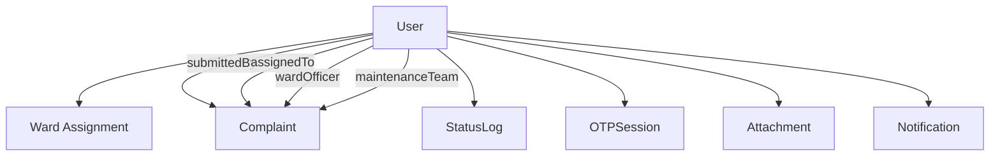
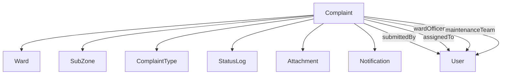
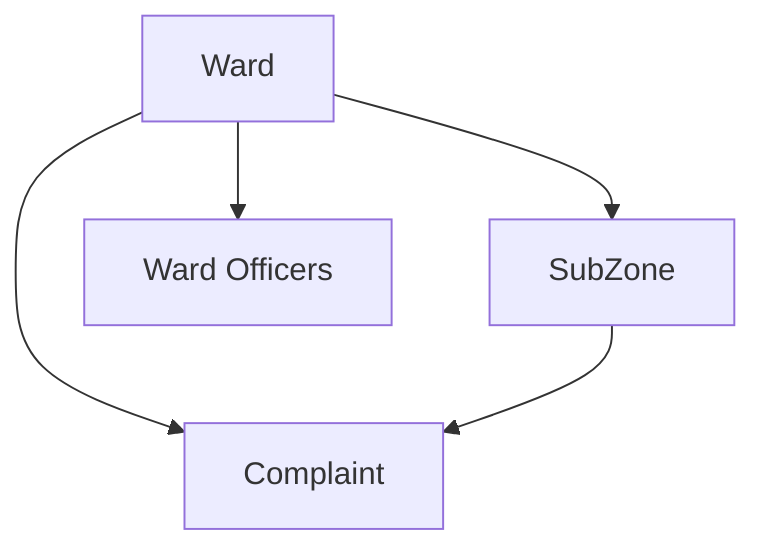

# Database Schema Reference

Complete reference for the NLC-CMS PostgreSQL database schema using Prisma ORM.

## 📋 Table of Contents

- [Enums](#enums)
- [Core Models](#core-models)
- [Complaint Management](#complaint-management)
- [File Management](#file-management)
- [Authentication & Security](#authentication--security)
- [System Configuration](#system-configuration)
- [Relationships Overview](#relationships-overview)
- [Indexes & Performance](#indexes--performance)

## 🏷️ Enums

### UserRole
Defines system user roles with specific permissions:
```prisma
enum UserRole {
  CITIZEN          // End users who submit complaints
  WARD_OFFICER     // Ward-level administrators
  MAINTENANCE_TEAM // Field maintenance personnel
  ADMINISTRATOR    // System administrators
  GUEST           // Temporary/unverified users
}
```

### ComplaintStatus
Tracks complaint lifecycle states:
```prisma
enum ComplaintStatus {
  REGISTERED  // Initial submission
  ASSIGNED    // Assigned to officer/team
  IN_PROGRESS // Work in progress
  RESOLVED    // Work completed
  CLOSED      // Officially closed
  REOPENED    // Reopened after closure
}
```

### Priority
Complaint priority levels:
```prisma
enum Priority {
  LOW      // Non-urgent issues
  MEDIUM   // Standard priority
  HIGH     // Important issues
  CRITICAL // Emergency situations
}
```

### SLAStatus
Service Level Agreement tracking:
```prisma
enum SLAStatus {
  ON_TIME   // Within SLA timeframe
  WARNING   // Approaching deadline
  OVERDUE   // Past deadline
  COMPLETED // Resolved within SLA
}
```

### AttachmentEntityType
Defines what entity an attachment belongs to:
```prisma
enum AttachmentEntityType {
  COMPLAINT        // Complaint photos/documents
  CITIZEN         // Citizen profile images
  USER            // User avatars
  MAINTENANCE_PHOTO // Work progress photos
}
```

## 👥 Core Models

### User
Central user management for all system roles:

```prisma
model User {
  id          String    @id @default(cuid())
  email       String    @unique
  fullName    String
  phoneNumber String?
  password    String?   // Nullable for guest users
  role        UserRole  @default(CITIZEN)
  wardId      String?   // Optional ward assignment
  department  String?   // For officers/maintenance
  language    String    @default("en")
  avatar      String?   // Profile image URL
  isActive    Boolean   @default(true)
  lastLogin   DateTime?
  joinedOn    DateTime  @default(now())
  createdAt   DateTime  @default(now())
  updatedAt   DateTime  @updatedAt
}
```

**Key Features:**
- CUID primary keys for security
- Multi-role support with role-based permissions
- Optional ward assignment for geographic organization
- Multi-language support with default fallback
- Soft deletion via `isActive` flag

**Relationships:**
- One-to-many with Complaint (multiple relationship types)
- Many-to-one with Ward
- One-to-many with StatusLog, OTPSession, Attachment, Notification

### Ward
Geographic administrative divisions:

```prisma
model Ward {
  id          String  @id @default(cuid())
  name        String  @unique
  description String?
  isActive    Boolean @default(true)
  createdAt   DateTime @default(now())
  updatedAt   DateTime @updatedAt
}
```

**Key Features:**
- Unique ward names for clear identification
- Hierarchical organization with SubZones
- Soft deletion support

**Relationships:**
- One-to-many with User (ward officers and assignments)
- One-to-many with Complaint (geographic complaint routing)
- One-to-many with SubZone (administrative subdivisions)

### SubZone
Sub-ward geographic divisions:

```prisma
model SubZone {
  id          String  @id @default(cuid())
  name        String
  wardId      String
  description String?
  isActive    Boolean @default(true)
  createdAt   DateTime @default(now())
  updatedAt   DateTime @updatedAt
}
```

**Key Features:**
- Hierarchical organization under Wards
- Enables fine-grained geographic complaint routing

### ComplaintType
Categorization system for complaints:

```prisma
model ComplaintType {
  id          Int      @id @default(autoincrement())
  name        String   @unique
  description String?
  priority    Priority @default(MEDIUM)
  slaHours    Int      @default(48)
  isActive    Boolean  @default(true)
  createdAt   DateTime @default(now())
  updatedAt   DateTime @updatedAt
}
```

**Key Features:**
- Integer IDs for performance in high-volume queries
- Built-in SLA management with configurable hours
- Default priority assignment
- Soft deletion support

## 📋 Complaint Management

### Complaint
Core complaint entity with comprehensive tracking:

```prisma
model Complaint {
  id              String          @id @default(cuid())
  complaintId     String?         @unique // Human-readable ID (e.g., AMC0001)
  title           String?
  description     String
  type            String?         // Legacy field for backward compatibility
  complaintTypeId Int?           // New structured type reference
  status          ComplaintStatus @default(REGISTERED)
  priority        Priority        @default(MEDIUM)
  slaStatus       SLAStatus       @default(ON_TIME)
  
  // Location Information
  wardId      String
  subZoneId   String?
  area        String
  landmark    String?
  address     String?
  coordinates String?  // JSON string for lat/lng
  latitude    Float?   // Explicit latitude
  longitude   Float?   // Explicit longitude
  
  // Contact Information
  contactName  String?
  contactEmail String?
  contactPhone String
  isAnonymous  Boolean @default(false)
  
  // Assignment and Tracking
  submittedById     String?
  assignedToId      String? // Generic assignment (legacy)
  resolvedById      String?
  wardOfficerId     String? // Specific ward officer
  maintenanceTeamId String? // Specific maintenance team member
  
  // Timestamps
  submittedOn DateTime  @default(now())
  assignedOn  DateTime?
  resolvedOn  DateTime?
  closedOn    DateTime?
  deadline    DateTime?
  
  // Additional Information
  remarks         String?
  citizenFeedback String?
  rating          Int?    // 1-5 rating
  assignToTeam    Boolean @default(false)
  tags            String? // JSON array of tags
  
  createdAt DateTime @default(now())
  updatedAt DateTime @updatedAt
}
```

**Key Features:**
- Dual typing system (legacy string + new structured types)
- Multiple assignment patterns (generic, role-specific)
- Comprehensive location tracking (hierarchical + coordinates)
- Anonymous complaint support
- SLA tracking with automatic status updates
- Flexible tagging system via JSON

**Location Hierarchy:**
```
Ward → SubZone → Area → Landmark → Address → Coordinates
```

### StatusLog
Audit trail for complaint status changes:

```prisma
model StatusLog {
  id          String   @id @default(cuid())
  complaintId String
  userId      String
  fromStatus  String?  // Previous status
  toStatus    String   // New status
  comment     String?
  timestamp   DateTime @default(now())
}
```

**Key Features:**
- Complete audit trail for all status changes
- User attribution for accountability
- Optional comments for context
- Immutable log entries

## 📎 File Management

### Attachment
Unified file attachment system:

```prisma
model Attachment {
  id           String               @id @default(cuid())
  entityType   AttachmentEntityType @default(COMPLAINT)
  entityId     String              // Generic entity reference
  complaintId  String?             // Specific complaint reference (legacy)
  fileName     String
  originalName String
  mimeType     String
  size         Int
  url          String
  description  String?
  createdAt    DateTime            @default(now())
  uploadedById String?
}
```

**Key Features:**
- Generic entity attachment system
- Backward compatibility with complaint-specific attachments
- File metadata tracking (size, type, original name)
- Optional descriptions for context
- User attribution for uploads

**Supported Entity Types:**
- Complaints (photos, documents)
- Users (avatars, profiles)
- Citizens (identity documents)
- Maintenance (progress photos)

## 🔐 Authentication & Security

### OTPSession
One-time password management:

```prisma
model OTPSession {
  id          String    @id @default(cuid())
  userId      String?
  email       String
  phoneNumber String?
  otpCode     String
  purpose     String    @default("GUEST_VERIFICATION")
  isVerified  Boolean   @default(false)
  expiresAt   DateTime
  createdAt   DateTime  @default(now())
  verifiedAt  DateTime?
}
```

**Key Features:**
- Multi-purpose OTP system (verification, password reset)
- Email and SMS support
- Automatic expiration handling
- Verification tracking

**Common Purposes:**
- `GUEST_VERIFICATION` - Anonymous user verification
- `PASSWORD_RESET` - Password reset flow
- `PHONE_VERIFICATION` - Phone number verification

## 🔔 Notifications

### Notification
In-app notification system:

```prisma
model Notification {
  id          String   @id @default(cuid())
  userId      String
  complaintId String?
  type        String   @default("IN_APP")
  title       String
  message     String
  isRead      Boolean  @default(false)
  createdAt   DateTime @default(now())
  updatedAt   DateTime @updatedAt
}
```

**Key Features:**
- Multi-channel support (IN_APP, EMAIL, SMS)
- Complaint-specific notifications
- Read/unread tracking
- Flexible message content

## ⚙️ System Configuration

### SystemConfig
Dynamic application configuration:

```prisma
model SystemConfig {
  id          String   @id @default(cuid())
  key         String   @unique
  value       String
  type        String?  // Configuration category
  description String?
  isActive    Boolean  @default(true)
  updatedAt   DateTime @updatedAt
}
```

**Key Features:**
- Dynamic configuration without code changes
- Categorized settings via `type` field
- Soft deletion via `isActive`
- Audit trail via `updatedAt`

**Common Configuration Types:**
- `app` - Application settings (name, logo, branding)
- `complaint` - Complaint handling settings (ID format, SLA)
- `contact` - Contact information and support details
- `system` - System behavior and limits

## 🔗 Relationships Overview

### User Relationships


### Complaint Relationships


### Geographic Hierarchy


## 📊 Indexes & Performance

### Primary Indexes
All models use optimized primary keys:
- **CUID** for security-sensitive models (User, Complaint, etc.)
- **Auto-increment integers** for high-volume reference data (ComplaintType)

### Performance Indexes

#### User Model
```sql
-- Role-based queries
CREATE INDEX idx_users_role_active ON users(role, isActive);
-- Ward assignment queries
CREATE INDEX idx_users_ward ON users(wardId);
-- Authentication queries
CREATE INDEX idx_users_email ON users(email);
```

#### Complaint Model
```sql
-- User-specific complaint queries
CREATE INDEX idx_complaints_submitted_created ON complaints(submittedById, createdAt);
-- Ward-based filtering
CREATE INDEX idx_complaints_ward_status ON complaints(wardId, status);
-- Assignment queries
CREATE INDEX idx_complaints_assigned_status ON complaints(assignedToId, status);
CREATE INDEX idx_complaints_maintenance_status ON complaints(maintenanceTeamId, status);
-- Type-based filtering
CREATE INDEX idx_complaints_type_status ON complaints(type, status);
CREATE INDEX idx_complaints_complaint_type_status ON complaints(complaintTypeId, status);
-- Priority and temporal queries
CREATE INDEX idx_complaints_priority_status ON complaints(priority, status);
CREATE INDEX idx_complaints_submitted ON complaints(submittedOn);
CREATE INDEX idx_complaints_status_created ON complaints(status, createdAt);
-- Human-readable ID lookup
CREATE INDEX idx_complaints_complaint_id ON complaints(complaintId);
```

#### StatusLog Model
```sql
-- Complaint audit trail
CREATE INDEX idx_status_logs_complaint_timestamp ON status_logs(complaintId, timestamp);
-- User activity tracking
CREATE INDEX idx_status_logs_user ON status_logs(userId);
-- Temporal queries
CREATE INDEX idx_status_logs_timestamp ON status_logs(timestamp);
```

#### Attachment Model
```sql
-- Generic entity lookups
CREATE INDEX idx_attachments_entity ON attachments(entityType, entityId);
-- File management
CREATE INDEX idx_attachments_filename ON attachments(fileName);
-- Complaint-specific (legacy)
CREATE INDEX idx_attachments_complaint ON attachments(complaintId);
-- User attribution
CREATE INDEX idx_attachments_uploaded_by ON attachments(uploadedById);
-- Temporal queries
CREATE INDEX idx_attachments_created ON attachments(createdAt);
```

#### Notification Model
```sql
-- User notification queries
CREATE INDEX idx_notifications_user_read ON notifications(userId, isRead);
-- Temporal queries
CREATE INDEX idx_notifications_created ON notifications(createdAt);
-- Complaint-specific notifications
CREATE INDEX idx_notifications_complaint ON notifications(complaintId);
```

#### SystemConfig Model
```sql
-- Configuration lookups
CREATE INDEX idx_system_config_key_active ON system_config(key, isActive);
-- Category-based queries
CREATE INDEX idx_system_config_type ON system_config(type);
```

### Query Optimization Tips

1. **Use role-based indexes** for user queries
2. **Combine status with other fields** for complaint filtering
3. **Leverage temporal indexes** for date-range queries
4. **Use entity-type indexes** for attachment queries
5. **Consider composite indexes** for complex WHERE clauses

## 🔄 Migration Considerations

### Backward Compatibility
- Legacy `type` field maintained alongside `complaintTypeId`
- Generic `assignedToId` preserved with specific role assignments
- Complaint-specific attachment fields alongside generic entity system

### Future Extensibility
- JSON fields for flexible data (coordinates, tags)
- Generic entity attachment system
- Configurable SLA and priority systems
- Multi-purpose OTP system

## 📚 See Also

### Within Database Department
- **[Migration Guidelines](migration_guidelines.md)** - Schema change procedures and rollback strategies
- **[Seed & Fallback Logic](seed_fallback_logic.md)** - Data initialization and configuration fallback
- **[Performance Tuning](performance_tuning.md)** - Database optimization and indexing strategies

### Cross-Department References
- **[System Configuration Overview](../System/system_config_overview.md)** - SystemConfig model usage and management
- **[System Environment Management](../System/env_management.md)** - Database connection configuration
- **[Developer Architecture Overview](../Developer/architecture_overview.md)** - Database layer in system architecture
- **[Developer API Contracts](../Developer/api_contracts.md)** - API endpoints using database models
- **[QA Test Cases](../QA/test_cases.md)** - Database testing procedures and validation
- **[QA Integration Checklist](../QA/integration_checklist.md)** - Database integration testing
- **[Deployment Linux Guide](../Deployment/linux_deployment.md)** - PostgreSQL deployment and configuration
- **[Deployment Multi-Environment Setup](../Deployment/multi_env_setup.md)** - Database setup across environments
- **[Onboarding Local Setup](../Onboarding/local_setup.md)** - Local database setup for development