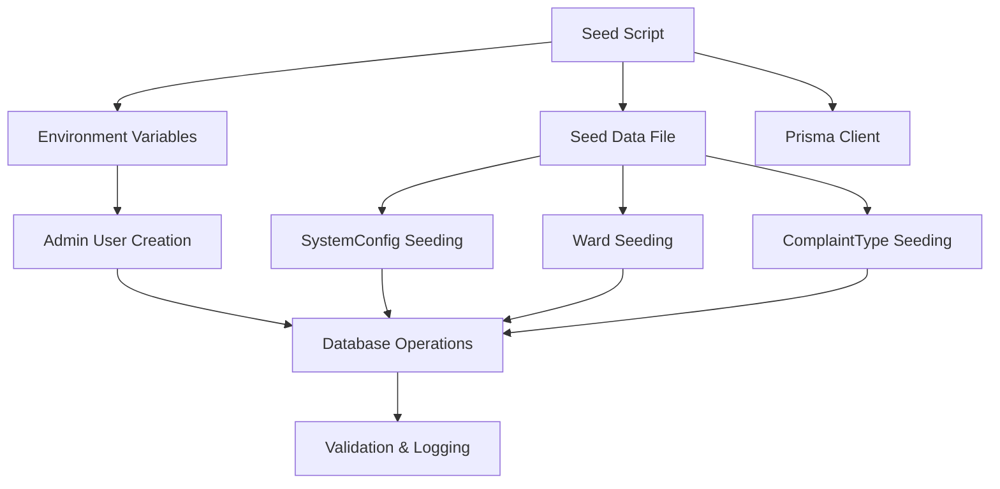
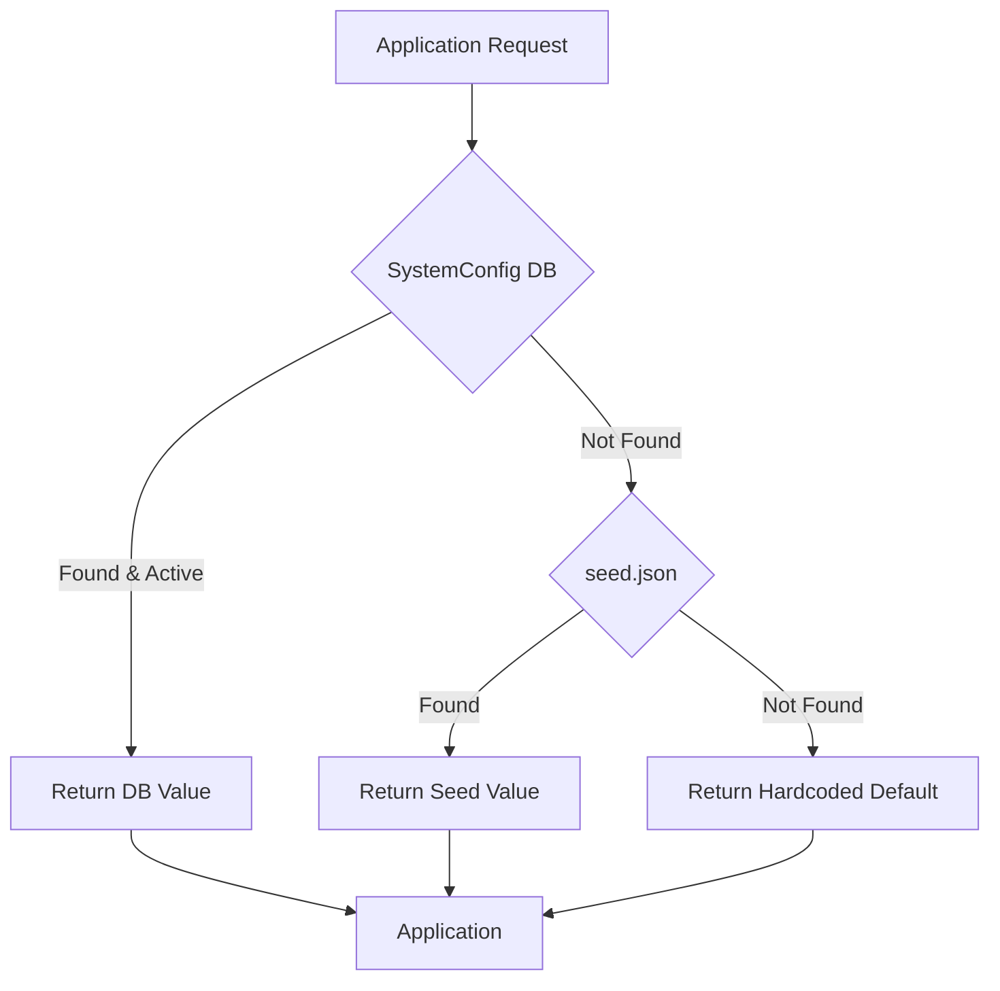

# Seed & Fallback Logic Documentation

Comprehensive guide to the NLC-CMS database seeding system and SystemConfig fallback mechanisms.

## 📋 Table of Contents

- [Overview](#overview)
- [Seed System Architecture](#seed-system-architecture)
- [SystemConfig Fallback Logic](#systemconfig-fallback-logic)
- [Seed Data Structure](#seed-data-structure)
- [Seeding Modes](#seeding-modes)
- [Fallback Mechanisms](#fallback-mechanisms)
- [Configuration Management](#configuration-management)
- [Troubleshooting](#troubleshooting)

## 🌱 Overview

The NLC-CMS seeding system provides automated database initialization with intelligent fallback mechanisms. It ensures the application can function with minimal configuration while supporting extensive customization through the SystemConfig model.

### Key Features

- **Dual-mode seeding** (destructive/non-destructive)
- **Intelligent fallbacks** for missing configuration
- **Environment-based customization** via environment variables
- **Safe upsert operations** to prevent data conflicts
- **Comprehensive error handling** with detailed logging

## 🏗️ Seed System Architecture

### Core Components



### File Structure
```
prisma/
├── seed.js              # Main seeding script
├── seeds/
│   ├── seed.json        # Primary seed data
│   └── seed1.json       # Alternative seed data
└── schema.prisma        # Database schema
```

## ⚙️ SystemConfig Fallback Logic

### Fallback Hierarchy

The application uses a three-tier fallback system for configuration values:



### Implementation Pattern

```javascript
// Typical fallback implementation in application code
async function getConfigValue(key, defaultValue = null) {
  try {
    // 1. Try database first
    const config = await prisma.systemConfig.findFirst({
      where: { key, isActive: true }
    });
    
    if (config) {
      return config.value;
    }
    
    // 2. Fall back to seed data
    const seedValue = getSeedConfigValue(key);
    if (seedValue !== null) {
      return seedValue;
    }
    
    // 3. Use hardcoded default
    return defaultValue;
    
  } catch (error) {
    console.warn(`Config fallback for ${key}:`, error.message);
    return defaultValue;
  }
}
```

### Configuration Categories

#### Application Settings
```json
{
  "key": "APP_NAME",
  "value": "Ahmedabad CMS",
  "type": "app",
  "description": "Application name displayed in UI"
}
```

#### Complaint Management
```json
{
  "key": "COMPLAINT_ID_PREFIX",
  "value": "AMC",
  "type": "complaint",
  "description": "Prefix for auto-generated complaint IDs"
}
```

#### System Behavior
```json
{
  "key": "OTP_EXPIRY_MINUTES",
  "value": "5",
  "type": "system",
  "description": "OTP expiration time in minutes"
}
```

## 📊 Seed Data Structure

### Primary Seed File (`seed.json`)

```json
{
  "config-of": "generic-saas-template",
  "deployment-notes": "Customize values for your specific deployment",
  
  "systemConfig": [
    {
      "key": "APP_NAME",
      "value": "Ahmedabad CMS",
      "description": "Application name",
      "isActive": true
    }
  ],
  
  "ward": [
    {
      "name": "Ward 1",
      "description": "Central Ward",
      "isActive": true
    }
  ],
  
  "complaintType": [
    {
      "name": "Water Supply",
      "description": "Water-related complaints",
      "priority": "HIGH",
      "slaHours": 24,
      "isActive": true
    }
  ]
}
```

### Configuration Schema

#### SystemConfig Entry
```typescript
interface SystemConfigSeed {
  key: string;           // Unique configuration key
  value: string;         // Configuration value (always string)
  description?: string;  // Human-readable description
  type?: string;         // Category (app, complaint, system, etc.)
  isActive?: boolean;    // Active flag (default: true)
}
```

#### Ward Entry
```typescript
interface WardSeed {
  name: string;          // Unique ward name
  description?: string;  // Ward description
  isActive?: boolean;    // Active flag (default: true)
}
```

#### ComplaintType Entry
```typescript
interface ComplaintTypeSeed {
  name: string;          // Unique complaint type name
  description?: string;  // Type description
  priority: 'LOW' | 'MEDIUM' | 'HIGH' | 'CRITICAL';
  slaHours: number;      // SLA in hours
  isActive?: boolean;    // Active flag (default: true)
}
```

## 🔄 Seeding Modes

### Non-Destructive Mode (Default)

Safe mode that preserves existing data:

```bash
# Standard seeding
npm run db:seed

# Explicit non-destructive
DESTRUCTIVE_SEED=false npm run db:seed
```

**Behavior:**
- Uses `upsert` operations for all data
- Preserves existing records
- Updates only specified fields
- Safe for production environments

### Destructive Mode

Complete database reset and reseed:

```bash
# Destructive seeding
DESTRUCTIVE_SEED=true npm run db:seed
```

**Behavior:**
- Clears all existing data
- Recreates all seed data
- **⚠️ WARNING: Data loss will occur**
- Use only in development/testing

### Deletion Order (Destructive Mode)

```javascript
const deleteOrder = [
  "attachment",      // Files and media
  "notification",    // User notifications
  "statusLog",       // Audit trails
  "oTPSession",      // Authentication sessions
  "complaint",       // Main complaint records
  "complaintType",   // Complaint categories
  "subZone",         // Geographic subdivisions
  "user",            // User accounts
  "ward",            // Geographic divisions
  "systemConfig"     // System configuration
];
```

## 🛡️ Fallback Mechanisms

### Database Connection Failures

```javascript
// Graceful degradation when database is unavailable
class ConfigService {
  constructor() {
    this.seedCache = this.loadSeedCache();
    this.hardcodedDefaults = {
      'APP_NAME': 'CMS Application',
      'OTP_EXPIRY_MINUTES': '5',
      'MAX_FILE_SIZE_MB': '10'
    };
  }
  
  async getConfig(key) {
    try {
      // Try database first
      return await this.getFromDatabase(key);
    } catch (dbError) {
      console.warn('Database unavailable, using fallback');
      
      // Fall back to seed cache
      if (this.seedCache[key]) {
        return this.seedCache[key];
      }
      
      // Final fallback to hardcoded
      return this.hardcodedDefaults[key] || null;
    }
  }
}
```

### Missing Configuration Keys

```javascript
// Handle missing configuration gracefully
function getConfigWithDefault(key, defaultValue, type = 'string') {
  const value = getConfig(key) || defaultValue;
  
  // Type conversion with validation
  switch (type) {
    case 'number':
      return parseInt(value) || defaultValue;
    case 'boolean':
      return value === 'true' || value === true;
    case 'json':
      try {
        return JSON.parse(value);
      } catch {
        return defaultValue;
      }
    default:
      return value;
  }
}
```

### Environment Variable Integration

```javascript
// Environment variables take precedence over database config
function getEnvironmentAwareConfig(key) {
  // 1. Check environment variables first
  const envValue = process.env[key];
  if (envValue !== undefined) {
    return envValue;
  }
  
  // 2. Fall back to database/seed system
  return getConfig(key);
}
```

## 🔧 Configuration Management

### Admin User Creation

The seeding system automatically creates an admin user:

```javascript
// Environment-based admin user creation
const adminEmail = process.env.ADMIN_EMAIL || "admin@fixsmart.dev";
const adminPassword = process.env.ADMIN_PASSWORD || "admin@123";

// Safe upsert operation
await prisma.user.upsert({
  where: { email: adminEmail },
  update: { role: "ADMINISTRATOR" },
  create: {
    email: adminEmail,
    fullName: "Administrator",
    password: await hash(adminPassword),
    role: "ADMINISTRATOR",
    language: "en",
    isActive: true
  }
});
```

### Configuration Updates

#### Runtime Updates
```javascript
// Update configuration at runtime
async function updateConfig(key, value, description = null) {
  return await prisma.systemConfig.upsert({
    where: { key },
    update: { 
      value, 
      description,
      updatedAt: new Date()
    },
    create: { 
      key, 
      value, 
      description,
      isActive: true 
    }
  });
}
```

#### Bulk Configuration Import
```javascript
// Import configuration from external source
async function importConfiguration(configData) {
  const results = [];
  
  for (const config of configData) {
    try {
      const result = await prisma.systemConfig.upsert({
        where: { key: config.key },
        update: {
          value: config.value,
          description: config.description,
          type: config.type,
          isActive: config.isActive ?? true
        },
        create: config
      });
      
      results.push({ key: config.key, status: 'success' });
    } catch (error) {
      results.push({ 
        key: config.key, 
        status: 'error', 
        error: error.message 
      });
    }
  }
  
  return results;
}
```

## 🔍 Troubleshooting

### Common Issues

#### Seed File Not Found
```bash
Error: Seed file not found at prisma/seed.json
```

**Solution:**
1. Verify file exists at `prisma/seeds/seed.json`
2. Check file permissions
3. Validate JSON syntax

#### Database Connection Errors
```bash
Error: Can't reach database server
```

**Solution:**
1. Verify `DATABASE_URL` environment variable
2. Check database server status
3. Validate connection credentials
4. Ensure database exists

#### Unique Constraint Violations
```bash
Error: Unique constraint failed on the fields: (`name`)
```

**Solution:**
1. Use non-destructive mode for updates
2. Check for duplicate entries in seed data
3. Consider using destructive mode for clean slate

#### Permission Errors
```bash
Error: permission denied for table system_config
```

**Solution:**
1. Verify database user permissions
2. Check PostgreSQL role assignments
3. Ensure user has INSERT/UPDATE privileges

### Validation Scripts

#### Seed File Validation
```bash
# Validate seed file structure
node scripts/validate-seed-file.cjs
```

#### Database Configuration Validation
```bash
# Validate database configuration integrity
node scripts/validate-system-configuration-integrity.js
```

#### Environment Validation
```bash
# Validate database environment setup
npm run validate:db
```

### Debug Mode

Enable detailed logging during seeding:

```bash
# Enable debug logging
DEBUG=true npm run db:seed

# Verbose seeding output
VERBOSE=true npm run db:seed
```

### Recovery Procedures

#### Restore from Backup
```bash
# Restore database from backup
pg_restore -d your_database backup_file.sql

# Re-run seeding
npm run db:seed
```

#### Reset and Reseed
```bash
# Complete reset (development only)
npm run db:reset

# Manual reset and reseed
npm run db:migrate:reset
npm run db:setup
```

## 📈 Performance Considerations

### Seeding Performance

- **Batch operations** for large datasets
- **Upsert operations** to avoid conflicts
- **Indexed lookups** for existing record checks
- **Transaction batching** for consistency

### Configuration Caching

```javascript
// Cache frequently accessed configuration
class ConfigCache {
  constructor() {
    this.cache = new Map();
    this.cacheTimeout = 5 * 60 * 1000; // 5 minutes
  }
  
  async get(key) {
    const cached = this.cache.get(key);
    
    if (cached && Date.now() - cached.timestamp < this.cacheTimeout) {
      return cached.value;
    }
    
    const value = await this.fetchFromDatabase(key);
    this.cache.set(key, {
      value,
      timestamp: Date.now()
    });
    
    return value;
  }
}
```

## 🔗 See Also

- **[Schema Reference](schema_reference.md)** - Complete database schema documentation
- **[Migration Guidelines](migration_guidelines.md)** - Schema change procedures
- **[System Configuration](../System/system_config_overview.md)** - SystemConfig usage patterns
- **[Environment Management](../System/env_management.md)** - Environment variable setup