# Architecture Overview

This document provides a comprehensive system-wide architectural explanation and component relationships for the complaint management system.

## System Architecture

### High-Level Architecture

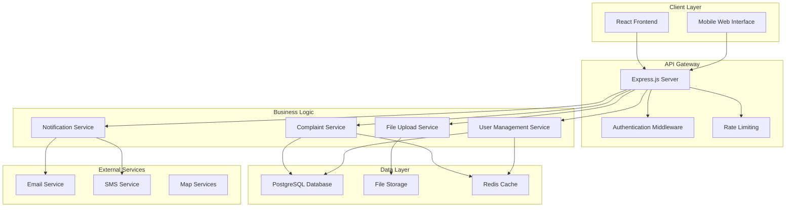

### Component Architecture

#### Frontend Architecture

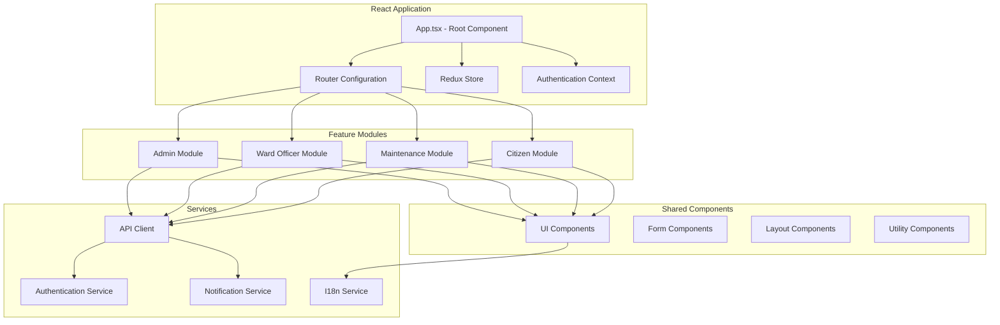

#### Backend Architecture

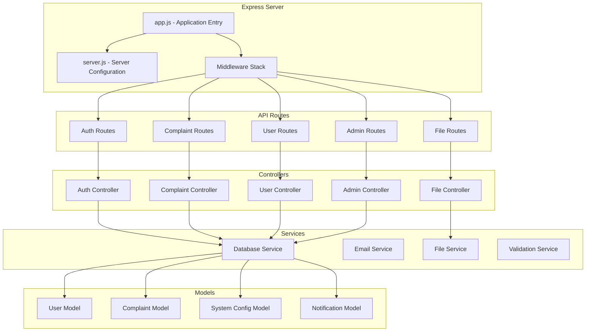

## Core Components

### Frontend Components

#### Authentication System
- **Location**: `client/contexts/AuthContext.tsx`
- **Purpose**: Manages user authentication state and JWT tokens
- **Key Features**:
  - JWT token management
  - Role-based access control
  - Automatic token refresh
  - Logout handling

```typescript
interface AuthContext {
  user: User | null;
  token: string | null;
  login: (credentials: LoginCredentials) => Promise<void>;
  logout: () => void;
  isAuthenticated: boolean;
  hasRole: (role: UserRole) => boolean;
}
```

#### State Management
- **Location**: `client/store/`
- **Technology**: Redux Toolkit
- **Structure**:
  - `authSlice.ts` - Authentication state
  - `complaintsSlice.ts` - Complaint management
  - `usersSlice.ts` - User management
  - `configSlice.ts` - System configuration

#### Routing System
- **Location**: `client/App.tsx`
- **Technology**: React Router v6
- **Features**:
  - Role-based route protection
  - Lazy loading for code splitting
  - Nested routing for complex layouts
  - Redirect handling for authentication

#### Internationalization
- **Location**: `client/hooks/useTranslation.ts`
- **Technology**: Custom i18n implementation
- **Features**:
  - Dynamic language switching
  - Namespace-based translations
  - Fallback language support
  - Context-aware translations

### Backend Components

#### API Layer
- **Location**: `server/routes/`
- **Framework**: Express.js
- **Structure**:
  - RESTful API design
  - Consistent response formats
  - Error handling middleware
  - Request validation

#### Authentication Middleware
- **Location**: `server/middleware/auth.js`
- **Features**:
  - JWT token validation
  - Role-based access control
  - Rate limiting
  - Session management

#### Database Layer
- **Location**: `server/model/`
- **Technology**: Prisma ORM with PostgreSQL
- **Features**:
  - Type-safe database queries
  - Migration management
  - Connection pooling
  - Query optimization

#### Service Layer
- **Location**: `server/services/`
- **Purpose**: Business logic implementation
- **Components**:
  - `ComplaintService.js` - Complaint processing
  - `UserService.js` - User management
  - `NotificationService.js` - Email/SMS notifications
  - `FileService.js` - File upload/download

## Data Flow Architecture

### Request Flow

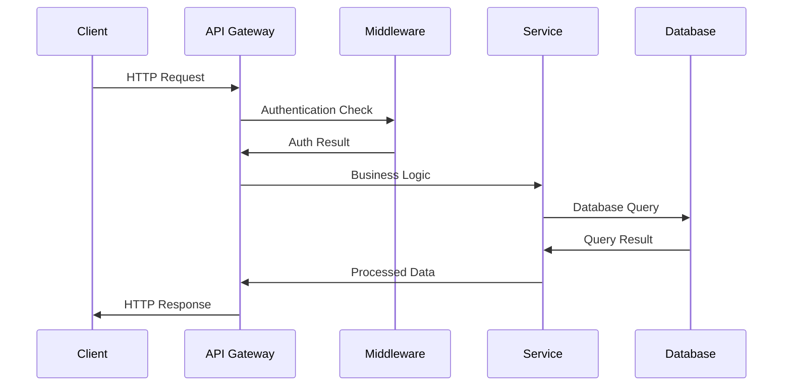

### State Management Flow

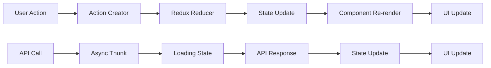

## Database Architecture

### Entity Relationship Diagram

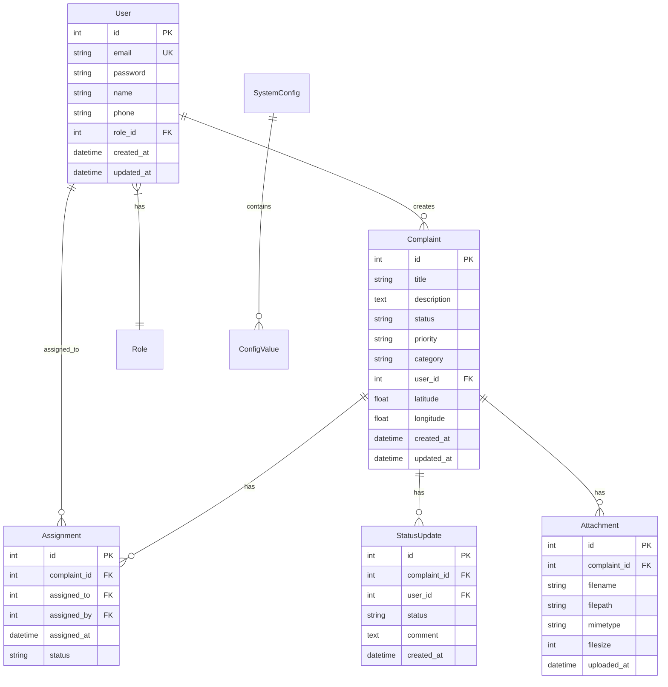

### Database Design Principles

#### Normalization
- Third Normal Form (3NF) compliance
- Elimination of data redundancy
- Proper foreign key relationships
- Indexed columns for performance

#### Data Integrity
- Primary key constraints
- Foreign key constraints
- Check constraints for data validation
- Unique constraints where appropriate

#### Performance Optimization
- Strategic indexing on frequently queried columns
- Query optimization through proper joins
- Connection pooling for concurrent access
- Caching layer for frequently accessed data

## Security Architecture

### Authentication Flow

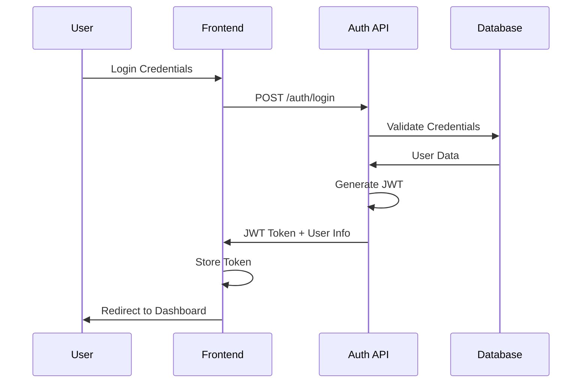

### Authorization Model

#### Role-Based Access Control (RBAC)
- **Admin**: Full system access and configuration
- **Ward Officer**: Area-specific complaint management
- **Maintenance**: Assigned complaint handling
- **Citizen**: Personal complaint submission and tracking

#### Permission Matrix
| Resource | Admin | Ward Officer | Maintenance | Citizen |
|----------|-------|--------------|-------------|---------|
| View All Complaints | ✓ | Area Only | Assigned Only | Own Only |
| Create Complaints | ✓ | ✓ | ✓ | ✓ |
| Assign Complaints | ✓ | ✓ | ✗ | ✗ |
| Update Status | ✓ | ✓ | ✓ | ✗ |
| User Management | ✓ | Limited | ✗ | ✗ |
| System Config | ✓ | ✗ | ✗ | ✗ |

### Data Security

#### Encryption
- Passwords hashed using bcrypt
- JWT tokens for stateless authentication
- HTTPS for all client-server communication
- File uploads validated and sanitized

#### Input Validation
- Server-side validation for all inputs
- SQL injection prevention through parameterized queries
- XSS protection through input sanitization
- CSRF protection for state-changing operations

## Performance Architecture

### Caching Strategy

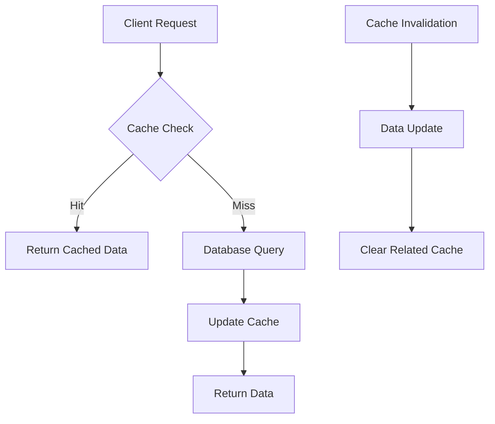

#### Caching Layers
1. **Browser Cache**: Static assets and API responses
2. **CDN Cache**: Public assets and images
3. **Application Cache**: Frequently accessed data
4. **Database Cache**: Query result caching

### Performance Optimization

#### Frontend Optimization
- Code splitting with React.lazy()
- Bundle optimization with Vite
- Image optimization and lazy loading
- Memoization of expensive computations

#### Backend Optimization
- Database query optimization
- Connection pooling
- Response compression
- Rate limiting to prevent abuse

#### Database Optimization
- Proper indexing strategy
- Query performance monitoring
- Connection pooling
- Read replicas for scaling

## Scalability Architecture

### Horizontal Scaling

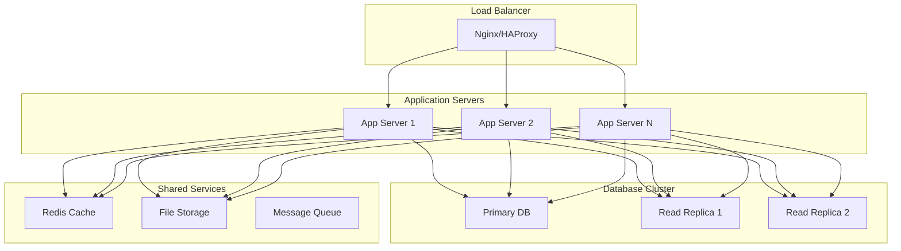

### Microservices Considerations

While currently monolithic, the architecture supports future microservices migration:

#### Service Boundaries
- **User Service**: Authentication and user management
- **Complaint Service**: Complaint processing and workflow
- **Notification Service**: Email and SMS notifications
- **File Service**: File upload and storage management
- **Reporting Service**: Analytics and reporting

#### Communication Patterns
- **Synchronous**: REST APIs for real-time operations
- **Asynchronous**: Message queues for background processing
- **Event-Driven**: Event sourcing for audit trails

## Deployment Architecture

### Environment Structure

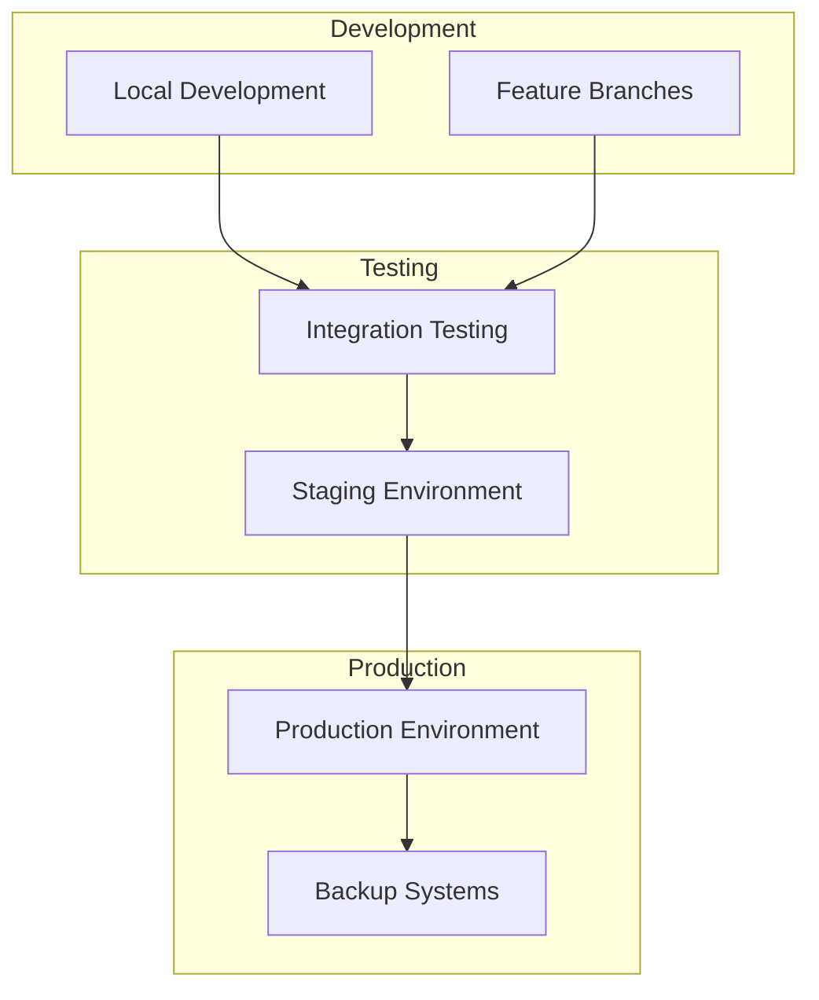

#### Environment Configuration
- **Development**: Local development with hot reloading
- **Staging**: Production-like environment for testing
- **Production**: Live system with monitoring and backups

### CI/CD Pipeline

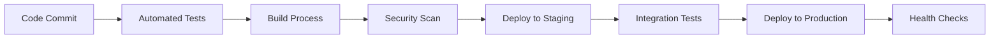

## Monitoring and Observability

### Application Monitoring
- **Metrics**: Response times, error rates, throughput
- **Logging**: Structured logging with correlation IDs
- **Tracing**: Request tracing across components
- **Alerting**: Automated alerts for critical issues

### Health Checks
- **Application Health**: API endpoint availability
- **Database Health**: Connection and query performance
- **External Services**: Third-party service availability
- **Resource Health**: CPU, memory, and disk usage

## See Also

### Within Developer Department
- [API Contracts](./api_contracts.md) - Detailed API specifications and integration patterns
- [Code Guidelines](./code_guidelines.md) - Development standards and best practices
- [I18n Conversion Guide](./i18n_conversion_guide.md) - Internationalization implementation

### Cross-Department References
- [Database Schema Reference](../Database/schema_reference.md) - Detailed database documentation and relationships
- [Database Migration Guidelines](../Database/migration_guidelines.md) - Schema change procedures
- [System Configuration Overview](../System/system_config_overview.md) - Configuration management and hierarchy
- [System Security Standards](../System/security_standards.md) - Security architecture and policies
- [QA Test Cases](../QA/test_cases.md) - Testing procedures for architectural components
- [QA Integration Checklist](../QA/integration_checklist.md) - System integration validation
- [Deployment Linux Guide](../Deployment/linux_deployment.md) - Production deployment architecture
- [Deployment Multi-Environment Setup](../Deployment/multi_env_setup.md) - Environment-specific configurations
- [Onboarding Local Setup](../Onboarding/local_setup.md) - Development environment architecture