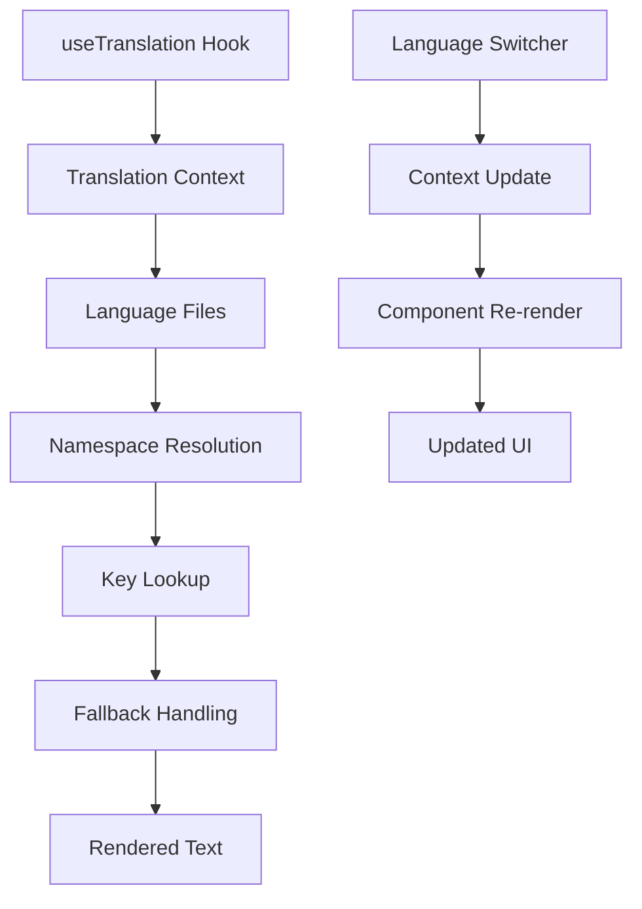
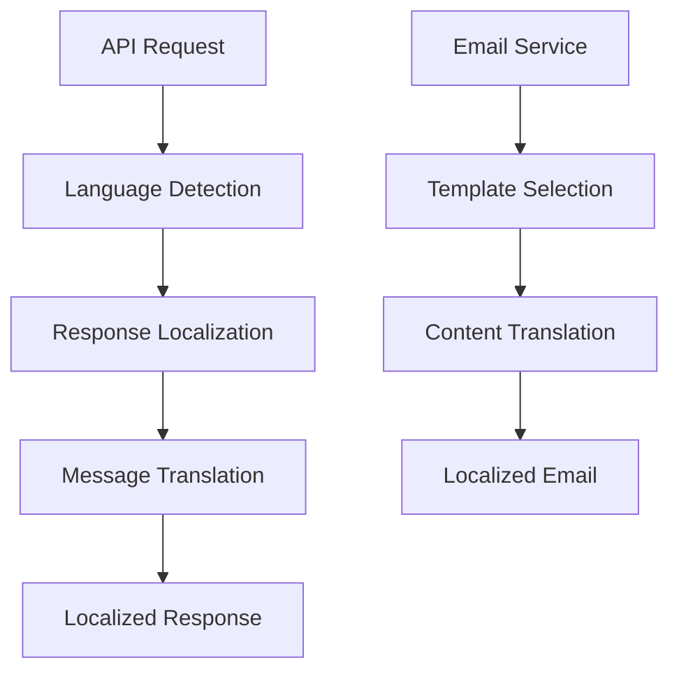

# I18n Conversion Guide

This document provides detailed instructions for implementing and maintaining translations in the complaint management system, ensuring consistent internationalization across all user interfaces and backend responses.

## Overview

The internationalization (i18n) system supports multiple languages with dynamic language switching, role-based translations, and fallback mechanisms. The system currently supports English (en), Hindi (hi), and Malayalam (ml) with the ability to add more languages.

## Translation Architecture

### Frontend I18n System



### Backend Localization System



## Frontend Implementation

### Translation Hook Usage

#### Basic Translation
```typescript
import { useTranslation } from '../hooks/useTranslation';

const MyComponent: React.FC = () => {
  const { t } = useTranslation();
  
  return (
    <div>
      <h1>{t('common.welcome')}</h1>
      <p>{t('dashboard.description')}</p>
    </div>
  );
};
```

#### Translation with Parameters
```typescript
const UserProfile: React.FC<{ user: User }> = ({ user }) => {
  const { t } = useTranslation();
  
  return (
    <div>
      <h2>{t('user.welcome_message', { name: user.name })}</h2>
      <p>{t('user.last_login', { date: formatDate(user.lastLogin) })}</p>
    </div>
  );
};
```

#### Namespace-specific Translations
```typescript
const AdminPanel: React.FC = () => {
  const { t } = useTranslation('admin');
  
  return (
    <div>
      <h1>{t('dashboard.title')}</h1>
      <button>{t('actions.create_user')}</button>
    </div>
  );
};
```

### Translation Key Naming Conventions

#### Hierarchical Structure
```json
{
  "common": {
    "actions": {
      "save": "Save",
      "cancel": "Cancel",
      "delete": "Delete",
      "edit": "Edit"
    },
    "status": {
      "loading": "Loading...",
      "error": "An error occurred",
      "success": "Operation successful"
    }
  },
  "complaints": {
    "form": {
      "title": "Complaint Title",
      "description": "Description",
      "category": "Category"
    },
    "status": {
      "pending": "Pending",
      "assigned": "Assigned",
      "resolved": "Resolved"
    }
  }
}
```

#### Role-based Namespaces
```json
{
  "admin": {
    "dashboard": {
      "title": "Admin Dashboard",
      "stats": {
        "total_complaints": "Total Complaints",
        "pending_complaints": "Pending Complaints"
      }
    }
  },
  "citizen": {
    "dashboard": {
      "title": "My Complaints",
      "submit_new": "Submit New Complaint"
    }
  }
}
```

### Component Conversion Process

#### Before Conversion
```typescript
// ❌ Hardcoded strings
const ComplaintForm: React.FC = () => {
  return (
    <form>
      <h2>Submit a Complaint</h2>
      <label>Title</label>
      <input placeholder="Enter complaint title" />
      <label>Description</label>
      <textarea placeholder="Describe your complaint" />
      <button type="submit">Submit Complaint</button>
    </form>
  );
};
```

#### After Conversion
```typescript
// ✅ Using translation keys
import { useTranslation } from '../hooks/useTranslation';

const ComplaintForm: React.FC = () => {
  const { t } = useTranslation('complaints');
  
  return (
    <form>
      <h2>{t('form.title')}</h2>
      <label>{t('form.fields.title')}</label>
      <input placeholder={t('form.placeholders.title')} />
      <label>{t('form.fields.description')}</label>
      <textarea placeholder={t('form.placeholders.description')} />
      <button type="submit">{t('form.actions.submit')}</button>
    </form>
  );
};
```

### Dynamic Content Translation

#### Lists and Arrays
```typescript
const StatusSelector: React.FC = () => {
  const { t } = useTranslation('complaints');
  
  const statusOptions = [
    { value: 'pending', label: t('status.pending') },
    { value: 'assigned', label: t('status.assigned') },
    { value: 'in_progress', label: t('status.in_progress') },
    { value: 'resolved', label: t('status.resolved') },
  ];
  
  return (
    <select>
      {statusOptions.map(option => (
        <option key={option.value} value={option.value}>
          {option.label}
        </option>
      ))}
    </select>
  );
};
```

#### Conditional Messages
```typescript
const ComplaintStatus: React.FC<{ complaint: Complaint }> = ({ complaint }) => {
  const { t } = useTranslation('complaints');
  
  const getStatusMessage = () => {
    switch (complaint.status) {
      case 'pending':
        return t('messages.status_pending');
      case 'assigned':
        return t('messages.status_assigned', { assignee: complaint.assignedTo?.name });
      case 'resolved':
        return t('messages.status_resolved', { date: formatDate(complaint.resolvedAt) });
      default:
        return t('messages.status_unknown');
    }
  };
  
  return <p className="status-message">{getStatusMessage()}</p>;
};
```

### Form Validation Messages

#### Client-side Validation
```typescript
import { useTranslation } from '../hooks/useTranslation';

const useFormValidation = () => {
  const { t } = useTranslation('validation');
  
  const validateComplaintForm = (data: ComplaintFormData) => {
    const errors: Record<string, string> = {};
    
    if (!data.title || data.title.length < 5) {
      errors.title = t('title_min_length', { min: 5 });
    }
    
    if (!data.description || data.description.length < 10) {
      errors.description = t('description_min_length', { min: 10 });
    }
    
    if (!data.category) {
      errors.category = t('category_required');
    }
    
    return errors;
  };
  
  return { validateComplaintForm };
};
```

### Toast and Notification Messages

#### Success/Error Messages
```typescript
import { useTranslation } from '../hooks/useTranslation';
import { toast } from 'react-toastify';

const useComplaintActions = () => {
  const { t } = useTranslation('complaints');
  
  const createComplaint = async (data: ComplaintFormData) => {
    try {
      await api.createComplaint(data);
      toast.success(t('messages.create_success'));
    } catch (error) {
      toast.error(t('messages.create_error'));
    }
  };
  
  const updateComplaint = async (id: number, data: Partial<ComplaintFormData>) => {
    try {
      await api.updateComplaint(id, data);
      toast.success(t('messages.update_success'));
    } catch (error) {
      toast.error(t('messages.update_error'));
    }
  };
  
  return { createComplaint, updateComplaint };
};
```

## Backend Implementation

### Response Message Localization

#### Controller Implementation
```javascript
const { getTranslation } = require('../utils/i18n');

class ComplaintController {
  static async createComplaint(req, res, next) {
    try {
      const complaint = await ComplaintService.createComplaint(req.body);
      const language = req.headers['accept-language'] || 'en';
      
      res.status(201).json({
        success: true,
        data: complaint,
        message: getTranslation('complaints.create_success', language)
      });
    } catch (error) {
      const language = req.headers['accept-language'] || 'en';
      res.status(400).json({
        success: false,
        message: getTranslation('complaints.create_error', language),
        error: error.message
      });
    }
  }
}
```

#### Translation Utility
```javascript
// server/utils/i18n.js
const fs = require('fs');
const path = require('path');

class I18nService {
  constructor() {
    this.translations = {};
    this.loadTranslations();
  }
  
  loadTranslations() {
    const languages = ['en', 'hi', 'ml'];
    
    languages.forEach(lang => {
      const filePath = path.join(__dirname, `../locales/${lang}.json`);
      if (fs.existsSync(filePath)) {
        this.translations[lang] = JSON.parse(fs.readFileSync(filePath, 'utf8'));
      }
    });
  }
  
  getTranslation(key, language = 'en', params = {}) {
    const keys = key.split('.');
    let translation = this.translations[language];
    
    // Navigate through nested keys
    for (const k of keys) {
      if (translation && typeof translation === 'object') {
        translation = translation[k];
      } else {
        translation = null;
        break;
      }
    }
    
    // Fallback to English if translation not found
    if (!translation && language !== 'en') {
      return this.getTranslation(key, 'en', params);
    }
    
    // Replace parameters in translation
    if (translation && typeof translation === 'string') {
      return this.replaceParams(translation, params);
    }
    
    return key; // Return key if no translation found
  }
  
  replaceParams(text, params) {
    return text.replace(/\{\{(\w+)\}\}/g, (match, param) => {
      return params[param] || match;
    });
  }
}

const i18nService = new I18nService();

module.exports = {
  getTranslation: (key, language, params) => 
    i18nService.getTranslation(key, language, params)
};
```

### Email Template Localization

#### Template Structure
```
server/templates/
├── en/
│   ├── welcome.html
│   ├── complaint-status.html
│   └── password-reset.html
├── hi/
│   ├── welcome.html
│   ├── complaint-status.html
│   └── password-reset.html
└── ml/
    ├── welcome.html
    ├── complaint-status.html
    └── password-reset.html
```

#### Email Service Implementation
```javascript
const { getTranslation } = require('../utils/i18n');
const fs = require('fs');
const path = require('path');

class EmailService {
  static async sendComplaintStatusUpdate(user, complaint, language = 'en') {
    const templatePath = path.join(
      __dirname, 
      `../templates/${language}/complaint-status.html`
    );
    
    let template = fs.readFileSync(templatePath, 'utf8');
    
    // Replace template variables
    template = template
      .replace('{{userName}}', user.name)
      .replace('{{complaintTitle}}', complaint.title)
      .replace('{{status}}', getTranslation(`complaints.status.${complaint.status}`, language))
      .replace('{{updateDate}}', new Date().toLocaleDateString());
    
    const subject = getTranslation('email.complaint_status_subject', language, {
      id: complaint.id
    });
    
    await this.sendEmail({
      to: user.email,
      subject,
      html: template
    });
  }
}
```

### Validation Message Localization

#### Validation Middleware
```javascript
const { body, validationResult } = require('express-validator');
const { getTranslation } = require('../utils/i18n');

const validateComplaint = [
  body('title')
    .isLength({ min: 5, max: 200 })
    .withMessage((value, { req }) => {
      const lang = req.headers['accept-language'] || 'en';
      return getTranslation('validation.title_length', lang, { min: 5, max: 200 });
    }),
  
  body('description')
    .isLength({ min: 10, max: 2000 })
    .withMessage((value, { req }) => {
      const lang = req.headers['accept-language'] || 'en';
      return getTranslation('validation.description_length', lang, { min: 10, max: 2000 });
    }),
  
  body('category')
    .isIn(['infrastructure', 'sanitation', 'utilities'])
    .withMessage((value, { req }) => {
      const lang = req.headers['accept-language'] || 'en';
      return getTranslation('validation.invalid_category', lang);
    }),
];

const handleValidationErrors = (req, res, next) => {
  const errors = validationResult(req);
  if (!errors.isEmpty()) {
    return res.status(400).json({
      success: false,
      message: 'Validation failed',
      errors: errors.array()
    });
  }
  next();
};
```

## Translation File Management

### File Structure
```
client/locales/
├── en.json          # English translations
├── hi.json          # Hindi translations
└── ml.json          # Malayalam translations

server/locales/
├── en.json          # Server-side English translations
├── hi.json          # Server-side Hindi translations
└── ml.json          # Server-side Malayalam translations
```

### Translation File Format

#### Frontend Translation File (client/locales/en.json)
```json
{
  "common": {
    "actions": {
      "save": "Save",
      "cancel": "Cancel",
      "delete": "Delete",
      "edit": "Edit",
      "submit": "Submit",
      "close": "Close"
    },
    "status": {
      "loading": "Loading...",
      "error": "An error occurred",
      "success": "Operation successful",
      "no_data": "No data available"
    },
    "navigation": {
      "dashboard": "Dashboard",
      "complaints": "Complaints",
      "users": "Users",
      "settings": "Settings",
      "logout": "Logout"
    }
  },
  "auth": {
    "login": {
      "title": "Login",
      "email": "Email Address",
      "password": "Password",
      "submit": "Sign In",
      "forgot_password": "Forgot Password?",
      "no_account": "Don't have an account?"
    },
    "register": {
      "title": "Create Account",
      "name": "Full Name",
      "email": "Email Address",
      "password": "Password",
      "confirm_password": "Confirm Password",
      "submit": "Create Account",
      "have_account": "Already have an account?"
    }
  },
  "complaints": {
    "form": {
      "title": "Submit Complaint",
      "fields": {
        "title": "Complaint Title",
        "description": "Description",
        "category": "Category",
        "location": "Location"
      },
      "placeholders": {
        "title": "Enter a brief title for your complaint",
        "description": "Provide detailed description of the issue"
      },
      "actions": {
        "submit": "Submit Complaint",
        "save_draft": "Save as Draft"
      }
    },
    "status": {
      "pending": "Pending",
      "assigned": "Assigned",
      "in_progress": "In Progress",
      "resolved": "Resolved",
      "closed": "Closed"
    },
    "messages": {
      "create_success": "Complaint submitted successfully",
      "create_error": "Failed to submit complaint",
      "update_success": "Complaint updated successfully",
      "update_error": "Failed to update complaint",
      "status_pending": "Your complaint is pending review",
      "status_assigned": "Your complaint has been assigned to {{assignee}}",
      "status_resolved": "Your complaint was resolved on {{date}}"
    }
  },
  "admin": {
    "dashboard": {
      "title": "Admin Dashboard",
      "stats": {
        "total_complaints": "Total Complaints",
        "pending_complaints": "Pending Complaints",
        "resolved_complaints": "Resolved Complaints",
        "active_users": "Active Users"
      }
    },
    "users": {
      "title": "User Management",
      "actions": {
        "create_user": "Create User",
        "edit_user": "Edit User",
        "delete_user": "Delete User"
      }
    }
  },
  "validation": {
    "required": "This field is required",
    "email_invalid": "Please enter a valid email address",
    "password_min_length": "Password must be at least {{min}} characters",
    "title_min_length": "Title must be at least {{min}} characters",
    "description_min_length": "Description must be at least {{min}} characters",
    "category_required": "Please select a category"
  }
}
```

#### Backend Translation File (server/locales/en.json)
```json
{
  "api": {
    "auth": {
      "login_success": "Login successful",
      "login_failed": "Invalid credentials",
      "logout_success": "Logout successful",
      "token_invalid": "Invalid or expired token",
      "access_denied": "Access denied"
    },
    "complaints": {
      "create_success": "Complaint created successfully",
      "create_error": "Failed to create complaint",
      "update_success": "Complaint updated successfully",
      "update_error": "Failed to update complaint",
      "not_found": "Complaint not found",
      "access_denied": "You don't have permission to access this complaint"
    },
    "users": {
      "create_success": "User created successfully",
      "update_success": "User updated successfully",
      "delete_success": "User deleted successfully",
      "not_found": "User not found",
      "email_exists": "Email address already exists"
    }
  },
  "email": {
    "subjects": {
      "welcome": "Welcome to Complaint Management System",
      "complaint_status": "Complaint #{{id}} Status Update",
      "password_reset": "Password Reset Request"
    },
    "content": {
      "welcome_message": "Welcome {{name}}, your account has been created successfully",
      "complaint_assigned": "Your complaint has been assigned to our team",
      "complaint_resolved": "Your complaint has been resolved"
    }
  },
  "validation": {
    "title_length": "Title must be between {{min}} and {{max}} characters",
    "description_length": "Description must be between {{min}} and {{max}} characters",
    "invalid_category": "Please select a valid category",
    "invalid_email": "Please provide a valid email address",
    "password_requirements": "Password must be at least {{min}} characters long"
  }
}
```

### Adding New Languages

#### Step 1: Create Translation Files
```bash
# Create new language files
touch client/locales/ta.json  # Tamil
touch server/locales/ta.json  # Tamil
```

#### Step 2: Update Language Configuration
```typescript
// client/contexts/LanguageContext.tsx
export const SUPPORTED_LANGUAGES = {
  en: 'English',
  hi: 'हिंदी',
  ml: 'മലയാളം',
  ta: 'தமிழ்',  // Add new language
} as const;
```

#### Step 3: Populate Translation Content
Copy the structure from existing language files and translate the content.

## Best Practices

### Translation Key Guidelines

#### Naming Conventions
- Use lowercase with underscores: `user_profile_title`
- Use hierarchical structure: `complaints.form.fields.title`
- Be descriptive: `validation.password_min_length` not `validation.pwd_min`
- Group related keys: All form fields under `form.fields`

#### Key Organization
```json
{
  "feature": {
    "component": {
      "element_type": {
        "specific_key": "Translation"
      }
    }
  }
}
```

Example:
```json
{
  "complaints": {
    "form": {
      "fields": {
        "title": "Title",
        "description": "Description"
      },
      "actions": {
        "submit": "Submit",
        "cancel": "Cancel"
      },
      "validation": {
        "title_required": "Title is required"
      }
    }
  }
}
```

### Performance Optimization

#### Lazy Loading Translations
```typescript
const useTranslation = (namespace?: string) => {
  const [translations, setTranslations] = useState<Record<string, any>>({});
  
  useEffect(() => {
    const loadTranslations = async () => {
      const lang = getCurrentLanguage();
      const module = await import(`../locales/${lang}.json`);
      setTranslations(module.default);
    };
    
    loadTranslations();
  }, [namespace]);
  
  // Implementation
};
```

#### Translation Caching
```typescript
class TranslationCache {
  private cache = new Map<string, any>();
  
  async getTranslations(language: string): Promise<any> {
    if (this.cache.has(language)) {
      return this.cache.get(language);
    }
    
    const translations = await import(`../locales/${language}.json`);
    this.cache.set(language, translations.default);
    return translations.default;
  }
  
  clearCache() {
    this.cache.clear();
  }
}
```

### Testing Translations

#### Unit Testing
```typescript
import { render, screen } from '@testing-library/react';
import { LanguageProvider } from '../contexts/LanguageContext';
import { ComplaintForm } from './ComplaintForm';

describe('ComplaintForm Translations', () => {
  it('should display English text by default', () => {
    render(
      <LanguageProvider>
        <ComplaintForm />
      </LanguageProvider>
    );
    
    expect(screen.getByText('Submit Complaint')).toBeInTheDocument();
  });
  
  it('should display Hindi text when language is changed', () => {
    render(
      <LanguageProvider initialLanguage="hi">
        <ComplaintForm />
      </LanguageProvider>
    );
    
    expect(screen.getByText('शिकायत दर्ज करें')).toBeInTheDocument();
  });
});
```

#### Integration Testing
```typescript
describe('Language Switching', () => {
  it('should update all text when language is changed', async () => {
    render(<App />);
    
    // Change language to Hindi
    const languageSelector = screen.getByRole('combobox', { name: /language/i });
    fireEvent.change(languageSelector, { target: { value: 'hi' } });
    
    await waitFor(() => {
      expect(screen.getByText('डैशबोर्ड')).toBeInTheDocument();
    });
  });
});
```

### Maintenance and Updates

#### Translation Audit
```bash
# Script to find missing translations
node scripts/audit-translations.js
```

```javascript
// scripts/audit-translations.js
const fs = require('fs');
const path = require('path');

const auditTranslations = () => {
  const languages = ['en', 'hi', 'ml'];
  const baseLanguage = 'en';
  
  const baseTranslations = JSON.parse(
    fs.readFileSync(`client/locales/${baseLanguage}.json`, 'utf8')
  );
  
  languages.forEach(lang => {
    if (lang === baseLanguage) return;
    
    const translations = JSON.parse(
      fs.readFileSync(`client/locales/${lang}.json`, 'utf8')
    );
    
    const missingKeys = findMissingKeys(baseTranslations, translations);
    
    if (missingKeys.length > 0) {
      console.log(`Missing keys in ${lang}:`, missingKeys);
    }
  });
};

const findMissingKeys = (base, target, prefix = '') => {
  const missing = [];
  
  Object.keys(base).forEach(key => {
    const fullKey = prefix ? `${prefix}.${key}` : key;
    
    if (!(key in target)) {
      missing.push(fullKey);
    } else if (typeof base[key] === 'object' && typeof target[key] === 'object') {
      missing.push(...findMissingKeys(base[key], target[key], fullKey));
    }
  });
  
  return missing;
};

auditTranslations();
```

#### Automated Translation Updates
```javascript
// scripts/update-translations.js
const updateTranslationFiles = async (newKeys) => {
  const languages = ['en', 'hi', 'ml'];
  
  for (const lang of languages) {
    const filePath = `client/locales/${lang}.json`;
    const translations = JSON.parse(fs.readFileSync(filePath, 'utf8'));
    
    // Add new keys with placeholder values
    newKeys.forEach(key => {
      setNestedValue(translations, key, lang === 'en' ? key : `[${key}]`);
    });
    
    fs.writeFileSync(filePath, JSON.stringify(translations, null, 2));
  }
};
```

## Migration Strategy

### Existing Code Conversion

#### Automated Detection
```bash
# Find hardcoded strings in components
grep -r "\"[A-Z].*\"" client/components/ --include="*.tsx" --include="*.ts"
```

#### Conversion Script
```javascript
// scripts/convert-hardcoded-strings.js
const convertComponent = (filePath) => {
  let content = fs.readFileSync(filePath, 'utf8');
  
  // Find hardcoded strings in JSX
  const jsxStringRegex = />([^<>{]*[A-Za-z][^<>{}]*)</g;
  const matches = content.match(jsxStringRegex);
  
  if (matches) {
    matches.forEach(match => {
      const text = match.slice(1, -1).trim();
      if (text && !text.includes('{') && !text.includes('t(')) {
        const key = generateTranslationKey(text);
        content = content.replace(match, `>{t('${key}')}<`);
      }
    });
  }
  
  fs.writeFileSync(filePath, content);
};
```

### Gradual Migration Approach

#### Phase 1: Core Components
- Navigation and layout components
- Common UI elements (buttons, forms)
- Error and success messages

#### Phase 2: Feature-specific Components
- Complaint management interfaces
- User management interfaces
- Admin panels

#### Phase 3: Backend Integration
- API response messages
- Email templates
- Validation messages

#### Phase 4: Advanced Features
- Dynamic content translation
- Context-aware translations
- Performance optimization

## Troubleshooting

### Common Issues

#### Missing Translation Keys
```typescript
// Add fallback handling
const t = (key: string, params?: Record<string, any>) => {
  const translation = getTranslation(key, params);
  
  if (!translation) {
    console.warn(`Missing translation for key: ${key}`);
    return key; // Return key as fallback
  }
  
  return translation;
};
```

#### Parameter Replacement Issues
```typescript
// Ensure parameters are properly formatted
const t = (key: string, params?: Record<string, any>) => {
  let translation = getTranslation(key);
  
  if (params && translation) {
    Object.keys(params).forEach(param => {
      const regex = new RegExp(`\\{\\{${param}\\}\\}`, 'g');
      translation = translation.replace(regex, String(params[param]));
    });
  }
  
  return translation;
};
```

#### Language Switching Delays
```typescript
// Preload translations
const preloadTranslations = async (languages: string[]) => {
  const promises = languages.map(lang => 
    import(`../locales/${lang}.json`)
  );
  
  await Promise.all(promises);
};
```

## See Also

- [Architecture Overview](./architecture_overview.md) - System architecture and component relationships
- [Code Guidelines](./code_guidelines.md) - Coding standards and best practices
- [API Contracts](./api_contracts.md) - Backend API structure and conventions
- [QA Test Cases](../QA/test_cases.md) - Testing procedures for i18n validation
- [System Configuration](../System/system_config_overview.md) - Configuration management for i18n settings