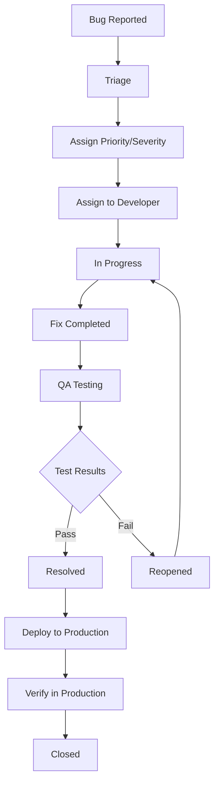

# Bug Reporting

This document outlines effective bug reporting and issue tracking processes to ensure consistent, actionable, and traceable issue management.

## Bug Report Template

### Standard Bug Report Format

```markdown
## Bug Report ID: BUG-[YYYY-MM-DD]-[NUMBER]

**Title**: [Clear, concise description of the issue]

**Severity**: [Critical/High/Medium/Low]

**Priority**: [P1/P2/P3/P4]

**Status**: [New/In Progress/Resolved/Closed/Reopened]

**Reporter**: [Name and contact information]

**Assignee**: [Developer/Team assigned to fix]

**Date Reported**: [YYYY-MM-DD]

**Environment**: [Production/Staging/Development/Local]

**Browser/Platform**: [Chrome 118, Firefox 119, Safari 16, etc.]

**User Role**: [Admin/Ward Officer/Maintenance/Citizen]

**Affected Components**: [Frontend/Backend/Database/API/UI]

### Description
[Detailed description of the issue, including what was expected vs. what actually happened]

### Steps to Reproduce
1. [Step 1]
2. [Step 2]
3. [Step 3]
4. [Result]

### Expected Behavior
[What should have happened]

### Actual Behavior
[What actually happened]

### Screenshots/Videos
[Attach visual evidence if applicable]

### Error Messages
```
[Include exact error messages, stack traces, or console logs]
```

### Additional Information
- **Frequency**: [Always/Sometimes/Rarely/Once]
- **Workaround**: [Any temporary solutions]
- **Related Issues**: [Links to related bugs or features]
- **Test Data Used**: [Specific data that triggers the issue]

### Impact Assessment
[Description of how this affects users and business operations]
```

## Severity and Priority Guidelines

### Severity Levels

#### Critical
- System crashes or becomes completely unusable
- Data loss or corruption occurs
- Security vulnerabilities that expose sensitive data
- Complete failure of core functionality

**Examples**:
- Application won't start
- Database corruption
- Authentication system completely broken
- Payment processing failures

#### High
- Major functionality is broken or severely impacted
- Significant user experience degradation
- Performance issues affecting multiple users
- Important features not working as designed

**Examples**:
- Complaint submission fails
- User roles not working correctly
- Major UI components not displaying
- Email notifications not sending

#### Medium
- Minor functionality issues
- Cosmetic problems that affect usability
- Performance issues affecting individual users
- Non-critical features not working properly

**Examples**:
- Form validation messages unclear
- Minor UI alignment issues
- Slow loading of non-critical components
- Optional features not working

#### Low
- Cosmetic issues with minimal impact
- Enhancement requests
- Documentation errors
- Minor usability improvements

**Examples**:
- Text formatting inconsistencies
- Color scheme improvements
- Tooltip text corrections
- Minor accessibility improvements

### Priority Levels

#### P1 (Immediate)
- Must be fixed before next release
- Blocking critical functionality
- Security vulnerabilities
- Data integrity issues

#### P2 (High)
- Should be fixed in current sprint
- Important functionality affected
- Significant user impact
- Performance degradation

#### P3 (Medium)
- Can be scheduled for upcoming sprint
- Moderate user impact
- Non-critical functionality
- Usability improvements

#### P4 (Low)
- Can be addressed in future releases
- Minimal user impact
- Enhancement requests
- Documentation updates

## Bug Lifecycle

### Status Definitions

1. **New** - Bug reported and awaiting triage
2. **Triaged** - Bug reviewed and assigned priority/severity
3. **Assigned** - Bug assigned to developer/team
4. **In Progress** - Developer actively working on fix
5. **Fixed** - Developer completed fix, awaiting testing
6. **Testing** - QA team validating the fix
7. **Resolved** - Fix validated and ready for release
8. **Closed** - Fix deployed and verified in production
9. **Reopened** - Issue reoccurred or fix was insufficient

### Workflow Process



## Triage Process

### Triage Meeting Schedule
- **Daily Standup**: Review new critical/high priority bugs
- **Weekly Triage**: Comprehensive review of all open bugs
- **Monthly Review**: Analyze bug trends and process improvements

### Triage Criteria

#### Information Completeness
- [ ] Clear reproduction steps provided
- [ ] Environment and browser information included
- [ ] Screenshots or error messages attached
- [ ] Expected vs. actual behavior documented
- [ ] Impact assessment completed

#### Severity Assessment
- [ ] Severity level appropriate for impact
- [ ] Priority aligns with business needs
- [ ] Dependencies identified
- [ ] Workarounds documented (if available)

#### Assignment Criteria
- [ ] Appropriate team/developer assigned
- [ ] Required skills match the issue
- [ ] Workload capacity considered
- [ ] Timeline expectations set

## Bug Categories

### Frontend Issues
- **UI/UX Problems**: Layout, styling, responsiveness
- **Functionality Issues**: Form submissions, navigation, interactions
- **Performance Issues**: Slow loading, memory leaks, rendering problems
- **Accessibility Issues**: Screen reader compatibility, keyboard navigation

### Backend Issues
- **API Problems**: Endpoint failures, incorrect responses, timeout issues
- **Database Issues**: Query performance, data integrity, connection problems
- **Authentication Issues**: Login failures, permission problems, session management
- **Integration Issues**: Third-party service failures, email delivery problems

### Cross-Platform Issues
- **Browser Compatibility**: Inconsistent behavior across browsers
- **Mobile Issues**: Responsive design problems, touch interface issues
- **Performance Issues**: Slow response times, resource utilization problems
- **Security Issues**: Vulnerabilities, data exposure, unauthorized access

## Quality Assurance for Bug Reports

### Before Submitting
- [ ] Verify the issue is reproducible
- [ ] Check if the issue already exists
- [ ] Gather all necessary information
- [ ] Test in multiple environments (if possible)
- [ ] Document clear reproduction steps

### Review Checklist
- [ ] Title clearly describes the issue
- [ ] Severity and priority are appropriate
- [ ] Reproduction steps are clear and complete
- [ ] Expected behavior is well-defined
- [ ] Screenshots/evidence are included
- [ ] Environment information is complete

## Bug Tracking Tools and Integration

### Issue Tracking System
- **Primary Tool**: GitHub Issues / Jira / Azure DevOps
- **Labels**: Use consistent labeling for categorization
- **Milestones**: Link bugs to specific releases
- **Projects**: Organize bugs by feature or component

### Integration with Development Workflow
- Link bug reports to pull requests
- Automatically update status based on code commits
- Include bug IDs in commit messages
- Track time spent on bug fixes

### Reporting and Analytics
- Weekly bug reports by severity and component
- Monthly trend analysis
- Resolution time metrics
- Recurring issue identification

## Communication Guidelines

### Internal Communication
- **Daily Updates**: Critical and high-priority bugs
- **Weekly Reports**: Overall bug status and trends
- **Release Notes**: Include fixed bugs in release documentation
- **Post-Mortem**: Analyze critical bugs and process improvements

### External Communication
- **User Notifications**: Inform users of known issues and workarounds
- **Status Updates**: Regular updates on fix progress for critical issues
- **Release Notes**: Communicate bug fixes to end users
- **Support Documentation**: Update help documentation with known issues

## Best Practices

### For Bug Reporters
1. **Be Specific**: Provide exact steps and clear descriptions
2. **Include Context**: Environment, user role, and system state
3. **Attach Evidence**: Screenshots, logs, and error messages
4. **Test Thoroughly**: Verify reproduction steps before submitting
5. **Follow Up**: Provide additional information when requested

### For Developers
1. **Acknowledge Quickly**: Respond to bug assignments promptly
2. **Ask Questions**: Request clarification when needed
3. **Document Fixes**: Explain what was changed and why
4. **Test Thoroughly**: Verify fix doesn't introduce new issues
5. **Update Status**: Keep bug status current throughout development

### For QA Team
1. **Verify Reproduction**: Confirm bug exists before assignment
2. **Test Fixes Thoroughly**: Validate fixes in multiple scenarios
3. **Regression Testing**: Ensure fixes don't break existing functionality
4. **Document Results**: Provide clear pass/fail criteria
5. **Close Properly**: Verify fixes in production before closing

## Metrics and KPIs

### Bug Tracking Metrics
- **Bug Discovery Rate**: New bugs reported per week/month
- **Resolution Time**: Average time from report to fix
- **Reopen Rate**: Percentage of bugs that are reopened
- **Severity Distribution**: Breakdown of bugs by severity level
- **Component Analysis**: Which components have the most bugs

### Quality Metrics
- **Escape Rate**: Bugs found in production vs. testing
- **Fix Quality**: Percentage of bugs fixed correctly on first attempt
- **Customer Impact**: User-reported vs. internally discovered bugs
- **Trend Analysis**: Bug rates over time and by release

## See Also

### Within QA Department
- [Test Cases](./test_cases.md) - Standardized testing procedures for bug validation
- [Integration Checklist](./integration_checklist.md) - Integration testing to prevent bugs
- [Release Validation](./release_validation.md) - Pre-production validation procedures

### Cross-Department References
- [Developer Code Guidelines](../Developer/code_guidelines.md) - Code quality standards to prevent bugs
- [Developer Architecture Overview](../Developer/architecture_overview.md) - System architecture for bug analysis
- [Developer API Contracts](../Developer/api_contracts.md) - API-related bug investigation
- [System Logging & Monitoring](../System/logging_monitoring.md) - Production monitoring for early bug detection
- [System Security Standards](../System/security_standards.md) - Security-related bug reporting
- [Database Performance Tuning](../Database/performance_tuning.md) - Database-related bug analysis
- [Database Migration Guidelines](../Database/migration_guidelines.md) - Migration-related issue tracking
- [Deployment Multi-Environment Setup](../Deployment/multi_env_setup.md) - Environment-specific bug tracking
- [Onboarding Debugging Tips](../Onboarding/debugging_tips.md) - Development debugging procedures