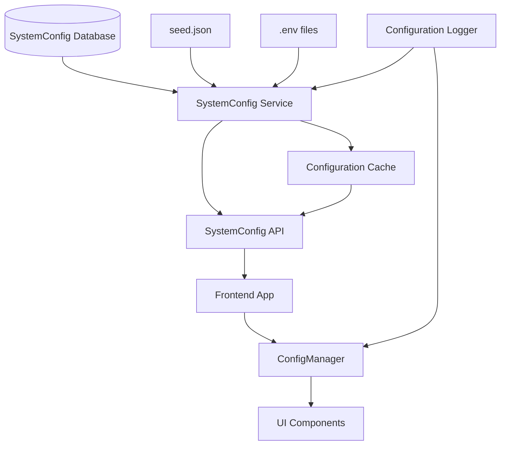

# Configuration Architecture Guide

**Version:** 2.0  
**Last Updated:** October 30, 2025  
**Status:** Production Ready  

## Overview

This document describes the new centralized configuration architecture implemented as part of the System Configuration Integrity Audit. The system now ensures that database-driven configuration values are properly propagated to the frontend without silent fallbacks to hardcoded defaults.

## Architecture Components

### 1. Configuration Flow



### 2. Priority Chain

1. **Primary Source:** Database SystemConfig table (isActive = true)
2. **Secondary Source:** seed.json (with logging)
3. **Tertiary Source:** Environment variables (emergency fallback with warnings)
4. **Final Fallback:** Hardcoded defaults (with error logging)

## Backend Components

### SystemConfig Service

**Location:** `server/controller/systemConfigController.js`

**Key Functions:**
- `getPublicSystemSettings()` - Public configuration endpoint
- `getActiveSystemConfig(key, defaultValue)` - Get single config value
- `getActiveSystemConfigs(keys)` - Get multiple config values
- `performConfigurationAudit()` - Audit configuration integrity
- `performConfigurationValidation()` - Validate configuration completeness

**Features:**
- Database connectivity checking
- Automatic fallback to seed.json when database unavailable
- Comprehensive error handling and logging
- Configuration caching with invalidation
- Source tracking and metadata

### API Endpoints

#### Public Configuration
```
GET /api/system-config/public
```

**Response Format:**
```json
{
  "success": true,
  "message": "Public system settings retrieved successfully",
  "data": {
    "config": [
      {
        "key": "APP_NAME",
        "value": "Ahmedabad CMS",
        "description": "Application name",
        "type": "string",
        "enabled": true
      }
    ],
    "complaintTypes": []
  },
  "meta": {
    "source": "database",
    "databaseAvailable": true
  }
}
```

#### Admin Configuration
```
GET /api/system-config/audit          # Configuration audit
GET /api/system-config/validate       # Configuration validation
GET /api/system-config/canonical-keys # Canonical key mapping
```

## Frontend Components

### ConfigManager

**Location:** `client/lib/ConfigManager.ts`

**Key Methods:**
```typescript
class ConfigManager {
  // Initialization
  async initialize(): Promise<void>
  async refreshConfig(): Promise<void>
  
  // Configuration access
  getConfig(key: string, defaultValue?: any): any
  getAppName(): string
  getBrandingConfig(): BrandingConfig
  getContactInfo(): ContactInfo
  getThemeConfig(): ThemeConfig
  
  // Validation and debugging
  validateConfigIntegrity(): ConfigValidationResult
  getConfigSource(key: string): ConfigSource
  getDebugInfo(): ConfigDebugInfo
  logMissingConfig(key: string, component: string): void
}
```

**Features:**
- Centralized configuration access
- Automatic API initialization
- Fallback handling with logging
- Configuration validation
- Source tracking and debugging
- Type-safe configuration access

### ConfigurationProvider

**Location:** `client/components/ConfigurationProvider.tsx`

**Usage:**
```tsx
import { ConfigurationProvider } from './components/ConfigurationProvider';

function App() {
  return (
    <ConfigurationProvider>
      <YourAppComponents />
    </ConfigurationProvider>
  );
}
```

**Features:**
- React Context for configuration state
- Loading state management
- Error boundary integration
- Configuration refresh capabilities
- Debug information access

### Configuration Hooks

**Location:** `client/hooks/useConfigManager.ts`

```typescript
import { useConfiguration } from '../components/ConfigurationProvider';

function MyComponent() {
  const { getConfig, getAppName, isLoading } = useConfiguration();
  
  const appName = getAppName();
  const logoUrl = getConfig('APP_LOGO_URL');
  
  return <div>{appName}</div>;
}
```

## Configuration Keys

### Core Application Settings

| Key | Description | Type | Example |
|-----|-------------|------|---------|
| `APP_NAME` | Application display name | string | "Ahmedabad CMS" |
| `APP_LOGO_URL` | Application logo URL | string | "uploads/logo.png" |
| `APP_LOGO_SIZE` | Logo size (small/medium/large) | string | "large" |
| `COMPLAINT_ID_PREFIX` | Complaint ID prefix | string | "AMC" |
| `COMPLAINT_ID_LENGTH` | Complaint ID number length | number | 5 |

### Contact Information

| Key | Description | Type | Example |
|-----|-------------|------|---------|
| `ADMIN_EMAIL` | Administrator email | string | "admin@ahmedabadcity.gov.in" |
| `CONTACT_EMAIL` | Public contact email | string | "support@ahmedabadcity.gov.in" |
| `CONTACT_HELPLINE` | Support phone number | string | "+91-79-2658-4801" |
| `CONTACT_OFFICE_HOURS` | Office hours | string | "Monday to Friday: 9:00 AM - 5:00 PM" |
| `CONTACT_OFFICE_ADDRESS` | Office address | string | "Ahmedabad Municipal Corporation..." |

### System Behavior

| Key | Description | Type | Example |
|-----|-------------|------|---------|
| `CITIZEN_REGISTRATION_ENABLED` | Allow citizen registration | boolean | true |
| `GUEST_COMPLAINT_ENABLED` | Allow guest complaints | boolean | true |
| `AUTO_ASSIGN_COMPLAINTS` | Auto-assign complaints | boolean | true |
| `MAINTENANCE_MODE` | System maintenance mode | boolean | false |
| `DEFAULT_SLA_HOURS` | Default SLA in hours | number | 48 |

### Notification Settings

| Key | Description | Type | Example |
|-----|-------------|------|---------|
| `EMAIL_NOTIFICATIONS_ENABLED` | Enable email notifications | boolean | true |
| `SMS_NOTIFICATIONS_ENABLED` | Enable SMS notifications | boolean | false |
| `NOTIFICATION_SETTINGS` | Notification preferences | json | {"email":true,"sms":false} |

### Map Configuration

| Key | Description | Type | Example |
|-----|-------------|------|---------|
| `MAP_DEFAULT_LAT` | Default map latitude | number | 23.0225 |
| `MAP_DEFAULT_LNG` | Default map longitude | number | 72.5714 |
| `MAP_SEARCH_PLACE` | Map search context | string | "Ahmedabad, Gujarat, India" |
| `SERVICE_AREA_BOUNDARY` | Service area GeoJSON | json | {"type":"Polygon",...} |

## Usage Patterns

### Component Configuration Access

**✅ Correct Usage:**
```tsx
import { useConfiguration } from '../components/ConfigurationProvider';

function MyComponent() {
  const { getConfig, getAppName } = useConfiguration();
  
  return (
    <div>
      <h1>{getAppName()}</h1>
      <p>Contact: {getConfig('CONTACT_EMAIL')}</p>
    </div>
  );
}
```

**❌ Incorrect Usage:**
```tsx
// Don't use hardcoded values
function MyComponent() {
  return <h1>Smart City CMS</h1>; // ❌ Hardcoded
}

// Don't access process.env directly
function MyComponent() {
  return <h1>{process.env.APP_NAME}</h1>; // ❌ Direct env access
}
```

### Backend Configuration Access

**✅ Correct Usage:**
```javascript
import { getActiveSystemConfig } from '../controller/systemConfigController.js';

// Get single configuration
const appName = await getActiveSystemConfig('APP_NAME', 'Default App');

// Get multiple configurations
const configs = await getActiveSystemConfigs(['APP_NAME', 'CONTACT_EMAIL']);
```

**❌ Incorrect Usage:**
```javascript
// Don't use hardcoded values
const appName = 'Smart City CMS'; // ❌ Hardcoded

// Don't access process.env directly for app config
const appName = process.env.APP_NAME; // ❌ Direct env access
```

## Error Handling

### Configuration Loading Errors

The system handles various error scenarios gracefully:

1. **Database Unavailable:** Falls back to seed.json with warning logs
2. **API Timeout:** Uses cached values with staleness indicators
3. **Invalid Configuration:** Uses defaults with error notifications
4. **Missing Keys:** Logs missing keys and uses fallback chain

### Error Logging

All configuration errors are logged with structured information:

```javascript
// Example error log
{
  level: 'error',
  message: 'ConfigManager: Failed to load configuration from API',
  error: 'Network timeout',
  timestamp: '2025-10-30T19:40:32.148Z',
  source: 'ConfigManager.initialize'
}
```

## Monitoring and Debugging

### Configuration Debug Information

Access debug information in development:

```typescript
const debugInfo = configManager.getDebugInfo();
console.log('Configuration Debug Info:', {
  loadTime: debugInfo.loadTime,
  source: debugInfo.source,
  fallbacksUsed: debugInfo.fallbacksUsed,
  apiResponseTime: debugInfo.apiResponseTime,
  configCount: debugInfo.configCount
});
```

### Configuration Validation

Validate configuration integrity:

```typescript
const validation = configManager.validateConfigIntegrity();
if (!validation.isValid) {
  console.error('Configuration issues:', validation.missingKeys);
}
```

### Performance Monitoring

Monitor configuration performance:

- API response times
- Configuration load times
- Cache hit rates
- Fallback usage frequency

## Deployment Considerations

### Environment Setup

1. **Database Configuration:** Ensure SystemConfig table is populated
2. **API Endpoints:** Verify `/api/system-config/public` is accessible
3. **Environment Variables:** Set required environment variables
4. **Seed Data:** Ensure seed.json contains fallback configurations

### Production Checklist

- [ ] Database contains customized configuration values
- [ ] API endpoints return correct values
- [ ] Frontend displays database values (not defaults)
- [ ] Fallback mechanisms work correctly
- [ ] Logging is configured properly
- [ ] Performance monitoring is in place

### Migration from Legacy System

1. **Audit existing hardcoded values** using audit tools
2. **Migrate values to database** using migration scripts
3. **Update components** to use ConfigManager
4. **Test configuration flow** end-to-end
5. **Validate fallback behavior** in various scenarios

## Troubleshooting

### Common Issues

#### Frontend Shows Default Values

**Symptoms:** Frontend displays "NLC-CMS" instead of "Ahmedabad CMS"

**Diagnosis:**
```bash
# Check API endpoint
curl http://localhost:4005/api/system-config/public

# Check database values
node -e "
import { getPrisma } from './server/db/connection.dev.js';
const prisma = getPrisma();
prisma.systemConfig.findMany({ where: { key: 'APP_NAME' } })
  .then(console.log)
  .finally(() => process.exit(0));
"
```

**Solutions:**
1. Verify database connectivity
2. Check API endpoint accessibility
3. Ensure ConfigurationProvider wraps app
4. Verify component uses ConfigManager

#### Configuration Not Loading

**Symptoms:** Configuration loading indefinitely or failing

**Diagnosis:**
```javascript
// Check ConfigManager status
console.log('Config initialized:', configManager.isConfigInitialized());
console.log('Config stats:', configManager.getConfigStats());
```

**Solutions:**
1. Check network connectivity to API
2. Verify API endpoint is running
3. Check browser console for errors
4. Validate API response format

#### Fallbacks Being Used

**Symptoms:** Logs show fallback usage when database is available

**Diagnosis:**
```bash
# Run configuration validation
node scripts/validate-system-config-integration.js
```

**Solutions:**
1. Check database connectivity
2. Verify configuration keys exist in database
3. Ensure configurations are marked as active
4. Check API endpoint implementation

## Testing

### Automated Tests

Run configuration tests:

```bash
# Integration validation
node scripts/validate-system-config-integration.js

# Frontend configuration tests
node scripts/test-frontend-config-display.js

# Performance tests
npm run test:systemconfig:performance
```

### Manual Testing

1. **Database Values:** Verify database contains correct values
2. **API Response:** Test API endpoint returns database values
3. **Frontend Display:** Check frontend shows database values
4. **Fallback Behavior:** Test with database unavailable
5. **Configuration Refresh:** Test configuration refresh functionality

## Best Practices

### Development

1. **Always use ConfigManager** for configuration access
2. **Never hardcode configuration values** in components
3. **Handle loading states** properly in components
4. **Log configuration errors** for debugging
5. **Test fallback scenarios** during development

### Production

1. **Monitor configuration performance** regularly
2. **Set up alerts** for configuration failures
3. **Backup configuration data** regularly
4. **Document configuration changes** properly
5. **Test configuration updates** before deployment

## Migration Guide

### From Legacy System

If migrating from a system with hardcoded values:

1. **Identify hardcoded values** using grep/search
2. **Add values to database** via SystemConfig table
3. **Update components** to use ConfigManager
4. **Test thoroughly** in development
5. **Deploy with monitoring** enabled

### Configuration Updates

To update configuration values:

1. **Update database** via admin interface or SQL
2. **Test changes** in staging environment
3. **Deploy to production** with monitoring
4. **Verify changes** are reflected in frontend
5. **Monitor for issues** post-deployment

---

**Document Version:** 2.0  
**Last Updated:** October 30, 2025  
**Next Review:** January 30, 2026