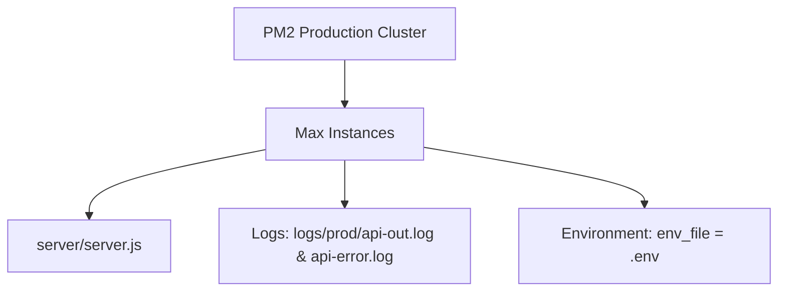
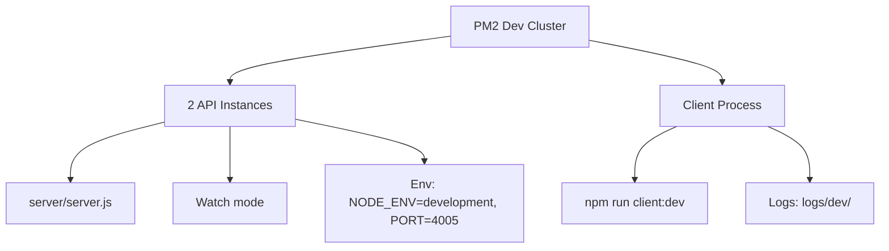

# PM2 Ecosystem & Environment Strategy (Urban-Voice)

This guide explains how the Urban-voice (Fix_Smart_CMS) platform separates runtime environments, manages PM2 ecosystem files, and controls environment variable loading for secure deployments.

## 🎯 Architecture Overview

Urban-voice supports three primary environments that share the same Node.js codebase while targeting different infrastructure requirements.

| Environment | Database | Primary Purpose |
|-------------|----------|-----------------|
| Development | Local PostgreSQL (Docker or native) | Local development with hot reload and debugging |
| QA / Staging | Dedicated PostgreSQL schema | Production-like validation with verbose logging |
| Production | Hardened PostgreSQL instance | Live traffic with optimized performance |

Each environment can run from the same repository by combining PM2 ecosystem files with environment-specific `.env` manifests.

## ⚙️ PM2 Ecosystem Configuration

Urban-voice keeps its PM2 configurations at the repository root:

- `ecosystem.prod.config.cjs` – Production cluster profile (checked in)
- `ecosystem.dev.config.cjs` – Development cluster profile (checked in)
- `ecosystem.qa.config.cjs` – Optional QA profile (create by copying production template)

### Production (`ecosystem.prod.config.cjs`)



Key characteristics verified in the committed file:

- **Cluster mode** uses `instances: "max"` to scale across all CPU cores.
- **Auto-healing** restarts on crash, enforces `max_memory_restart: "1G"`, and performs a nightly `cron_restart` at 02:00.
- **Environment loading** pulls secrets from `.env` (override with any filename by editing the `env_file` property).
- **Node.js tuning** applies `--max-old-space-size=2048 --optimize-for-size` for memory stability.
- **Logging** streams JSON logs into `logs/prod/` (`api-out.log`, `api-error.log`, `api-combined.log`). Ensure this directory exists before start-up.

### Development (`ecosystem.dev.config.cjs`)



Highlights from the file:

- Launches **two backend instances** plus a **client dev server** for Vite hot reload.
- Watches the `server/` and `client/` directories for live reload while ignoring `node_modules`, `dist`, and generated assets.
- Loads defaults from `.env.development` (create from `.env` if it does not exist yet).
- Maintains lighter resource limits (`max_memory_restart: "600M"`) appropriate for laptops and dev VMs.

### QA (`ecosystem.qa.config.cjs`)

A QA ecosystem file is not tracked in Git, but teams can create it with:

```bash
cp ecosystem.prod.config.cjs ecosystem.qa.config.cjs
```

Recommended adjustments:

- Set `name: "NLC-CMS-qa"` and `env_file: ".env.qa"`.
- Reduce `instances` to `2` for staging servers.
- Point log paths to `logs/qa/` for clean separation.
- Enable verbose diagnostics by adding `env: { DEBUG: "urban-voice:*" }` inside the process definition.

## 🗂️ Environment Variable Management

Urban-voice reads environment variables from `.env` files using Node's `dotenv` package. All environments share the same key set; only the values differ.

| File | Typical Location | Purpose |
|------|------------------|---------|
| `.env` | Repository root | Default production secrets (deployed via PM2 `env_file` or systemd export) |
| `.env.development` | Repository root | Developer-friendly overrides; used by `ecosystem.dev.config.cjs` |
| `.env.qa` | Repository root | QA/staging credentials and feature flags |
| `.env.production` | Optional alias | Convenience copy if you prefer storing production secrets separately |

### Template Workflow

1. Copy `.env` to the target environment file:
   ```bash
   cp .env .env.production
   cp .env .env.development
   cp .env .env.qa
   ```
2. Replace sensitive values per environment:
   - `DATABASE_URL` – unique database/schema per environment.
   - `JWT_SECRET` – generate a fresh secret (`openssl rand -hex 32`).
   - `EMAIL_PASS` – environment-specific SMTP credentials.
   - `CLIENT_URL`, `CORS_ORIGIN` – match the corresponding frontend URLs.
   - `INIT_DB`, `DESTRUCTIVE_SEED` – set to `true` only during initial provisioning.
3. Confirm files are excluded from Git (`.env*` patterns are already ignored) and secure them on servers (`chmod 600 .env.production`).

### Runtime Loader Example

Applications can load the correct file dynamically:

```javascript
import dotenv from "dotenv";
import path from "path";

const envFile = `.env.${process.env.NODE_ENV || "development"}`;
dotenv.config({ path: path.resolve(process.cwd(), envFile) });
console.log(`✅ Loaded ${envFile}`);
```

This pattern aligns with the `env_file` options in the PM2 configs.

## 📂 Directory & File Layout

```
/opt/urban-voice/
├── .env                     # Default production file referenced by PM2
├── .env.qa                  # Optional QA manifest
├── .env.development         # Developer settings
├── ecosystem.prod.config.cjs
├── ecosystem.dev.config.cjs
├── ecosystem.qa.config.cjs  # Created from template when needed
├── logs/
│   ├── prod/
│   ├── qa/
│   └── dev/
├── uploads/
└── server/
```

Keep log directories writable by the PM2 user and add them to your backup or log shipping strategy.

## 🧩 PM2 Process Management

Common lifecycle commands once the ecosystem file is ready:

```bash
pm2 start ecosystem.prod.config.cjs
pm2 list
pm2 monit
pm2 logs NLC-CMS --lines 100
```

Other helpful operations:

- `pm2 restart NLC-CMS`
- `pm2 reload NLC-CMS` (zero downtime)
- `pm2 stop NLC-CMS`
- `pm2 delete NLC-CMS`
- `pm2 scale NLC-CMS 6`
- `pm2 save`
- `pm2 startup`
- `pm2 resurrect`

## 🗄️ Database Provisioning Recipes

### Production

```bash
sudo -u postgres createdb nlc_cms_prod
sudo -u postgres createuser nlc_cms_user
psql -c "ALTER USER nlc_cms_user PASSWORD 'secure_password';"
psql -d nlc_cms_prod -c "GRANT ALL PRIVILEGES ON DATABASE nlc_cms_prod TO nlc_cms_user;"
npm run db:generate
npm run db:push
npm run db:seed
```

### QA

```bash
sudo -u postgres createdb nlc_cms_qa
psql -d nlc_cms_qa -c "GRANT ALL PRIVILEGES ON DATABASE nlc_cms_qa TO nlc_cms_user;"
npm run db:generate
npm run db:push
npm run db:seed
```

Replace usernames, passwords, and database names with your environment-specific values.

## 📄 Log Management

The production ecosystem relies on Winston logging with optional rotation. A typical configuration looks like:

```javascript
import winston from "winston";
import DailyRotateFile from "winston-daily-rotate-file";
import { env } from "./environment.js";

const logDir = `logs/${env.NODE_ENV}`;
const logger = winston.createLogger({
  level: env.LOG_LEVEL,
  transports: [
    new winston.transports.Console({ format: winston.format.simple() }),
    ...(env.LOG_TO_FILE ? [
      new DailyRotateFile({
        dirname: logDir,
        filename: "%DATE%-app.log",
        maxSize: "20m",
        maxFiles: "30d",
        zippedArchive: true,
      })
    ] : []),
  ],
});

export default logger;
```

Tips:

- Rotate logs daily, compress archives, and retain ~30 days.
- Run `pm2 flush` after archival to clear in-memory log buffers.
- Forward `logs/prod/` to your SIEM or centralized logging solution.

## 🔒 Security Considerations

- Limit read access to `.env*` files (`chmod 600` and owned by the PM2 user).
- Keep secrets out of Git – the repository already ignores `.env*` files.
- Use distinct JWT secrets and database credentials per environment.
- Consider a secret manager (AWS Secrets Manager, HashiCorp Vault, etc.) for production deployments.

## 🛠️ Troubleshooting

| Symptom | Check |
|---------|-------|
| PM2 process stuck in `errored` | `pm2 logs <name>` for stack trace, verify `.env` permissions |
| Environment not loading | Confirm `env_file` path and run `node -e "console.log(process.env.DATABASE_URL)"` |
| Database connection failures | Test using `psql` with the same DSN or run `npm run db:validate` |
| Memory restarts | Increase `max_memory_restart` or review queries/logging volume |

---

*Last updated: October 2025*
