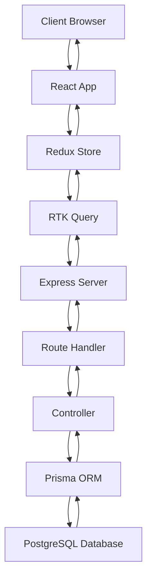
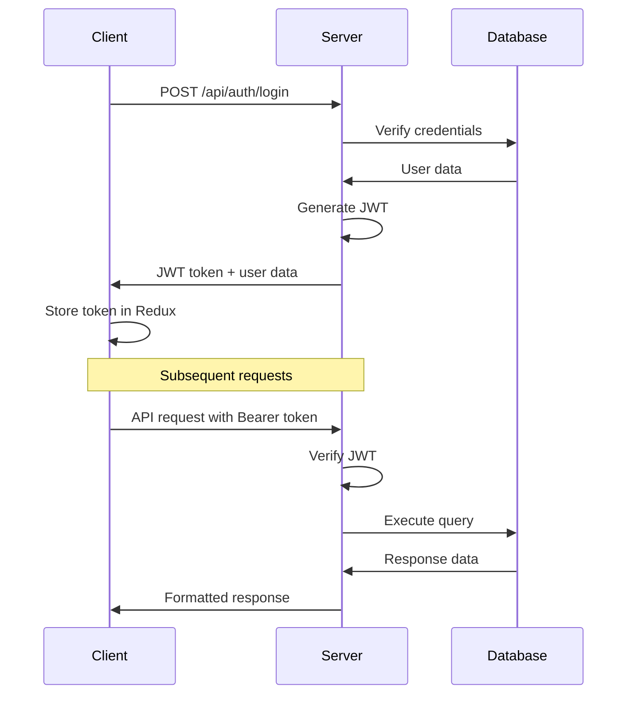

# Architecture Overview

## System Architecture

NLC-CMS is a modern, full-stack web application built with a **client-server architecture** using React for the frontend and Node.js/Express for the backend, with PostgreSQL as the production database.

## Technology Stack

### Frontend (Client)
- **Framework**: React 18.2.0 with TypeScript
- **Build Tool**: Vite 7.1.3 with Hot Module Replacement (HMR)
- **UI Framework**: TailwindCSS + Radix UI components
- **State Management**: Redux Toolkit with RTK Query for API calls
- **Routing**: React Router DOM v6
- **Maps**: Leaflet with React-Leaflet for geographic features
- **Forms**: React Hook Form with Zod validation
- **Internationalization**: i18next with react-i18next
- **Testing**: Vitest + Testing Library + Cypress

### Backend (Server)
- **Runtime**: Node.js (>=18.0.0) with ES Modules
- **Framework**: Express.js with middleware stack
- **Database ORM**: Prisma 6.16.3 with PostgreSQL
- **Authentication**: JWT-based with bcryptjs for password hashing
- **File Upload**: Multer with local file storage
- **Email**: Nodemailer for notifications
- **Logging**: Winston with daily log rotation
- **API Documentation**: Swagger/OpenAPI 3.0
- **Security**: Helmet, CORS, Rate Limiting

### Database
- **Production**: PostgreSQL with Prisma ORM
- **Development**: SQLite for local development
- **Schema Management**: Prisma migrations with separate dev/prod schemas
- **Seeding**: Automated seed scripts for both environments

### DevOps & Deployment
- **Process Manager**: PM2 with ecosystem configuration
- **Build System**: TypeScript compilation + Vite bundling
- **Environment Management**: dotenv with separate .env files
- **Logging**: Structured logging with Winston
- **Monitoring**: Health check endpoints and performance monitoring

## System Components

### 1. Client Application (`/client`)
```
client/
├── components/          # Reusable UI components
│   ├── ui/             # Base UI components (Radix UI)
│   ├── forms/          # Form components
│   ├── layouts/        # Layout components
│   └── charts/         # Data visualization
├── pages/              # Route-based page components
├── store/              # Redux store and slices
│   ├── api/           # RTK Query API definitions
│   ├── slices/        # Redux slices
│   └── resources/     # Resource management
├── hooks/              # Custom React hooks
├── utils/              # Utility functions
├── contexts/           # React contexts
└── types/              # TypeScript type definitions
```

### 2. Server Application (`/server`)
```
server/
├── controller/         # Business logic controllers
├── routes/            # Express route definitions
├── middleware/        # Custom middleware
├── model/             # Data models (Prisma-based)
├── db/                # Database connection and utilities
├── utils/             # Server utilities
├── config/            # Configuration management
└── scripts/           # Database and utility scripts
```

### 3. Shared Code (`/shared`)
```
shared/
├── api.ts             # Shared API types and interfaces
└── api.js             # Legacy JavaScript API utilities
```

### 4. Database Schema (`/prisma`)
```
prisma/
├── schema.prisma      # Main production schema
├── schema.dev.prisma  # Development schema
├── schema.prod.prisma # Production schema
├── migrations/        # Database migrations
├── seed.dev.js        # Development seed data
├── seed.prod.js       # Production seed data
└── migration-utils.js # Migration utilities
```

## Data Flow Architecture

### Request Flow


### Authentication Flow


## Core Modules

### 1. Authentication & Authorization
- **JWT-based authentication** with role-based access control
- **User roles**: CITIZEN, WARD_OFFICER, MAINTENANCE_TEAM, ADMINISTRATOR, GUEST
- **OTP verification** for guest users and password resets
- **Session management** with token refresh capabilities

### 2. Complaint Management
- **Complaint lifecycle**: REGISTERED → ASSIGNED → IN_PROGRESS → RESOLVED → CLOSED
- **Priority levels**: LOW, MEDIUM, HIGH, CRITICAL
- **SLA tracking** with automated status updates
- **File attachments** with unified attachment system
- **Geographic routing** based on ward boundaries

### 3. User Management
- **Multi-role user system** with ward-based assignment
- **Profile management** with avatar support
- **Department-based organization** for staff users
- **Activity tracking** and audit logs

### 4. Geographic Integration
- **Ward-based complaint routing** with automatic assignment
- **Sub-zone management** for granular location tracking
- **Interactive maps** using Leaflet for location selection
- **Coordinate storage** with latitude/longitude support

### 5. Notification System
- **Multi-channel notifications**: Email, SMS, In-App
- **Real-time updates** for complaint status changes
- **Automated SLA alerts** for overdue complaints
- **User preference management** for notification settings

### 6. Reporting & Analytics
- **Dashboard widgets** with real-time data
- **Complaint analytics** with filtering and export
- **Performance metrics** for staff and departments
- **SLA compliance reporting** with trend analysis

## Security Architecture

### 1. Authentication Security
- **JWT tokens** with configurable expiration
- **Password hashing** using bcryptjs with salt rounds
- **Rate limiting** to prevent brute force attacks
- **CORS configuration** for cross-origin requests

### 2. Data Security
- **Input validation** using Zod schemas
- **SQL injection prevention** through Prisma ORM
- **File upload security** with type and size restrictions
- **Environment variable protection** for sensitive data

### 3. API Security
- **Helmet.js** for security headers
- **Request logging** for audit trails
- **Error handling** without sensitive data exposure
- **Role-based endpoint protection** with middleware

## Performance Optimization

### 1. Frontend Optimization
- **Code splitting** with dynamic imports
- **Lazy loading** for routes and components
- **Bundle optimization** with Vite's tree shaking
- **Caching strategies** for API responses

### 2. Backend Optimization
- **Database indexing** for frequently queried fields
- **Connection pooling** with Prisma
- **Response compression** with gzip
- **Static file serving** with Express.static

### 3. Build Optimization
- **TypeScript compilation** with strict mode
- **Asset optimization** with Vite bundling
- **Environment-specific builds** for dev/prod
- **Source map generation** for debugging

## Deployment Architecture

### Production Environment
```
Production Server
├── PM2 Process Manager
│   ├── NLC-CMS (4 instances, cluster mode)
│   └── Load balancing across instances
├── Static Files
│   ├── /dist/spa (React build)
│   └── /uploads (User uploads)
├── Database
│   ├── PostgreSQL (production)
│   └── Automated backups
└── Logging
    ├── /logs/prod (PM2 logs)
    └── Winston structured logs
```

### Development Environment
```
Development Setup
├── Concurrent Processes
│   ├── Vite Dev Server (port 3000)
│   └── Express API Server (port 4005)
├── Database
│   ├── SQLite (local development)
│   └── Prisma Studio for browsing
└── Hot Reload
    ├── React HMR via Vite
    └── Nodemon for server restart
```

## Integration Points

### 1. Database Integration
- **Prisma Client** for type-safe database access
- **Migration system** for schema evolution
- **Seed scripts** for initial data setup
- **Connection management** with pooling

### 2. File System Integration
- **Upload handling** with Multer middleware
- **Static file serving** for attachments
- **File type validation** and size limits
- **Organized storage** by entity type

### 3. External Services
- **Email service** via Nodemailer (SMTP)
- **Map tiles** from OpenStreetMap
- **Logging service** with Winston
- **Health monitoring** endpoints

## Scalability Considerations

### 1. Horizontal Scaling
- **Stateless server design** for load balancing
- **PM2 cluster mode** for multi-core utilization
- **Database connection pooling** for concurrent requests
- **CDN-ready static assets** for global distribution

### 2. Vertical Scaling
- **Memory optimization** with efficient data structures
- **Database query optimization** with proper indexing
- **Caching strategies** for frequently accessed data
- **Resource monitoring** with health checks

### 3. Future Enhancements
- **Microservices architecture** for service separation
- **Message queue integration** for async processing
- **Caching layer** with Redis for session storage
- **API versioning** for backward compatibility

---

**Next**: [Module Breakdown](MODULE_BREAKDOWN.md) | **Up**: [Documentation Home](../README.md)