# Deployment Architecture and Process Flow Diagrams

> **Navigation**: [← Back to Main Index](README.md) | [Quick Start Guides →](quick-start-guides.md) | [Configuration Reference →](file-references.md)

This document provides visual representations of the Fix Smart CMS deployment architecture, process flows, and system interactions to help understand the deployment structure and relationships.

---

## 📊 Architecture Diagrams

### System Architecture Overview


### Linux Deployment Architecture

```mermaid
graph TB
    subgraph "Linux Server"
        subgraph "System Services"
            SYSTEMD[systemd<br/>Service Manager]
            FIREWALL[iptables/ufw<br/>Firewall]
            CRON[cron<br/>Scheduled Tasks]
        end
        
        subgraph "Web Server Layer"
            NGINX[Nginx<br/>Reverse Proxy<br/>Port 80/443]
            SSL[SSL/TLS<br/>Let's Encrypt]
        end
        
        subgraph "Application Layer"
            PM2[PM2<br/>Process Manager]
            NODE1[Node.js App<br/>Instance 1<br/>Port 4005]
            NODE2[Node.js App<br/>Instance 2<br/>Port 4006]
        end
        
        subgraph "Database Layer"
            PG[PostgreSQL<br/>Port 5432]
            PGDATA[(Database Files<br/>/var/lib/postgresql)]
        end
        
        subgraph "File System"
            APP_DIR[/var/www/fix-smart-cms<br/>Application Files]
            UPLOADS[/var/www/fix-smart-cms/uploads<br/>User Uploads]
            LOGS[/var/log<br/>System & App Logs]
        end
    end
    
    INTERNET[Internet] --> FIREWALL
    FIREWALL --> NGINX
    NGINX --> SSL
    NGINX --> NODE1
    NGINX --> NODE2
    
    PM2 --> NODE1
    PM2 --> NODE2
    
    NODE1 --> PG
    NODE2 --> PG
    
    PG --> PGDATA
    
    NODE1 --> UPLOADS
    NODE2 --> UPLOADS
    
    SYSTEMD --> PM2
    SYSTEMD --> NGINX
    SYSTEMD --> PG
    
    CRON --> LOGS
    
    classDef system fill:#ffecb3
    classDef web fill:#c8e6c9
    classDef app fill:#bbdefb
    classDef db fill:#f8bbd9
    classDef fs fill:#d7ccc8
    
    class SYSTEMD,FIREWALL,CRON system
    class NGINX,SSL web
    class PM2,NODE1,NODE2 app
    class PG,PGDATA db
    class APP_DIR,UPLOADS,LOGS fs
```

### Windows Deployment Architecture


---

## 🔄 Process Flow Diagrams

### Complete Deployment Process Flow

```mermaid
flowchart TD
    START([Start Deployment]) --> PREREQ{Prerequisites<br/>Met?}
    
    PREREQ -->|No| INSTALL_PREREQ[Install Prerequisites<br/>• Node.js<br/>• PostgreSQL<br/>• Web Server<br/>• PM2]
    INSTALL_PREREQ --> PREREQ
    
    PREREQ -->|Yes| CLONE[Clone Repository<br/>git clone ...]
    
    CLONE --> CONFIG[Configure Environment<br/>• Copy .env.example<br/>• Edit database settings<br/>• Set JWT secrets]
    
    CONFIG --> DEPS[Install Dependencies<br/>npm install]
    
    DEPS --> BUILD[Build Application<br/>npm run build]
    
    BUILD --> DB_SETUP[Database Setup<br/>• Create database<br/>• Run migrations<br/>• Seed data]
    
    DB_SETUP --> WEB_CONFIG[Configure Web Server<br/>• Create virtual host<br/>• Setup SSL<br/>• Configure proxy]
    
    WEB_CONFIG --> START_APP[Start Application<br/>pm2 start ecosystem.prod.config.cjs]
    
    START_APP --> TEST[Test Deployment<br/>• Health check<br/>• Web server response<br/>• Database connection]
    
    TEST --> SUCCESS{All Tests<br/>Pass?}
    
    SUCCESS -->|No| DEBUG[Debug Issues<br/>• Check logs<br/>• Verify configuration<br/>• Test connections]
    DEBUG --> TEST
    
    SUCCESS -->|Yes| SECURITY[Security Hardening<br/>• Firewall rules<br/>• File permissions<br/>• SSL configuration]
    
    SECURITY --> MONITOR[Setup Monitoring<br/>• Log rotation<br/>• Health checks<br/>• Backup procedures]
    
    MONITOR --> COMPLETE([Deployment Complete])
    
    classDef start fill:#c8e6c9
    classDef process fill:#bbdefb
    classDef decision fill:#fff3e0
    classDef error fill:#ffcdd2
    classDef success fill:#c8e6c9
    
    class START,COMPLETE start
    class CLONE,CONFIG,DEPS,BUILD,DB_SETUP,WEB_CONFIG,START_APP,SECURITY,MONITOR process
    class PREREQ,SUCCESS decision
    class DEBUG error
```



### Application Request Flow


### Database Migration Process

```mermaid
flowchart TD
    START_MIG([Start Migration]) --> BACKUP[Create Database Backup<br/>pg_dump fix_smart_cms]
    
    BACKUP --> CHECK_SCHEMA[Check Current Schema<br/>npx prisma db pull]
    
    CHECK_SCHEMA --> GEN_MIG[Generate Migration<br/>npx prisma migrate dev]
    
    GEN_MIG --> REVIEW[Review Migration Files<br/>prisma/migrations/]
    
    REVIEW --> APPROVE{Migration<br/>Approved?}
    
    APPROVE -->|No| MODIFY[Modify Migration<br/>Edit SQL files]
    MODIFY --> REVIEW
    
    APPROVE -->|Yes| TEST_MIG[Test Migration<br/>Development Environment]
    
    TEST_MIG --> TEST_RESULT{Test<br/>Successful?}
    
    TEST_RESULT -->|No| ROLLBACK[Rollback Changes<br/>Restore from backup]
    ROLLBACK --> MODIFY
    
    TEST_RESULT -->|Yes| PROD_MIG[Deploy to Production<br/>npx prisma migrate deploy]
    
    PROD_MIG --> VERIFY[Verify Migration<br/>• Check schema<br/>• Test queries<br/>• Validate data]
    
    VERIFY --> SUCCESS{Verification<br/>Successful?}
    
    SUCCESS -->|No| EMERGENCY[Emergency Rollback<br/>Restore from backup]
    EMERGENCY --> INVESTIGATE[Investigate Issues]
    
    SUCCESS -->|Yes| CLEANUP[Cleanup<br/>• Remove old backups<br/>• Update documentation]
    
    CLEANUP --> COMPLETE([Migration Complete])
    
    classDef start fill:#c8e6c9
    classDef process fill:#bbdefb
    classDef decision fill:#fff3e0
    classDef error fill:#ffcdd2
    classDef success fill:#c8e6c9
    
    class START_MIG,COMPLETE start
    class BACKUP,CHECK_SCHEMA,GEN_MIG,REVIEW,TEST_MIG,PROD_MIG,VERIFY,CLEANUP process
    class APPROVE,TEST_RESULT,SUCCESS decision
    class ROLLBACK,EMERGENCY,INVESTIGATE error
```



---

## 🏗️ Infrastructure Diagrams

### Network Architecture


### Security Architecture


---

## 📈 Scaling Diagrams

### Horizontal Scaling Architecture


### Performance Monitoring Flow


---

## 🔧 Troubleshooting Flow Diagrams

### Issue Resolution Process

```mermaid
flowchart TD
    ISSUE[Issue Reported<br/>• User Report<br/>• Monitoring Alert<br/>• System Error] --> TRIAGE{Issue Severity}
    
    TRIAGE -->|Critical| CRITICAL[Critical Issue<br/>• Service Down<br/>• Data Loss<br/>• Security Breach]
    TRIAGE -->|High| HIGH[High Priority<br/>• Performance Degradation<br/>• Feature Broken<br/>• Multiple Users Affected]
    TRIAGE -->|Medium| MEDIUM[Medium Priority<br/>• Minor Feature Issue<br/>• Single User Affected<br/>• Cosmetic Problem]
    TRIAGE -->|Low| LOW[Low Priority<br/>• Enhancement Request<br/>• Documentation Issue<br/>• Nice-to-Have Feature]
    
    CRITICAL --> IMMEDIATE[Immediate Response<br/>• Activate Incident Team<br/>• Implement Workaround<br/>• Communicate Status]
    HIGH --> URGENT[Urgent Response<br/>• Assign to Senior Engineer<br/>• Investigate Root Cause<br/>• Plan Resolution]
    MEDIUM --> SCHEDULED[Scheduled Response<br/>• Add to Sprint Backlog<br/>• Assign to Team Member<br/>• Plan for Next Release]
    LOW --> BACKLOG[Add to Backlog<br/>• Document Request<br/>• Prioritize for Future<br/>• Consider for Roadmap]
    
    IMMEDIATE --> INVESTIGATE[Investigate<br/>• Check Logs<br/>• Review Metrics<br/>• Analyze System State]
    URGENT --> INVESTIGATE
    SCHEDULED --> INVESTIGATE
    
    INVESTIGATE --> ROOT_CAUSE{Root Cause<br/>Identified?}
    
    ROOT_CAUSE -->|No| ESCALATE[Escalate<br/>• Senior Engineer<br/>• Vendor Support<br/>• External Expert]
    ESCALATE --> INVESTIGATE
    
    ROOT_CAUSE -->|Yes| SOLUTION[Develop Solution<br/>• Code Fix<br/>• Configuration Change<br/>• Infrastructure Update]
    
    SOLUTION --> TEST[Test Solution<br/>• Development Environment<br/>• Staging Environment<br/>• Limited Production]
    
    TEST --> DEPLOY[Deploy Solution<br/>• Production Deployment<br/>• Monitor Impact<br/>• Verify Resolution]
    
    DEPLOY --> VERIFY{Issue<br/>Resolved?}
    
    VERIFY -->|No| ROLLBACK[Rollback Changes<br/>• Revert Deployment<br/>• Restore Previous State<br/>• Re-investigate]
    ROLLBACK --> INVESTIGATE
    
    VERIFY -->|Yes| DOCUMENT[Document Resolution<br/>• Update Knowledge Base<br/>• Create Runbook<br/>• Share Lessons Learned]
    
    DOCUMENT --> CLOSE[Close Issue<br/>• Update Ticket<br/>• Notify Stakeholders<br/>• Schedule Follow-up]
    
    classDef issue fill:#ffcdd2
    classDef priority fill:#fff3e0
    classDef action fill:#e8f5e8
    classDef decision fill:#e3f2fd
    classDef success fill:#c8e6c9
    
    class ISSUE issue
    class CRITICAL,HIGH,MEDIUM,LOW priority
    class IMMEDIATE,URGENT,SCHEDULED,BACKLOG,INVESTIGATE,ESCALATE,SOLUTION,TEST,DEPLOY,ROLLBACK,DOCUMENT action
    class TRIAGE,ROOT_CAUSE,VERIFY decision
    class CLOSE success
```



---

## 📋 Diagram Legend and References

### Diagram Symbols

| Symbol | Meaning | Usage |
|--------|---------|-------|
| 🔄 | Process/Action | Represents a step or action in a workflow |
| 💾 | Data Storage | Database, file system, or data repository |
| 🌐 | Network/Internet | External network or internet connection |
| 🔒 | Security Component | Firewall, authentication, or security measure |
| ⚖️ | Load Balancer | Traffic distribution or load balancing |
| 📊 | Monitoring/Metrics | Monitoring tools or metric collection |
| 🚨 | Alert/Notification | Alert system or notification mechanism |
| 🔧 | Configuration | Configuration files or settings |

### Color Coding

| Color | Component Type | Examples |
|-------|----------------|----------|
| 🟢 Green | Application Layer | Node.js apps, PM2, application services |
| 🔵 Blue | Network/Proxy | Load balancers, reverse proxies, CDN |
| 🟡 Yellow | System Services | Operating system services, system tools |
| 🟣 Purple | Database/Storage | PostgreSQL, Redis, file storage |
| 🟠 Orange | External Services | Email, SMS, backup services |
| 🔴 Red | Security/Alerts | Firewalls, security tools, error states |

### Diagram Tools and Sources

These diagrams are created using:
- **Mermaid.js** - For flowcharts, sequence diagrams, and architecture diagrams
- **PlantUML** - Alternative for complex system diagrams
- **Draw.io** - For detailed infrastructure diagrams
- **Lucidchart** - For professional presentation diagrams

### Related Documentation

- **[Architecture Documentation](../architecture/README.md)** - Detailed system architecture
- **[System Design](../System/README.md)** - System design principles and patterns
- **[Network Configuration](file-references.md#network-configuration)** - Network setup details
- **[Security Architecture](file-references.md#security-configuration)** - Security implementation details

---

**Note**: These diagrams provide visual representations of the deployment architecture and processes. For detailed implementation instructions, refer to the platform-specific deployment guides and configuration references.