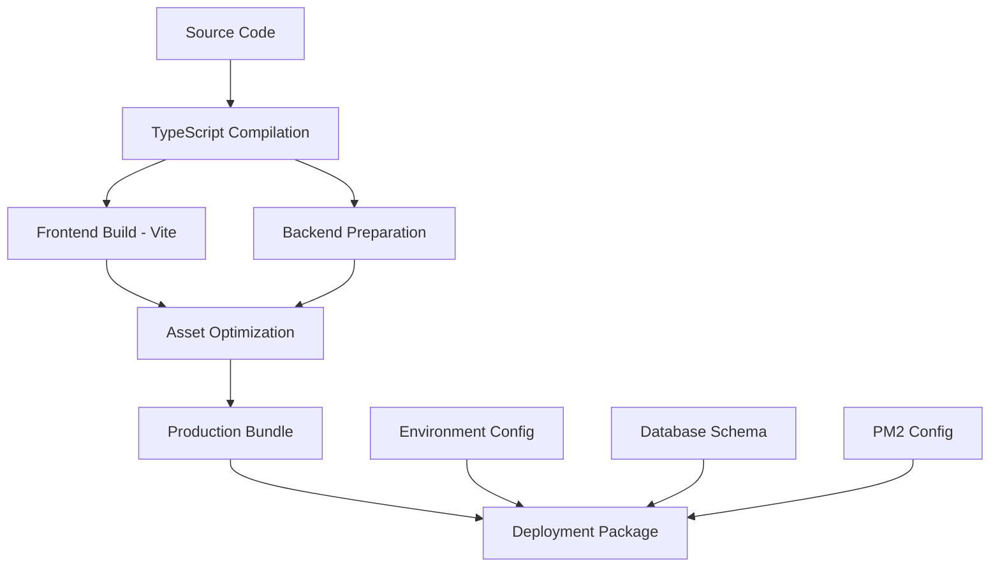

# Build Structure

Comprehensive guide to the NLC-CMS build output structure, file organization, and deployment artifacts.

## Overview

NLC-CMS uses a **multi-stage build process** that generates optimized artifacts for production deployment:
- **Frontend Build**: React SPA compiled with Vite
- **Backend Preparation**: Server files with TypeScript compilation
- **Asset Optimization**: Static files, uploads, and configurations
- **Deployment Package**: Complete production-ready bundle

## Build Process Flow



## Build Commands

### Development Build
```bash
# Development build with source maps
npm run build:ts          # TypeScript compilation only
npm run build:client      # Frontend build only
npm run build:legacy      # Legacy build process
```

### Production Build
```bash
# Complete production build
npm run build             # Main production build command
npm run build:qa          # QA build with additional artifacts
npm run build:server-only # Server-only build for updates
```

### Build Verification
```bash
# Test and verify builds
npm run build:test-ts     # Test TypeScript compilation
npm run typecheck         # Type checking without emit
```

## Build Output Structure

### Complete Build Output (`dist/`)
```
dist/
├── spa/                          # Frontend Single Page Application
│   ├── index.html               # Main HTML entry point
│   ├── assets/                  # Compiled frontend assets
│   │   ├── index-[hash].js      # Main JavaScript bundle
│   │   ├── index-[hash].css     # Main CSS bundle
│   │   ├── vendor-[hash].js     # Vendor libraries bundle
│   │   └── chunks/              # Code-split chunks
│   │       ├── vendor-react-[hash].js
│   │       ├── vendor-leaflet-[hash].js
│   │       └── vendor-heavy-[hash].js
│   ├── static/                  # Static assets
│   │   ├── images/              # Optimized images
│   │   ├── icons/               # Icon files
│   │   └── fonts/               # Web fonts
│   └── manifest.json            # Web app manifest
├── server/                      # Backend server files (if included)
│   ├── server.js               # Main server entry point
│   ├── app.js                  # Express application
│   ├── controller/             # API controllers
│   ├── routes/                 # Route definitions
│   ├── middleware/             # Custom middleware
│   ├── utils/                  # Server utilities
│   └── config/                 # Server configuration
└── package.json                # Production dependencies
```

### TypeScript Build Output (`tsbuild/`)
```
tsbuild/
├── client/                      # Compiled frontend TypeScript
│   ├── components/             # React components (JS)
│   ├── pages/                  # Page components (JS)
│   ├── store/                  # Redux store (JS)
│   ├── hooks/                  # Custom hooks (JS)
│   ├── utils/                  # Utility functions (JS)
│   └── types/                  # Type definitions (JS)
├── server/                     # Compiled backend TypeScript
│   ├── controller/             # Controllers (JS)
│   ├── routes/                 # Routes (JS)
│   ├── middleware/             # Middleware (JS)
│   ├── model/                  # Models (JS)
│   ├── utils/                  # Utilities (JS)
│   └── config/                 # Configuration (JS)
├── shared/                     # Shared utilities (JS)
└── prisma/                     # Prisma files (JS)
```

## Frontend Build Details

### Vite Build Configuration
```typescript
// vite.config.ts - Production build settings
export default defineConfig({
  build: {
    outDir: "dist/spa",
    sourcemap: false,              // No source maps in production
    minify: "terser",             // Minification with Terser
    cssCodeSplit: true,           // Split CSS into separate files
    chunkSizeWarningLimit: 1000,  // Warn for chunks > 1MB
    rollupOptions: {
      output: {
        manualChunks(id) {
          // Vendor chunk splitting
          if (id.includes("node_modules")) {
            if (id.includes("react") || id.includes("react-dom")) {
              return "vendor-react";
            }
            if (id.includes("leaflet")) {
              return "vendor-leaflet";
            }
            if (id.includes("jspdf") || id.includes("xlsx") || id.includes("html2canvas")) {
              return "vendor-heavy";
            }
            return "vendor";
          }
        },
      },
    },
  },
});
```

### Bundle Analysis
```bash
# Analyze bundle size
npm run build
ls -lah dist/spa/assets/

# Typical bundle sizes:
# index-[hash].js      ~200-300KB (main application code)
# vendor-react-[hash].js ~150-200KB (React and React-DOM)
# vendor-[hash].js     ~300-500KB (other vendor libraries)
# index-[hash].css     ~50-100KB  (compiled CSS)
```

### Asset Optimization
```
Static Assets Processing:
├── Images: Compressed and optimized
├── Fonts: Subset and compressed
├── Icons: SVG optimization
└── CSS: Minified and purged
```

## Backend Build Details

### Server File Structure
```
server/ (in production)
├── server.js              # Main entry point
├── app.js                 # Express application setup
├── controller/            # Business logic controllers
│   ├── authController.js
│   ├── complaintController.js
│   ├── userController.js
│   └── ...
├── routes/               # API route definitions
│   ├── authRoutes.js
│   ├── complaintRoutes.js
│   └── ...
├── middleware/           # Custom middleware
│   ├── auth.js
│   ├── errorHandler.js
│   └── validation.js
├── model/               # Data models
├── utils/               # Utility functions
│   ├── logger.js
│   ├── emailService.js
│   └── sla.js
├── config/              # Configuration files
└── db/                  # Database connection
```

### Dependencies Management
```json
// package.json - Production dependencies only
{
  "dependencies": {
    "@prisma/client": "^6.16.3",
    "express": "^4.18.2",
    "bcryptjs": "^2.4.3",
    "jsonwebtoken": "^9.0.2",
    "winston": "^3.17.0",
    "cors": "^2.8.5",
    "helmet": "^7.1.0",
    "multer": "^1.4.5-lts.1",
    "nodemailer": "^6.9.8"
  }
}
```

## Build Optimization

### Code Splitting Strategy
```typescript
// Lazy loading for routes
const AdminDashboard = lazy(() => import('@/pages/AdminDashboard'));
const CitizenDashboard = lazy(() => import('@/pages/CitizenDashboard'));
const ComplaintsList = lazy(() => import('@/pages/ComplaintsList'));

// Vendor chunk optimization
const vendorChunks = {
  'vendor-react': ['react', 'react-dom'],
  'vendor-ui': ['@radix-ui/react-*'],
  'vendor-maps': ['leaflet', 'react-leaflet'],
  'vendor-charts': ['recharts'],
  'vendor-utils': ['date-fns', 'clsx', 'zod']
};
```

### Tree Shaking Configuration
```typescript
// Ensure proper tree shaking
import { Button } from '@/components/ui/button';  // ✅ Good
import * as UI from '@/components/ui';            // ❌ Imports everything

// Optimize imports
import { format } from 'date-fns';               // ✅ Tree-shakeable
import dateFns from 'date-fns';                  // ❌ Imports entire library
```

### Asset Optimization
```typescript
// Image optimization
const images = {
  formats: ['webp', 'avif', 'png'],
  sizes: [320, 640, 960, 1280, 1920],
  quality: 80
};

// CSS optimization
const css = {
  purge: true,           // Remove unused CSS
  minify: true,          // Minify CSS
  autoprefixer: true     // Add vendor prefixes
};
```

## Deployment Package Structure

### Production Deployment Package
```
nlc-cms-production.tar.gz
├── dist/                    # Built application
├── server/                  # Server files (if separate)
├── prisma/                  # Database schema and migrations
├── package.json            # Production dependencies
├── package-lock.json       # Dependency lock file
├── ecosystem.prod.config.cjs # PM2 configuration
├── .env.production.example # Environment template
└── README-DEPLOYMENT.md    # Deployment instructions
```

### QA Deployment Package
```
nlc-cms-qa.tar.gz
├── dist/                   # Built application
├── tsbuild/               # TypeScript build (for debugging)
├── server/                # Server files
├── prisma/                # Database schema
├── package.json           # All dependencies
├── ecosystem.qa.config.cjs # QA PM2 configuration
├── .env.qa.example        # QA environment template
└── test-data/             # Sample test data
```

## Build Scripts Analysis

### Main Build Script (`scripts/build-production.js`)
```javascript
// Key build steps:
1. Clean previous builds
2. Install production dependencies
3. Run TypeScript compilation
4. Build frontend with Vite
5. Copy necessary files
6. Generate deployment package
7. Verify build integrity
```

### Build Verification
```bash
# Verify build completeness
npm run build
node scripts/build-verifier.js

# Check build output
ls -la dist/
du -sh dist/spa/
du -sh dist/server/

# Test build locally
cd dist/
npm install --production
node server/server.js
```

## Environment-Specific Builds

### Development Build
```bash
# Development build characteristics:
- Source maps enabled
- Hot module replacement
- Unminified code
- Development dependencies included
- Debug logging enabled
```

### QA Build
```bash
# QA build characteristics:
- Production optimizations
- Source maps for debugging
- Test data included
- Enhanced logging
- Performance monitoring
```

### Production Build
```bash
# Production build characteristics:
- Fully optimized and minified
- No source maps
- Production dependencies only
- Security headers enabled
- Performance optimized
```

## Build Performance

### Build Time Optimization
```bash
# Typical build times:
TypeScript compilation: 30-60 seconds
Frontend build (Vite):  60-120 seconds
Asset optimization:     15-30 seconds
Package creation:       10-20 seconds
Total build time:       2-4 minutes
```

### Build Size Metrics
```bash
# Typical build sizes:
Frontend (dist/spa/):    ~15-20MB
Backend (server/):       ~5-10MB
Dependencies:            ~100-200MB
Total deployment:        ~120-230MB
Compressed package:      ~30-50MB
```

### Build Caching
```bash
# Build cache locations:
node_modules/.cache/     # Dependency cache
.vite/                   # Vite build cache
tsbuild/                 # TypeScript output cache
dist/                    # Final build output

# Cache management:
npm run clean:client     # Clear frontend cache
npm run clean:tsbuild    # Clear TypeScript cache
rm -rf node_modules/.cache # Clear all caches
```

## Troubleshooting Build Issues

### Common Build Problems

#### Out of Memory Errors
```bash
# Increase Node.js heap size
export NODE_OPTIONS="--max-old-space-size=4096"
npm run build

# Or modify package.json
"build": "node --max-old-space-size=4096 scripts/build-production.js"
```

#### TypeScript Compilation Errors
```bash
# Check TypeScript configuration
npm run typecheck

# Fix common issues:
- Update import paths
- Regenerate Prisma client
- Check type definitions
```

#### Vite Build Failures
```bash
# Clear Vite cache
rm -rf node_modules/.vite
rm -rf dist/

# Rebuild from scratch
npm run build
```

#### Missing Dependencies
```bash
# Verify all dependencies are installed
npm ci

# Check for peer dependency issues
npm ls

# Update dependencies if needed
npm update
```

### Build Verification Checklist

#### Pre-Build Verification
- [ ] All dependencies installed
- [ ] TypeScript compilation passes
- [ ] Tests pass
- [ ] Linting passes
- [ ] Environment variables configured

#### Post-Build Verification
- [ ] Build completes without errors
- [ ] All expected files present in dist/
- [ ] Bundle sizes within expected ranges
- [ ] No critical security vulnerabilities
- [ ] Server starts successfully with built files

#### Deployment Verification
- [ ] Package extracts correctly
- [ ] Dependencies install successfully
- [ ] Database migrations run
- [ ] Application starts and responds
- [ ] Health checks pass

## Build Monitoring

### Build Metrics
```bash
# Monitor build performance
time npm run build

# Check bundle sizes
npm run build
ls -lah dist/spa/assets/

# Analyze dependencies
npm ls --depth=0
npm audit
```

### Automated Build Checks
```bash
# CI/CD build verification
npm run build
npm run test:run
npm run typecheck
npm run lint
node scripts/build-verifier.js
```

---

**Next**: [Logging and Monitoring](LOGGING_AND_MONITORING.md) | **Previous**: [Ecosystem and Environment Setup](ECOSYSTEM_AND_ENV_SETUP.md) | **Up**: [Documentation Home](../README.md)