# Data Flow Diagram

This document illustrates the data flow between components, backend controllers, and database entities in the NLC-CMS system.

## System Overview Flow

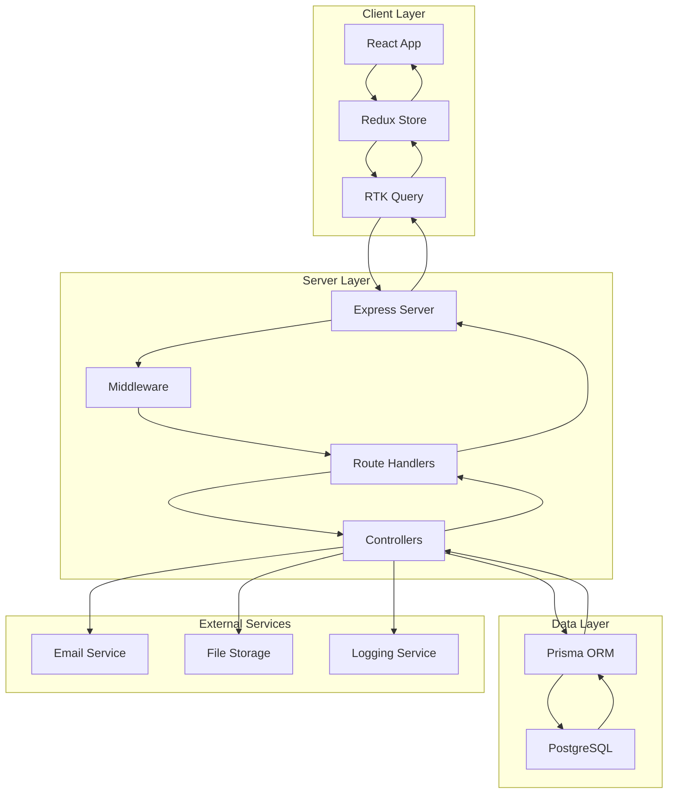

## Authentication Flow

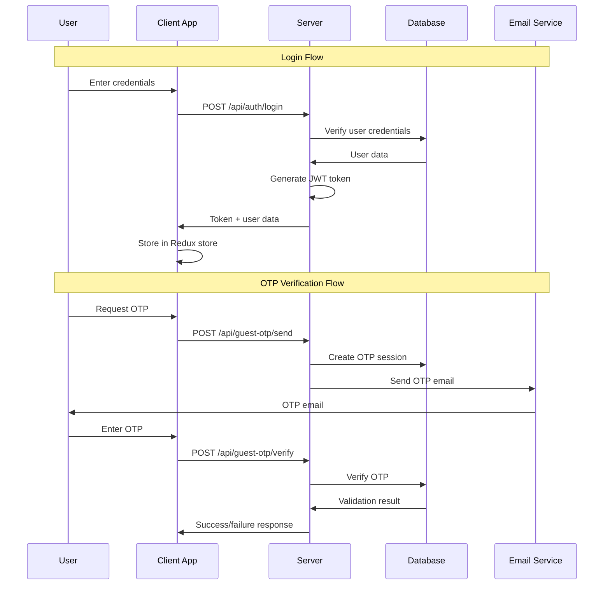

## Complaint Submission Flow

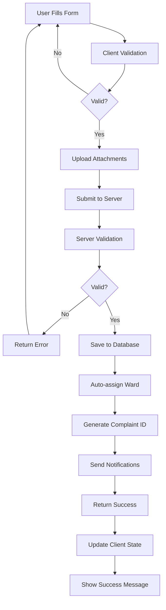

## Complaint Processing Flow

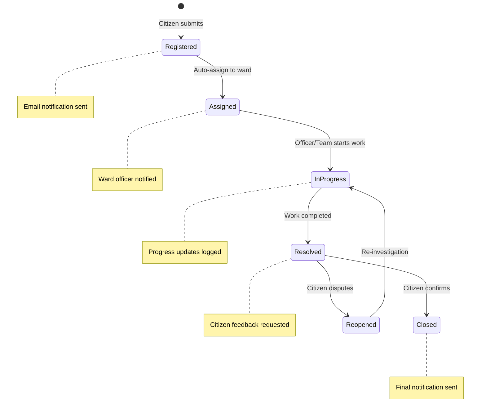

## Database Entity Relationships

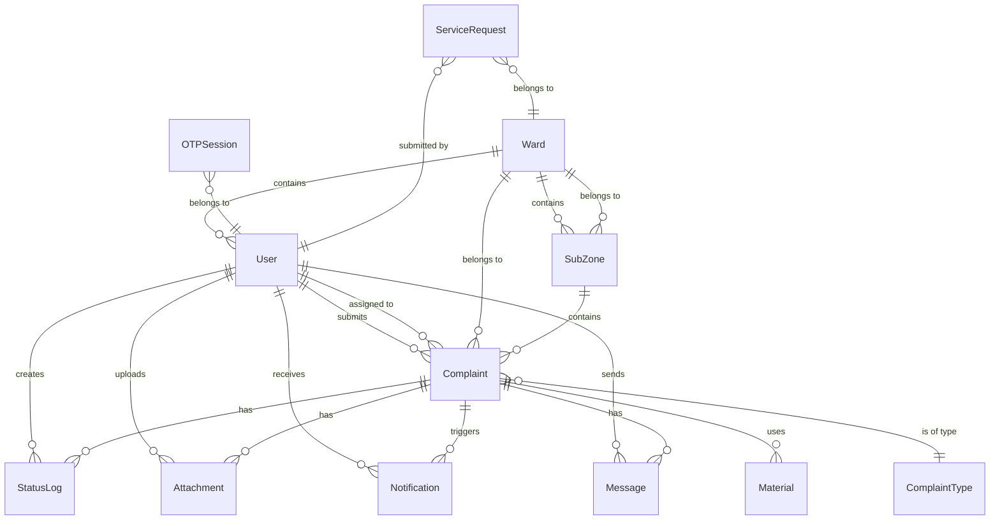

## API Request/Response Flow

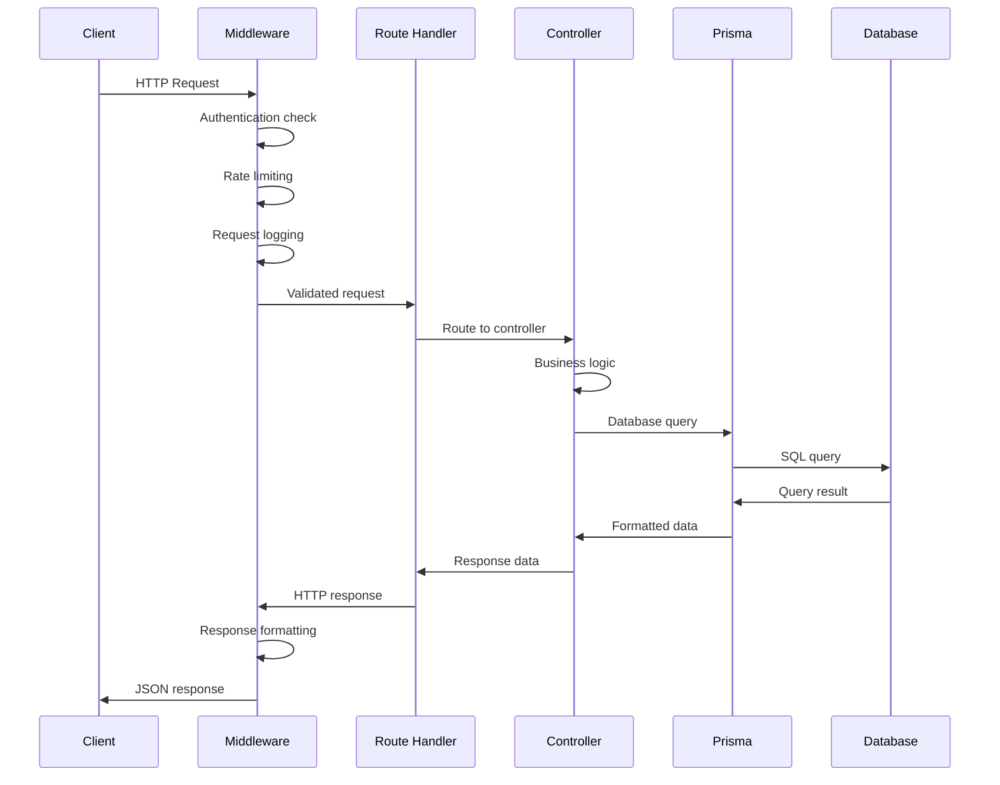

## File Upload Flow

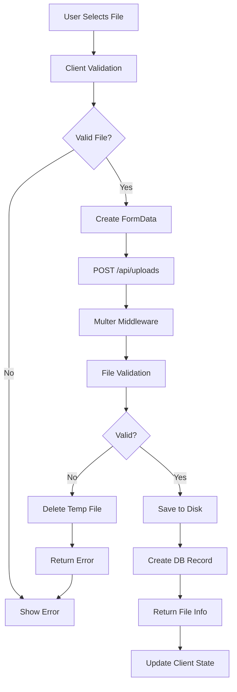

## Notification Flow

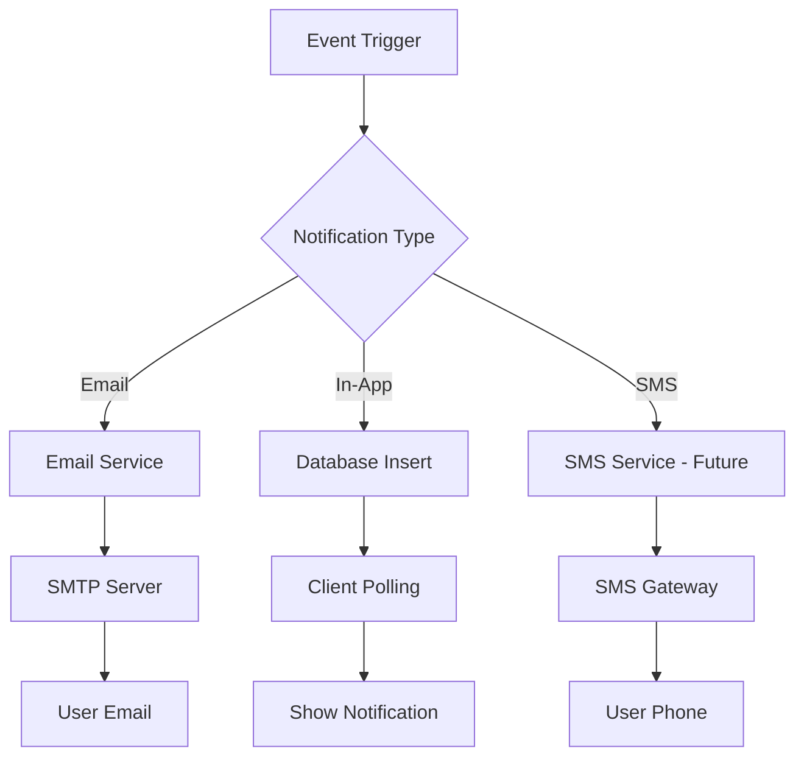

## Real-time Data Updates

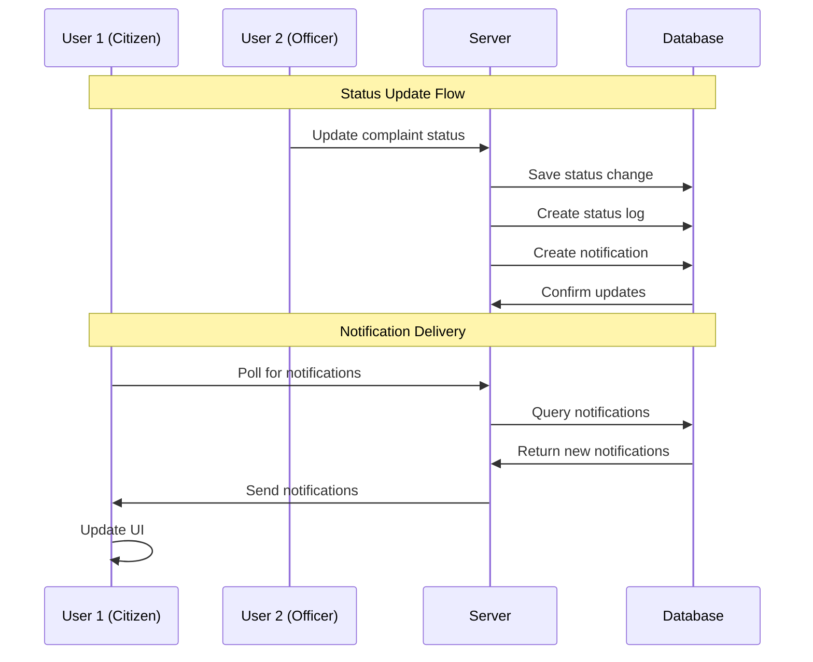

## Ward-based Routing Flow

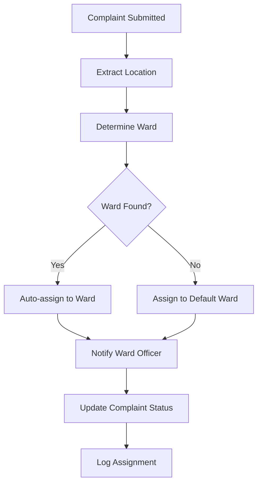

## Search and Filter Flow

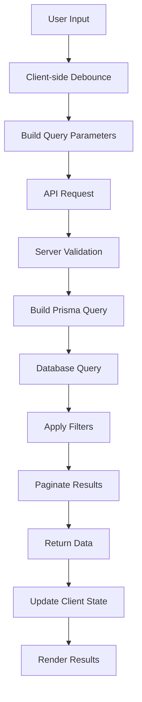

## Report Generation Flow

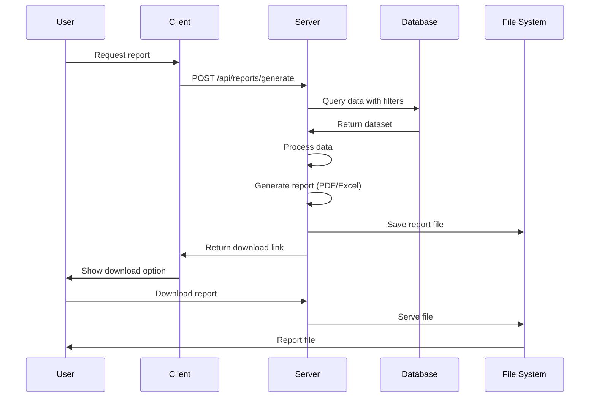

## Error Handling Flow

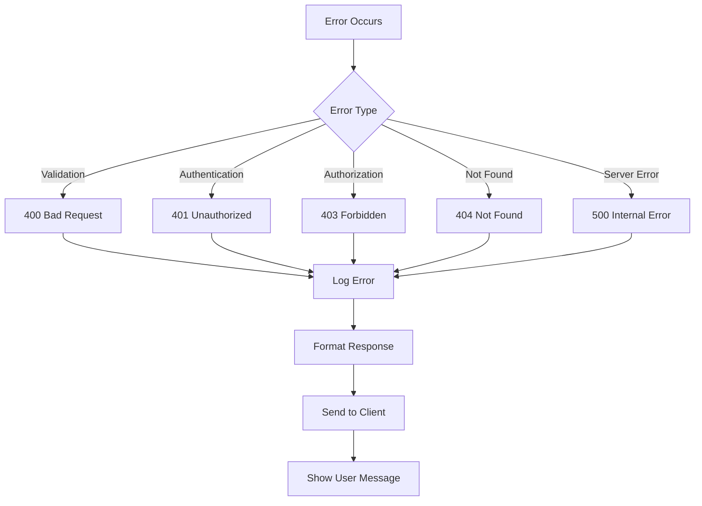

## Performance Monitoring Flow

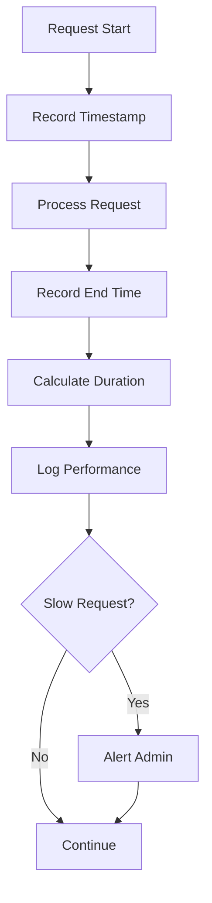

## Data Backup Flow

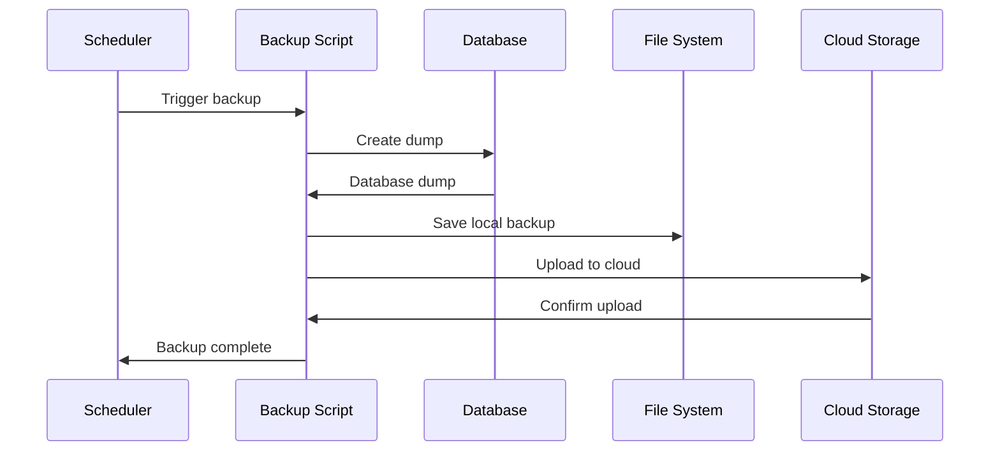

## Cache Strategy Flow

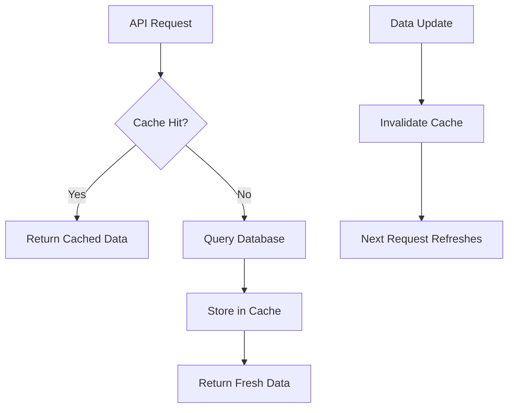

---

**Previous**: [Module Breakdown](MODULE_BREAKDOWN.md) | **Next**: [Developer Guide](../developer/DEVELOPER_GUIDE.md) | **Up**: [Documentation Home](../README.md)