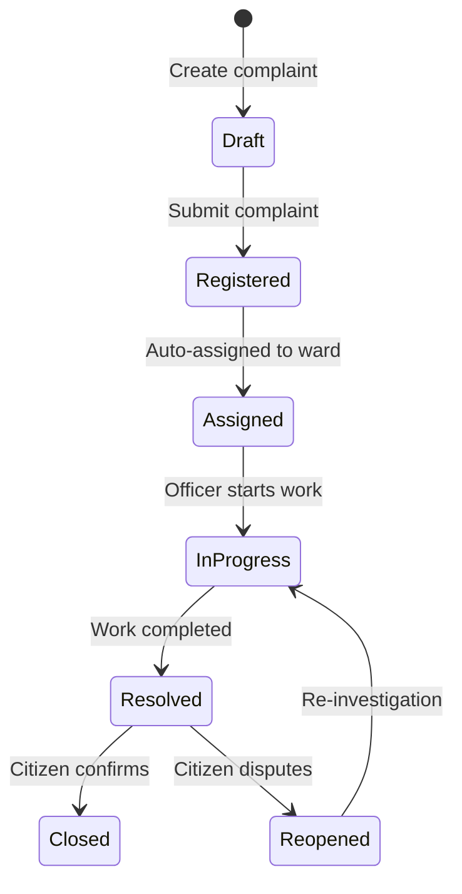
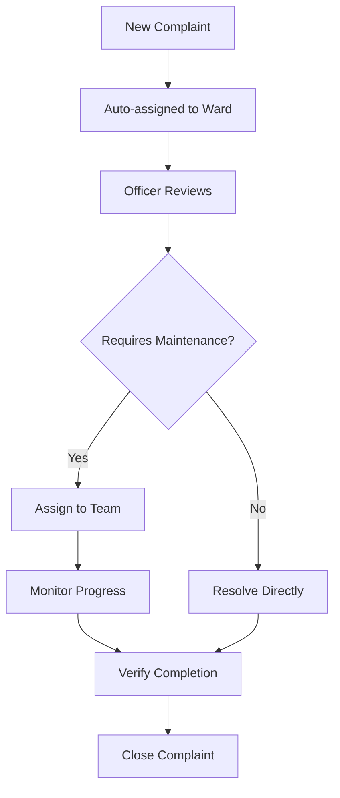
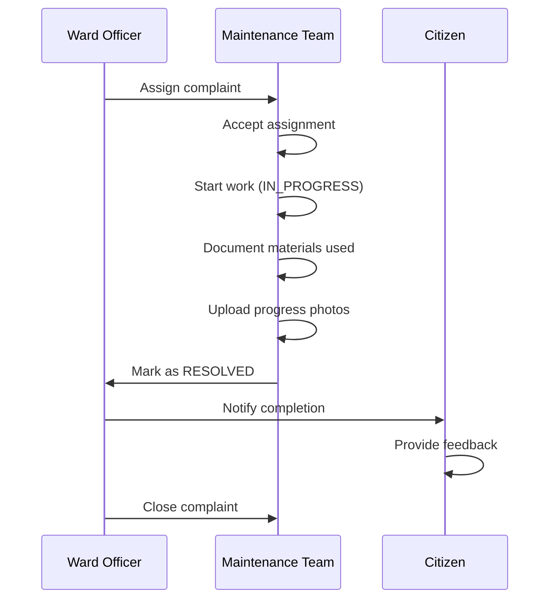
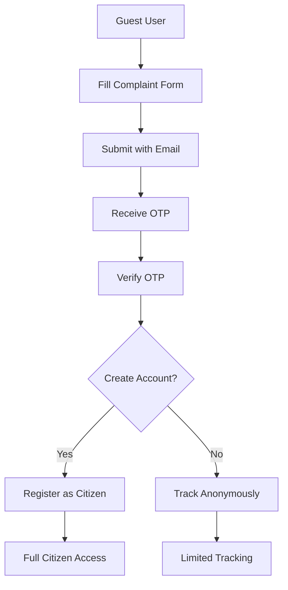

# Module Breakdown

This document provides a detailed breakdown of each logical module in the NLC-CMS system, including their components, routes, and interactions.

## 1. Authentication Module

### Purpose
Handles user authentication, authorization, and session management across all user roles.

### Components
- **Frontend**: `Login.tsx`, `Register.tsx`, `OTPVerification.tsx`, `SetPassword.tsx`
- **Backend**: `authController.js`, `authRoutes.js`
- **Middleware**: `auth.js` (JWT verification)
- **Database**: `User`, `OTPSession` models

### API Endpoints
```
POST /api/auth/login              # User login with credentials
POST /api/auth/register           # New user registration
POST /api/auth/logout             # User logout
POST /api/auth/refresh            # Token refresh
POST /api/auth/forgot-password    # Password reset request
POST /api/auth/reset-password     # Password reset confirmation
POST /api/auth/verify-otp         # OTP verification
GET  /api/auth/me                 # Get current user info
```

### Key Features
- **JWT-based authentication** with configurable expiration
- **Role-based access control** (RBAC) with middleware protection
- **OTP verification** for guest users and password resets
- **Password strength validation** with bcryptjs hashing
- **Session management** with automatic token refresh

### User Roles
```typescript
enum UserRole {
  CITIZEN           // Regular citizens submitting complaints
  WARD_OFFICER      // Ward-level officers managing complaints
  MAINTENANCE_TEAM  // Field staff resolving complaints
  ADMINISTRATOR     // System administrators
  GUEST            // Temporary users for complaint submission
}
```

## 2. Citizen Module

### Purpose
Enables citizens to submit, track, and manage their complaints with the municipal system.

### Components
- **Frontend**: `CitizenDashboard.tsx`, `CitizenComplaintForm.tsx`, `ComplaintsList.tsx`
- **Backend**: `complaintController.js`, `userController.js`
- **Database**: `Complaint`, `User`, `Attachment` models

### API Endpoints
```
GET  /api/complaints/my           # Get user's complaints
POST /api/complaints              # Submit new complaint
GET  /api/complaints/:id          # Get complaint details
PUT  /api/complaints/:id/feedback # Submit feedback/rating
GET  /api/users/profile           # Get user profile
PUT  /api/users/profile           # Update user profile
```

### Key Features
- **Complaint submission** with file attachments
- **Real-time status tracking** with notifications
- **Geographic location selection** using interactive maps
- **Complaint history** with filtering and search
- **Feedback system** with 5-star rating
- **Profile management** with avatar upload

### Complaint Lifecycle for Citizens


## 3. Ward Officer Module

### Purpose
Allows ward officers to manage complaints within their jurisdiction and coordinate with maintenance teams.

### Components
- **Frontend**: `WardOfficerDashboard.tsx`, `WardTasks.tsx`, `ComplaintDetailsModal.tsx`
- **Backend**: `complaintController.js`, `wardController.js`
- **Database**: `Complaint`, `Ward`, `StatusLog` models

### API Endpoints
```
GET  /api/complaints/ward/:wardId # Get ward complaints
PUT  /api/complaints/:id/assign   # Assign to maintenance team
PUT  /api/complaints/:id/status   # Update complaint status
POST /api/complaints/:id/message  # Add internal message
GET  /api/wards/:id/analytics     # Ward performance metrics
GET  /api/complaints/overdue      # Get overdue complaints
```

### Key Features
- **Ward-based complaint filtering** with automatic assignment
- **Complaint assignment** to maintenance teams
- **Status management** with audit trail
- **SLA monitoring** with overdue alerts
- **Internal messaging** with maintenance teams
- **Performance dashboard** with ward-specific metrics

### Ward Officer Workflow


## 4. Maintenance Team Module

### Purpose
Enables maintenance staff to receive, execute, and report on field work assignments.

### Components
- **Frontend**: `MaintenanceDashboard.tsx`, `MaintenanceTasks.tsx`, `TaskDetails.tsx`
- **Backend**: `complaintController.js`, `materialsController.js`
- **Database**: `Complaint`, `Material`, `Attachment` models

### API Endpoints
```
GET  /api/complaints/assigned     # Get assigned tasks
PUT  /api/complaints/:id/progress # Update work progress
POST /api/complaints/:id/materials # Add materials used
POST /api/complaints/:id/photos   # Upload work photos
PUT  /api/complaints/:id/complete # Mark task complete
GET  /api/maintenance/analytics   # Team performance metrics
```

### Key Features
- **Task assignment** with priority-based sorting
- **Progress tracking** with photo documentation
- **Materials tracking** with quantity and cost
- **Work completion** with before/after photos
- **Mobile-responsive interface** for field use
- **Performance analytics** with completion rates

### Maintenance Workflow


## 5. Administrator Module

### Purpose
Provides system administration capabilities including user management, system configuration, and analytics.

### Components
- **Frontend**: `AdminDashboard.tsx`, `AdminUsers.tsx`, `AdminConfig.tsx`, `AdminReports.tsx`
- **Backend**: `adminController.js`, `systemConfigController.js`, `reportRoutes.js`
- **Database**: `User`, `SystemConfig`, `Report`, `Department` models

### API Endpoints
```
GET  /api/admin/users             # Get all users
POST /api/admin/users             # Create new user
PUT  /api/admin/users/:id         # Update user
DELETE /api/admin/users/:id       # Deactivate user
GET  /api/admin/analytics         # System analytics
GET  /api/system-config           # Get system configuration
PUT  /api/system-config           # Update configuration
GET  /api/reports/generate        # Generate reports
```

### Key Features
- **User management** with role assignment
- **System configuration** with real-time updates
- **Comprehensive analytics** with export capabilities
- **Report generation** with multiple formats
- **Ward boundary management** with geographic tools
- **Department management** with hierarchy support

### Admin Dashboard Widgets
```typescript
interface AdminDashboard {
  totalComplaints: number;
  activeComplaints: number;
  resolvedComplaints: number;
  overdueComplaints: number;
  averageResolutionTime: number;
  userRegistrations: number;
  wardPerformance: WardMetrics[];
  complaintTrends: TrendData[];
}
```

## 6. Guest Module

### Purpose
Allows anonymous users to submit complaints without creating an account, with OTP verification.

### Components
- **Frontend**: `GuestDashboard.tsx`, `GuestComplaintForm.tsx`, `GuestTrackComplaint.tsx`
- **Backend**: `guestController.js`, `guestOtpController.js`
- **Database**: `Complaint`, `OTPSession` models

### API Endpoints
```
POST /api/guest/complaint         # Submit guest complaint
POST /api/guest-otp/send          # Send OTP for verification
POST /api/guest-otp/verify        # Verify OTP and create account
GET  /api/guest/track/:id         # Track complaint by ID
POST /api/guest/service-request   # Submit service request
```

### Key Features
- **Anonymous complaint submission** with email verification
- **OTP-based verification** for authenticity
- **Complaint tracking** without login
- **Optional account creation** after complaint submission
- **Service request submission** for non-complaint services
- **Email notifications** for status updates

### Guest User Flow


## 7. Public API Module

### Purpose
Provides public-facing APIs for integration with external systems and mobile applications.

### Components
- **Backend**: `complaintSummary.js`, `geoRoutes.js`, `reportRoutes.js`
- **Documentation**: Swagger/OpenAPI specifications
- **Database**: Read-only access to public data

### API Endpoints
```
GET  /api/complaints/public       # Public complaint statistics
GET  /api/wards/public            # Ward information
GET  /api/geo/boundaries          # Ward boundary data
GET  /api/reports/public          # Public reports
GET  /api/health                  # System health check
GET  /api-docs                    # API documentation
```

### Key Features
- **Public statistics** without sensitive data
- **Geographic data** for ward boundaries
- **Health monitoring** for system status
- **API documentation** with Swagger UI
- **Rate limiting** for abuse prevention
- **CORS configuration** for web integration

## 8. Notification Module

### Purpose
Manages multi-channel notifications for users across email, SMS, and in-app channels.

### Components
- **Backend**: `Notification.js` model, `emailService.js`
- **Database**: `Notification` model
- **External**: SMTP integration for emails

### Notification Types
```typescript
enum NotificationType {
  EMAIL     // Email notifications
  SMS       // SMS notifications (future)
  IN_APP    // In-application notifications
}
```

### Key Features
- **Multi-channel delivery** with user preferences
- **Template-based messages** for consistency
- **Delivery tracking** with read receipts
- **Batch processing** for bulk notifications
- **Retry mechanism** for failed deliveries
- **User preference management** for opt-out

## 9. File Management Module

### Purpose
Handles file uploads, storage, and serving for all system attachments.

### Components
- **Backend**: `uploadController.js`, `uploadRoutes.js`
- **Middleware**: Multer for file handling
- **Storage**: Local file system with organized structure
- **Database**: `Attachment` model with unified schema

### API Endpoints
```
POST /api/uploads                 # Upload file
GET  /api/uploads/:id             # Get file metadata
DELETE /api/uploads/:id           # Delete file
GET  /uploads/:filename           # Serve static file
```

### File Organization
```
uploads/
├── complaints/           # Complaint attachments
│   ├── 2024/            # Year-based organization
│   └── thumbnails/      # Generated thumbnails
├── users/               # User avatars
├── system/              # System files
└── temp/                # Temporary uploads
```

### Key Features
- **Unified attachment system** for all entities
- **File type validation** with MIME type checking
- **Size limitations** with configurable limits
- **Thumbnail generation** for images
- **Secure file serving** with access control
- **Cleanup routines** for orphaned files

## 10. Reporting Module

### Purpose
Generates comprehensive reports and analytics for system performance and complaint trends.

### Components
- **Frontend**: `ReportsAnalytics.tsx`, `UnifiedReports.tsx`
- **Backend**: `reportRoutes.js`, analytics controllers
- **Database**: `Report` model for saved reports

### Report Types
- **Complaint Summary Reports** with filtering
- **SLA Compliance Reports** with trend analysis
- **User Activity Reports** with role-based metrics
- **Ward Performance Reports** with comparisons
- **Material Usage Reports** with cost analysis
- **Custom Reports** with flexible parameters

### Export Formats
- **PDF** for formal reports
- **Excel** for data analysis
- **CSV** for data import/export
- **JSON** for API integration

---

**Next**: [Data Flow Diagram](DATA_FLOW_DIAGRAM.md) | **Previous**: [Architecture Overview](ARCHITECTURE_OVERVIEW.md) | **Up**: [Documentation Home](../README.md)