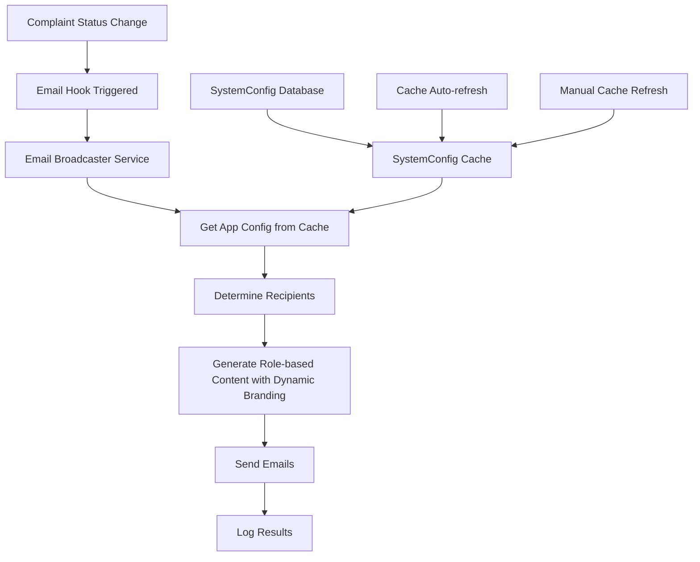

# Email Broadcaster System Documentation

## Overview

The Email Broadcaster System is a centralized, modular service for sending complaint status update emails to citizens, ward officers, maintenance teams, and administrators. It provides role-based content filtering, modern responsive HTML templates following OTP email design, dynamic SystemConfig integration, and comprehensive logging capabilities.

## Key Features

- **Dynamic App Branding**: Uses APP_NAME and other settings from SystemConfig table
- **Cached Configuration**: In-memory caching of SystemConfig for performance
- **OTP Email Design**: Follows the same modern, responsive design as OTP emails
- **Role-based Content**: Different email content based on recipient role
- **Multi-language Support**: Supports multiple languages for email content
- **Real-time Updates**: Cache refreshes automatically or on demand

## Table of Contents

1. [Architecture](#architecture)
2. [Installation & Configuration](#installation--configuration)
3. [Usage Examples](#usage-examples)
4. [Email Templates](#email-templates)
5. [Recipient Rules](#recipient-rules)
6. [Integration Guide](#integration-guide)
7. [Customization](#customization)
8. [Testing](#testing)
9. [Troubleshooting](#troubleshooting)
10. [API Reference](#api-reference)

---

## Architecture

### System Components

```
Email Broadcaster System
├── services/
│   ├── emailBroadcaster.js          # Main broadcaster service
│   ├── systemConfigCache.js         # SystemConfig caching service
│   └── initializeServices.js       # Service initialization
├── controller/
│   └── systemConfigController.js   # SystemConfig API endpoints
├── routes/
│   └── systemConfigRoutes.js       # SystemConfig routes
├── config/
│   └── emailBroadcasterConfig.js    # Dynamic configuration
├── utils/
│   ├── complaintEmailHooks.js       # Integration hooks
│   └── emailService.js              # Base email service
└── scripts/
    └── testEmailBroadcaster.js      # Testing utilities
```

### Core Classes

- **`ComplaintEmailBroadcaster`**: Main service class handling email broadcasting
- **`SystemConfigCache`**: In-memory caching service for system configuration
- **Email Hooks**: Integration functions for automatic triggering
- **Template Engine**: Role-based HTML/text email generation with dynamic branding
- **SystemConfig API**: RESTful endpoints for configuration management

### Data Flow



---

## Installation & Configuration

### Prerequisites

- Node.js 18.0.0+
- PostgreSQL database with Prisma ORM
- SMTP email service configured

### Environment Variables

Add the following to your `.env` file:

```bash
# Email Service Configuration
EMAIL_SERVICE=smtp.gmail.com
EMAIL_PORT=587
EMAIL_USER=your-email@gmail.com
EMAIL_PASS=your-app-password
EMAIL_FROM="Fix_Smart_CMS <noreply@your-domain.com>"

# Email Broadcasting Settings
EMAIL_BROADCAST_ENABLED=true
EMAIL_BROADCAST_ASYNC=true
EMAIL_BROADCAST_RETRY_ATTEMPTS=3
EMAIL_BROADCAST_RATE_LIMIT=10

# Template Settings
EMAIL_TEMPLATE_CACHE_TTL=3600
EMAIL_TEMPLATE_DEFAULT_LANGUAGE=en
```

### Installation Steps

1. **Install Dependencies** (already included in package.json):
   ```bash
   npm install nodemailer winston
   ```

2. **Initialize Services at Server Startup**:
   ```javascript
   import { initializeServices } from './services/initializeServices.js';
   
   // In your main server file
   await initializeServices();
   ```

3. **Import the Services**:
   ```javascript
   import emailBroadcaster from './services/emailBroadcaster.js';
   import systemConfigCache from './services/systemConfigCache.js';
   ```

4. **Configure Email Service**:
   Ensure your base email service is properly configured in `utils/emailService.js`.

5. **Set Up SystemConfig Routes** (optional for admin management):
   ```javascript
   import systemConfigRoutes from './routes/systemConfigRoutes.js';
   app.use('/api/config', systemConfigRoutes);
   ```

---

## SystemConfig Integration

### Overview

The email broadcaster now dynamically uses configuration values from the SystemConfig table, cached in memory for performance. This allows for real-time branding updates without code changes.

### Key Configuration Values

| Config Key | Description | Default Value | Used In |
|------------|-------------|---------------|---------|
| `APP_NAME` | Application display name | `Fix_Smart_CMS` | Email subjects, headers, footers |
| `ORGANIZATION_NAME` | Organization name | `Smart City Management` | Email content, branding |
| `PRIMARY_COLOR` | Primary brand color | `#667eea` | Email styling, buttons |
| `SECONDARY_COLOR` | Secondary brand color | `#764ba2` | Email styling, accents |
| `LOGO_URL` | Organization logo URL | `null` | Email headers (if provided) |
| `WEBSITE_URL` | Organization website | `https://fix-smart-cms.gov.in` | Email footers |
| `SUPPORT_EMAIL` | Support contact email | `support@fix-smart-cms.gov.in` | Email footers, reply-to |

### Cache Management

```javascript
import systemConfigCache from './services/systemConfigCache.js';

// Get app configuration
const appConfig = systemConfigCache.getAppConfig();
console.log(appConfig.appName); // "Fix_Smart_CMS" or custom value

// Get specific config value
const appName = systemConfigCache.get('APP_NAME', 'Default App Name');

// Check if config exists
if (systemConfigCache.has('CUSTOM_SETTING')) {
  // Use custom setting
}

// Force refresh cache (useful after config updates)
await systemConfigCache.forceRefresh();

// Get cache statistics
const stats = systemConfigCache.getStats();
console.log(`Cache has ${stats.configCount} entries`);
```

### Frontend Integration

The system provides a public API endpoint for frontend configuration:

```javascript
// GET /api/config/public
{
  "success": true,
  "data": {
    "appName": "Fix_Smart_CMS",
    "organizationName": "Smart City Management",
    "primaryColor": "#667eea",
    "websiteUrl": "https://fix-smart-cms.gov.in",
    "logoUrl": null,
    "supportEmail": "support@fix-smart-cms.gov.in"
  },
  "cached": {
    "isInitialized": true,
    "configCount": 15,
    "lastUpdated": "2024-12-08T10:30:00.000Z"
  }
}
```

### Admin Configuration Management

Administrators can manage system configuration through API endpoints:

```javascript
// Update configuration
PUT /api/config/APP_NAME
{
  "value": "My Custom CMS",
  "type": "app",
  "description": "Custom application name"
}

// Get all configuration (admin only)
GET /api/config/admin

// Refresh cache manually
POST /api/config/refresh

// Get cache statistics
GET /api/config/stats
```

---

## Usage Examples

### Basic Status Update

```javascript
import emailBroadcaster from '../services/emailBroadcaster.js';

// Broadcast a status update
const result = await emailBroadcaster.broadcastStatusUpdate({
  complaintId: 'complaint123',
  newStatus: 'RESOLVED',
  previousStatus: 'IN_PROGRESS',
  comment: 'Issue has been fixed and tested',
  updatedByUserId: 'user456'
});

console.log(`Emails sent: ${result.emailsSent}/${result.totalRecipients}`);
```

### Using Integration Hooks

```javascript
import { onComplaintStatusUpdated } from '../utils/complaintEmailHooks.js';

// In your complaint controller
export const updateComplaintStatus = async (req, res) => {
  // ... update complaint logic ...
  
  // Trigger email broadcast
  await onComplaintStatusUpdated({
    complaintId: complaint.id,
    newStatus: 'RESOLVED',
    previousStatus: complaint.status,
    comment: req.body.comment,
    updatedByUserId: req.user.id
  });
  
  res.json({ success: true, complaint });
};
```

### Complaint Creation

```javascript
import { onComplaintCreated } from '../utils/complaintEmailHooks.js';

// After creating a complaint
const complaint = await prisma.complaint.create({ /* ... */ });

// Notify relevant users
await onComplaintCreated(complaint, req.user.id);
```

### Assignment Notification

```javascript
import { onComplaintAssigned } from '../utils/complaintEmailHooks.js';

// When assigning to maintenance team
await onComplaintAssigned({
  complaintId: complaint.id,
  assignedToUserId: maintenanceTeamId,
  assignedByUserId: req.user.id,
  assignmentType: 'maintenance_team',
  comment: 'Assigned to maintenance team for resolution'
});
```

---

## Email Templates

### Template Types

The system supports three template types:

1. **Citizen Templates** (`citizen`):
   - Clean, user-friendly design
   - Limited to public information
   - Focus on status updates and next steps

2. **Staff Templates** (`staff`):
   - Professional design with more details
   - Internal comments and assignment info
   - Action-oriented content

3. **Admin Templates** (`admin`):
   - Comprehensive information display
   - Full system context
   - Monitoring and oversight focus

### Template Structure

```html
<!DOCTYPE html>
<html lang="en">
<head>
    <meta charset="UTF-8">
    <meta name="viewport" content="width=device-width, initial-scale=1.0">
    <title>Complaint Status Update</title>
    <style>
        /* Responsive CSS styles */
    </style>
</head>
<body>
    <div class="email-container">
        <!-- Header with branding -->
        <div class="header">
            <h1>🔔 Fix_Smart_CMS</h1>
            <p>Complaint Management System</p>
        </div>
        
        <!-- Main content -->
        <div class="content">
            <!-- Greeting and status message -->
            <!-- Complaint details card -->
            <!-- Role-specific sections -->
        </div>
        
        <!-- Footer -->
        <div class="footer">
            <!-- Branding and legal text -->
        </div>
    </div>
</body>
</html>
```

### Responsive Design Features

- **Mobile-first approach**: Optimized for mobile devices
- **Flexible grid system**: Adapts to different screen sizes
- **Dark mode support**: Respects user preferences
- **Accessibility compliant**: WCAG 2.1 AA standards

---

## Recipient Rules

### Role-based Email Distribution

| Recipient Role | Allowed Statuses | Internal Comments | Assignment Details | Maintenance Logs |
|---------------|------------------|-------------------|-------------------|------------------|
| **CITIZEN** | REGISTERED, ASSIGNED, RESOLVED, CLOSED, REOPENED | ❌ | ❌ | ❌ |
| **WARD_OFFICER** | All statuses | ✅ | ✅ | ✅ |
| **MAINTENANCE_TEAM** | ASSIGNED, IN_PROGRESS, RESOLVED, CLOSED, REOPENED | ✅ | ✅ | ✅ |
| **ADMINISTRATOR** | All statuses | ✅ | ✅ | ✅ |

### Recipient Determination Logic

```javascript
// Automatic recipient selection
const recipients = [
  complaint.submittedBy,        // Citizen (filtered content)
  complaint.wardOfficer,        // Ward officer (full content)
  complaint.maintenanceTeam,    // Maintenance team (relevant content)
  ...wardAdministrators,        // Ward-based admins
  ...systemAdministrators       // System admins (all content)
];
```

### Privacy Protection

- **Citizen emails**: Only public status updates, no internal comments
- **Staff emails**: Full context for assigned complaints only
- **Admin emails**: Complete system visibility with privacy indicators

---

## Integration Guide

### Automatic Integration

The system provides hooks that automatically trigger emails when complaint operations occur:

```javascript
// In your complaint controller
import {
  onComplaintCreated,
  onComplaintStatusUpdated,
  onComplaintAssigned,
  onMaintenanceWorkLogged,
  onComplaintResolved,
  onComplaintClosed,
  onComplaintReopened
} from '../utils/complaintEmailHooks.js';

// Example: Status update endpoint
export const updateComplaintStatus = async (req, res) => {
  try {
    const { id } = req.params;
    const { status, comment } = req.body;
    
    // Get current complaint
    const currentComplaint = await prisma.complaint.findUnique({
      where: { id }
    });
    
    // Update complaint
    const updatedComplaint = await prisma.complaint.update({
      where: { id },
      data: { 
        status,
        resolvedOn: status === 'RESOLVED' ? new Date() : null,
        closedOn: status === 'CLOSED' ? new Date() : null
      }
    });
    
    // Create status log
    await prisma.statusLog.create({
      data: {
        complaintId: id,
        userId: req.user.id,
        fromStatus: currentComplaint.status,
        toStatus: status,
        comment
      }
    });
    
    // Trigger email broadcast
    await onComplaintStatusUpdated({
      complaintId: id,
      newStatus: status,
      previousStatus: currentComplaint.status,
      comment,
      updatedByUserId: req.user.id
    });
    
    res.json({ success: true, complaint: updatedComplaint });
    
  } catch (error) {
    res.status(500).json({ success: false, message: error.message });
  }
};
```

### Manual Integration

For custom scenarios, use the broadcaster directly:

```javascript
import emailBroadcaster from '../services/emailBroadcaster.js';

// Custom email broadcast
const result = await emailBroadcaster.broadcastStatusUpdate({
  complaintId: 'complaint123',
  newStatus: 'CUSTOM_STATUS',
  comment: 'Custom status update message',
  updatedByUserId: 'user456',
  additionalData: {
    customField: 'customValue',
    attachments: [/* attachment objects */]
  }
});
```

### Error Handling

The system is designed to be non-blocking:

```javascript
import { safelyTriggerHook } from '../utils/complaintEmailHooks.js';

// Safe hook execution that won't break main operations
await safelyTriggerHook(
  onComplaintStatusUpdated,
  { complaintId, newStatus, /* ... */ },
  'status_update'
);
```

---

## Customization

### Adding New Status Types

1. **Update Status Messages**:
   ```javascript
   // In emailBroadcaster.js
   const STATUS_MESSAGES = {
     CITIZEN: {
       // ... existing statuses ...
       NEW_CUSTOM_STATUS: "Your custom status message for citizens"
     },
     STAFF: {
       // ... existing statuses ...
       NEW_CUSTOM_STATUS: "Staff message for custom status"
     }
   };
   ```

2. **Update Template Configurations**:
   ```javascript
   const EMAIL_TEMPLATES = {
     CITIZEN: {
       allowedStatuses: [/* ... */, 'NEW_CUSTOM_STATUS'],
       // ... other config ...
     }
   };
   ```

### Adding New Recipient Roles

1. **Define Role Template**:
   ```javascript
   const EMAIL_TEMPLATES = {
     // ... existing roles ...
     NEW_ROLE: {
       allowedStatuses: ['REGISTERED', 'ASSIGNED', 'RESOLVED'],
       showInternalComments: true,
       showAssignmentDetails: false,
       templateType: 'custom'
     }
   };
   ```

2. **Update Recipient Determination**:
   ```javascript
   // In determineRecipients method
   if (complaint.customRoleUser) {
     addRecipient(complaint.customRoleUser, 'NEW_ROLE');
   }
   ```

### Custom Email Templates

Create custom HTML templates:

```javascript
// Override generateHTMLContent method
async generateCustomHTMLContent(params) {
  const { complaint, recipient, newStatus } = params;
  
  return `
    <div class="custom-template">
      <h1>Custom Template for ${recipient.role}</h1>
      <p>Complaint ${complaint.complaintId} is now ${newStatus}</p>
      <!-- Custom content here -->
    </div>
  `;
}
```

### Multi-language Support

Add language-specific content:

```javascript
const MESSAGES_BY_LANGUAGE = {
  en: {
    RESOLVED: "Your complaint has been resolved."
  },
  hi: {
    RESOLVED: "आपकी शिकायत का समाधान हो गया है।"
  },
  ml: {
    RESOLVED: "നിങ്ങളുടെ പരാതി പരിഹരിച്ചു."
  }
};

// Use in template generation
const message = MESSAGES_BY_LANGUAGE[recipient.language] || 
                MESSAGES_BY_LANGUAGE.en;
```

---

## Testing

### Unit Tests

```javascript
// Test email broadcaster
import { ComplaintEmailBroadcaster } from '../services/emailBroadcaster.js';

describe('ComplaintEmailBroadcaster', () => {
  let broadcaster;
  
  beforeEach(() => {
    broadcaster = new ComplaintEmailBroadcaster();
  });
  
  test('should determine correct recipients', async () => {
    const complaint = {
      submittedBy: { email: 'citizen@test.com', role: 'CITIZEN' },
      wardOfficer: { email: 'officer@test.com', role: 'WARD_OFFICER' }
    };
    
    const recipients = await broadcaster.determineRecipients(complaint, 'RESOLVED');
    
    expect(recipients).toHaveLength(2);
    expect(recipients[0].role).toBe('CITIZEN');
    expect(recipients[1].role).toBe('WARD_OFFICER');
  });
  
  test('should filter statuses by role', () => {
    const citizenTemplate = EMAIL_TEMPLATES.CITIZEN;
    expect(citizenTemplate.allowedStatuses).not.toContain('IN_PROGRESS');
    
    const staffTemplate = EMAIL_TEMPLATES.WARD_OFFICER;
    expect(staffTemplate.allowedStatuses).toContain('IN_PROGRESS');
  });
});
```

### Integration Tests

```javascript
// Test email hooks integration
import { onComplaintStatusUpdated } from '../utils/complaintEmailHooks.js';

describe('Email Hooks Integration', () => {
  test('should send emails on status update', async () => {
    const mockComplaint = await createTestComplaint();
    
    const result = await onComplaintStatusUpdated({
      complaintId: mockComplaint.id,
      newStatus: 'RESOLVED',
      previousStatus: 'IN_PROGRESS',
      updatedByUserId: 'test-user'
    });
    
    // Verify emails were sent (mock email service)
    expect(mockEmailService.sendEmail).toHaveBeenCalled();
  });
});
```

### Manual Testing

1. **Create Test Complaint**:
   ```bash
   curl -X POST http://localhost:4005/api/complaints \
     -H "Authorization: Bearer YOUR_TOKEN" \
     -H "Content-Type: application/json" \
     -d '{"description":"Test complaint","type":"STREET_LIGHTING","wardId":"ward123"}'
   ```

2. **Update Status**:
   ```bash
   curl -X PUT http://localhost:4005/api/complaints/COMPLAINT_ID/status \
     -H "Authorization: Bearer YOUR_TOKEN" \
     -H "Content-Type: application/json" \
     -d '{"status":"RESOLVED","comment":"Test resolution"}'
   ```

3. **Check Email Logs**:
   ```bash
   tail -f logs/app.log | grep "email"
   ```

---

## Troubleshooting

### Common Issues

#### 1. Emails Not Sending

**Symptoms**: No emails received, no error logs
**Solutions**:
- Check SMTP configuration in `.env`
- Verify email service credentials
- Check firewall/network restrictions
- Enable debug logging: `EMAIL_DEBUG=true`

#### 2. Wrong Recipients

**Symptoms**: Emails going to incorrect users
**Solutions**:
- Verify complaint assignment data
- Check user roles in database
- Review recipient determination logic
- Enable recipient logging

#### 3. Template Rendering Issues

**Symptoms**: Broken email layouts, missing content
**Solutions**:
- Test HTML templates in email clients
- Check CSS compatibility
- Verify data availability in templates
- Use email testing tools

#### 4. Performance Issues

**Symptoms**: Slow email sending, timeouts
**Solutions**:
- Enable async email processing
- Implement email queuing
- Reduce recipient list size
- Optimize database queries

### Debug Configuration

```bash
# Enable detailed logging
EMAIL_DEBUG=true
EMAIL_BROADCAST_LOG_LEVEL=debug
LOG_LEVEL=debug

# Test mode (don't actually send emails)
EMAIL_TEST_MODE=true
EMAIL_PREVIEW_ONLY=true
```

### Monitoring

```javascript
// Add monitoring hooks
emailBroadcaster.on('emailSent', (data) => {
  console.log('Email sent:', data);
  // Send to monitoring service
});

emailBroadcaster.on('emailFailed', (error) => {
  console.error('Email failed:', error);
  // Alert administrators
});
```

---

## API Reference

### ComplaintEmailBroadcaster Class

#### Methods

##### `broadcastStatusUpdate(params)`

Broadcast complaint status update to all relevant recipients.

**Parameters:**
- `complaintId` (string): Complaint ID
- `newStatus` (string): New complaint status
- `previousStatus` (string, optional): Previous status
- `comment` (string, optional): Status change comment
- `updatedByUserId` (string): ID of user who made the update
- `additionalData` (object, optional): Additional template data

**Returns:** `Promise<Object>` - Broadcast result

**Example:**
```javascript
const result = await emailBroadcaster.broadcastStatusUpdate({
  complaintId: 'complaint123',
  newStatus: 'RESOLVED',
  previousStatus: 'IN_PROGRESS',
  comment: 'Issue resolved successfully',
  updatedByUserId: 'user456'
});
```

##### `broadcastAssignmentUpdate(params)`

Send complaint assignment notification.

**Parameters:**
- `complaintId` (string): Complaint ID
- `assignedToUserId` (string): ID of assigned user
- `assignedByUserId` (string): ID of user who made assignment
- `assignmentType` (string): 'ward_officer' or 'maintenance_team'
- `comment` (string, optional): Assignment comment

##### `broadcastComplaintCreated(params)`

Send complaint creation notification.

**Parameters:**
- `complaintId` (string): Complaint ID
- `createdByUserId` (string): ID of user who created complaint

### Email Hooks

#### `onComplaintCreated(complaint, createdByUserId)`

Hook for complaint creation.

#### `onComplaintStatusUpdated(params)`

Hook for status updates.

#### `onComplaintAssigned(params)`

Hook for complaint assignment.

#### `onMaintenanceWorkLogged(params)`

Hook for maintenance work logs.

#### `onComplaintResolved(params)`

Hook for complaint resolution.

#### `onComplaintClosed(params)`

Hook for complaint closure.

#### `onComplaintReopened(params)`

Hook for complaint reopening.

### Configuration Objects

#### EMAIL_TEMPLATES

```javascript
{
  ROLE_NAME: {
    allowedStatuses: ['STATUS1', 'STATUS2'],
    showInternalComments: boolean,
    showAssignmentDetails: boolean,
    showMaintenanceLogs: boolean,
    templateType: 'citizen' | 'staff' | 'admin'
  }
}
```

#### STATUS_MESSAGES

```javascript
{
  MESSAGE_TYPE: {
    STATUS_NAME: "Message text for this status"
  }
}
```

---

## Performance Considerations

### Email Queue Implementation

For high-volume systems, consider implementing an email queue:

```javascript
import Bull from 'bull';

const emailQueue = new Bull('email queue');

emailQueue.process(async (job) => {
  const { complaintId, newStatus, /* ... */ } = job.data;
  await emailBroadcaster.broadcastStatusUpdate(job.data);
});

// Queue email instead of sending immediately
await emailQueue.add('statusUpdate', {
  complaintId,
  newStatus,
  // ... other params
});
```

### Batch Processing

Process multiple status updates in batches:

```javascript
const batchSize = 10;
const statusUpdates = [/* array of updates */];

for (let i = 0; i < statusUpdates.length; i += batchSize) {
  const batch = statusUpdates.slice(i, i + batchSize);
  await Promise.all(
    batch.map(update => emailBroadcaster.broadcastStatusUpdate(update))
  );
  
  // Add delay between batches to avoid rate limiting
  await new Promise(resolve => setTimeout(resolve, 1000));
}
```

### Caching

Cache frequently accessed data:

```javascript
import NodeCache from 'node-cache';

const templateCache = new NodeCache({ stdTTL: 3600 }); // 1 hour

// Cache compiled templates
const getCachedTemplate = (templateKey) => {
  let template = templateCache.get(templateKey);
  if (!template) {
    template = compileTemplate(templateKey);
    templateCache.set(templateKey, template);
  }
  return template;
};
```

---

## Security Considerations

### Data Privacy

- **PII Protection**: Ensure personal information is only included in appropriate recipient emails
- **Role-based Filtering**: Strict enforcement of role-based content filtering
- **Audit Logging**: Log all email activities for compliance

### Email Security

- **SMTP Authentication**: Use secure SMTP with proper authentication
- **TLS Encryption**: Ensure all email communications are encrypted
- **Rate Limiting**: Implement rate limiting to prevent abuse

### Input Validation

```javascript
// Validate email parameters
const validateEmailParams = (params) => {
  const { complaintId, newStatus, updatedByUserId } = params;
  
  if (!complaintId || typeof complaintId !== 'string') {
    throw new Error('Invalid complaint ID');
  }
  
  if (!VALID_STATUSES.includes(newStatus)) {
    throw new Error('Invalid status');
  }
  
  if (!updatedByUserId || typeof updatedByUserId !== 'string') {
    throw new Error('Invalid user ID');
  }
};
```

---

## Changelog

### Version  1.0.0 (Current)
- Initial implementation of centralized email broadcaster
- Role-based content filtering
- Responsive HTML templates
- Comprehensive integration hooks
- Full documentation and testing suite

### Planned Features
- Email queue implementation for high-volume systems
- Advanced template customization UI
- Multi-language template management
- Email analytics and reporting
- Webhook integration for external systems

---

## Support

For technical support or questions about the Email Broadcaster System:

1. **Documentation**: Check this guide and inline code comments
2. **Logging**: Enable debug logging for troubleshooting
3. **Testing**: Use the provided test utilities
4. **Issues**: Report bugs through the project issue tracker

---

**Last Updated**: December 2024  
**Version**:  1.0.0  
**Maintainer**: Fix_Smart_CMS Development Team