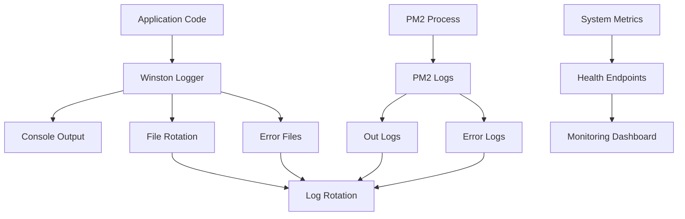

# Logging and Monitoring

Comprehensive guide to logging, monitoring, and observability in NLC-CMS for production environments.

## Overview

NLC-CMS implements a **multi-layered logging and monitoring strategy**:
- **Application Logging**: Winston-based structured logging
- **Process Monitoring**: PM2 process management and monitoring
- **Performance Monitoring**: Built-in performance metrics
- **Health Checks**: Automated system health monitoring
- **Error Tracking**: Comprehensive error logging and alerting

## Logging Architecture

### Logging Stack


### Winston Logger Configuration

#### Logger Setup (`server/utils/logger.js`)
```javascript
import winston from 'winston';
import DailyRotateFile from 'winston-daily-rotate-file';
import path from 'path';

const logDir = path.join(process.cwd(), 'logs', process.env.NODE_ENV || 'development');

// Custom log format
const logFormat = winston.format.combine(
  winston.format.timestamp({
    format: 'YYYY-MM-DD HH:mm:ss'
  }),
  winston.format.errors({ stack: true }),
  winston.format.json(),
  winston.format.printf(({ timestamp, level, message, ...meta }) => {
    return JSON.stringify({
      timestamp,
      level,
      message,
      ...meta
    });
  })
);

// Create logger instance
const logger = winston.createLogger({
  level: process.env.LOG_LEVEL || 'info',
  format: logFormat,
  defaultMeta: {
    service: 'nlc-cms',
    environment: process.env.NODE_ENV,
    version: process.env.npm_package_version
  },
  transports: [
    // Console logging for development
    new winston.transports.Console({
      format: winston.format.combine(
        winston.format.colorize(),
        winston.format.simple()
      ),
      silent: process.env.NODE_ENV === 'test'
    }),
    
    // Application logs
    new DailyRotateFile({
      filename: path.join(logDir, 'application-%DATE%.log'),
      datePattern: 'YYYY-MM-DD',
      maxSize: '20m',
      maxFiles: '14d',
      level: 'info'
    }),
    
    // Error logs
    new DailyRotateFile({
      filename: path.join(logDir, 'error-%DATE%.log'),
      datePattern: 'YYYY-MM-DD',
      maxSize: '20m',
      maxFiles: '30d',
      level: 'error'
    }),
    
    // Debug logs (development only)
    ...(process.env.NODE_ENV === 'development' ? [
      new DailyRotateFile({
        filename: path.join(logDir, 'debug-%DATE%.log'),
        datePattern: 'YYYY-MM-DD',
        maxSize: '50m',
        maxFiles: '7d',
        level: 'debug'
      })
    ] : [])
  ],
  
  // Handle uncaught exceptions
  exceptionHandlers: [
    new DailyRotateFile({
      filename: path.join(logDir, 'exceptions-%DATE%.log'),
      datePattern: 'YYYY-MM-DD',
      maxSize: '20m',
      maxFiles: '30d'
    })
  ],
  
  // Handle unhandled promise rejections
  rejectionHandlers: [
    new DailyRotateFile({
      filename: path.join(logDir, 'rejections-%DATE%.log'),
      datePattern: 'YYYY-MM-DD',
      maxSize: '20m',
      maxFiles: '30d'
    })
  ]
});

// Custom logging methods
logger.request = (req, res, duration) => {
  logger.info('HTTP Request', {
    method: req.method,
    url: req.originalUrl,
    statusCode: res.statusCode,
    duration: `${duration}ms`,
    userAgent: req.get('User-Agent'),
    ip: req.ip,
    userId: req.user?.id
  });
};

logger.database = (query, duration, error = null) => {
  if (error) {
    logger.error('Database Error', {
      query: query.substring(0, 200),
      duration: `${duration}ms`,
      error: error.message,
      stack: error.stack
    });
  } else {
    logger.debug('Database Query', {
      query: query.substring(0, 200),
      duration: `${duration}ms`
    });
  }
};

logger.security = (event, details) => {
  logger.warn('Security Event', {
    event,
    ...details,
    timestamp: new Date().toISOString()
  });
};

export default logger;
```

### Request Logging Middleware

#### Request Logger (`server/middleware/requestLogger.js`)
```javascript
import logger from '../utils/logger.js';

export const requestLogger = (req, res, next) => {
  const start = Date.now();
  
  // Log request start
  logger.debug('Request Started', {
    method: req.method,
    url: req.originalUrl,
    ip: req.ip,
    userAgent: req.get('User-Agent'),
    userId: req.user?.id
  });
  
  // Override res.end to capture response
  const originalEnd = res.end;
  res.end = function(chunk, encoding) {
    const duration = Date.now() - start;
    
    // Log request completion
    logger.request(req, res, duration);
    
    // Log slow requests
    if (duration > 1000) {
      logger.warn('Slow Request', {
        method: req.method,
        url: req.originalUrl,
        duration: `${duration}ms`,
        statusCode: res.statusCode
      });
    }
    
    // Call original end method
    originalEnd.call(this, chunk, encoding);
  };
  
  next();
};
```

## Log Levels and Usage

### Log Level Hierarchy
```
ERROR   - System errors, exceptions, critical failures
WARN    - Warning conditions, security events, slow operations
INFO    - General information, request logs, business events
HTTP    - HTTP request/response logs
VERBOSE - Detailed operational information
DEBUG   - Debug information, database queries
SILLY   - Very detailed debug information
```

### Logging Best Practices

#### Application Logging Examples
```javascript
// Error logging
try {
  await processComplaint(complaintData);
} catch (error) {
  logger.error('Complaint Processing Failed', {
    complaintId: complaintData.id,
    userId: req.user.id,
    error: error.message,
    stack: error.stack
  });
  throw error;
}

// Info logging
logger.info('User Login Successful', {
  userId: user.id,
  email: user.email,
  role: user.role,
  ip: req.ip
});

// Warning logging
if (uploadSize > MAX_FILE_SIZE) {
  logger.warn('Large File Upload Attempt', {
    userId: req.user.id,
    fileName: file.originalname,
    size: uploadSize,
    maxSize: MAX_FILE_SIZE
  });
}

// Debug logging
logger.debug('Database Query Executed', {
  query: 'SELECT * FROM complaints WHERE status = ?',
  params: ['REGISTERED'],
  duration: '45ms'
});

// Security logging
logger.security('Failed Login Attempt', {
  email: req.body.email,
  ip: req.ip,
  userAgent: req.get('User-Agent'),
  attempts: failedAttempts
});
```

## PM2 Process Monitoring

### PM2 Logging Configuration

#### Ecosystem Configuration
```javascript
// ecosystem.prod.config.cjs
const path = require("path");
const logDir = path.join(__dirname, "logs", "prod");

module.exports = {
  apps: [
    {
      name: "NLC-CMS",
      script: "server/server.js",
      instances: 4,
      exec_mode: "cluster",
      
      // Logging configuration
      out_file: path.join(logDir, "api-out.log"),
      error_file: path.join(logDir, "api-error.log"),
      log_file: path.join(logDir, "api-combined.log"),
      merge_logs: true,
      log_date_format: "YYYY-MM-DD HH:mm:ss Z",
      
      // Log rotation
      max_memory_restart: "600M",
      min_uptime: "10s",
      max_restarts: 10,
      
      // Environment
      env: {
        NODE_ENV: "production",
        LOG_LEVEL: "info"
      }
    }
  ]
};
```

### PM2 Monitoring Commands
```bash
# View real-time logs
pm2 logs NLC-CMS

# View logs with specific number of lines
pm2 logs NLC-CMS --lines 100

# View only error logs
pm2 logs NLC-CMS --err

# View only output logs
pm2 logs NLC-CMS --out

# Monitor processes in real-time
pm2 monit

# Show detailed process information
pm2 show NLC-CMS

# Flush all logs
pm2 flush

# Reload logs (useful after log rotation)
pm2 reloadLogs
```

## Log Management

### Log Directory Structure
```
logs/
├── prod/                        # Production logs
│   ├── application-2024-01-01.log
│   ├── error-2024-01-01.log
│   ├── exceptions-2024-01-01.log
│   ├── api-out.log             # PM2 output logs
│   ├── api-error.log           # PM2 error logs
│   └── api-combined.log        # PM2 combined logs
├── qa/                         # QA environment logs
│   └── ...
└── dev/                        # Development logs
    └── ...
```

### Log Rotation Configuration

#### Logrotate Setup
```bash
# Create logrotate configuration
sudo cat > /etc/logrotate.d/nlc-cms << 'EOF'
/opt/nlc-cms/logs/*/*.log {
    daily
    missingok
    rotate 30
    compress
    delaycompress
    notifempty
    create 644 nlc-cms nlc-cms
    postrotate
        pm2 reloadLogs
    endscript
}

# PM2 logs
/opt/nlc-cms/logs/*/api-*.log {
    daily
    missingok
    rotate 14
    compress
    delaycompress
    notifempty
    create 644 nlc-cms nlc-cms
    postrotate
        pm2 reloadLogs
    endscript
}
EOF
```

#### Manual Log Rotation
```bash
# Rotate logs manually
sudo logrotate -f /etc/logrotate.d/nlc-cms

# Test logrotate configuration
sudo logrotate -d /etc/logrotate.d/nlc-cms

# Check logrotate status
sudo cat /var/lib/logrotate/status | grep nlc-cms
```

## Health Monitoring

### Health Check Endpoints

#### Basic Health Check (`/api/health`)
```javascript
// server/routes/healthRoutes.js
app.get('/api/health', (req, res) => {
  res.status(200).json({
    success: true,
    message: 'Server is running',
    data: {
      status: 'healthy',
      timestamp: new Date().toISOString(),
      uptime: process.uptime(),
      version: process.env.npm_package_version,
      environment: process.env.NODE_ENV,
      memory: {
        used: Math.round(process.memoryUsage().heapUsed / 1024 / 1024),
        total: Math.round(process.memoryUsage().heapTotal / 1024 / 1024)
      }
    }
  });
});
```

#### Detailed Health Check (`/api/health/detailed`)
```javascript
app.get('/api/health/detailed', async (req, res) => {
  const healthChecks = {
    database: await checkDatabaseHealth(),
    redis: await checkRedisHealth(),
    email: await checkEmailService(),
    fileSystem: await checkFileSystemHealth(),
    externalAPIs: await checkExternalAPIs()
  };
  
  const overallHealth = Object.values(healthChecks).every(check => check.healthy);
  
  res.status(overallHealth ? 200 : 503).json({
    success: overallHealth,
    message: overallHealth ? 'All systems operational' : 'System issues detected',
    data: {
      overall: { healthy: overallHealth },
      checks: healthChecks,
      server: {
        uptime: process.uptime(),
        memory: process.memoryUsage(),
        cpu: process.cpuUsage(),
        version: process.env.npm_package_version
      }
    }
  });
});
```

### Performance Monitoring

#### Performance Metrics Collection
```javascript
// server/middleware/performanceMonitor.js
import logger from '../utils/logger.js';

const performanceMetrics = {
  requests: 0,
  errors: 0,
  totalResponseTime: 0,
  slowRequests: 0
};

export const performanceMonitor = (req, res, next) => {
  const start = process.hrtime.bigint();
  
  res.on('finish', () => {
    const duration = Number(process.hrtime.bigint() - start) / 1000000; // Convert to ms
    
    performanceMetrics.requests++;
    performanceMetrics.totalResponseTime += duration;
    
    if (res.statusCode >= 400) {
      performanceMetrics.errors++;
    }
    
    if (duration > 1000) {
      performanceMetrics.slowRequests++;
      logger.warn('Slow Request Detected', {
        method: req.method,
        url: req.originalUrl,
        duration: `${duration.toFixed(2)}ms`,
        statusCode: res.statusCode
      });
    }
    
    // Log performance metrics every 100 requests
    if (performanceMetrics.requests % 100 === 0) {
      const avgResponseTime = performanceMetrics.totalResponseTime / performanceMetrics.requests;
      const errorRate = (performanceMetrics.errors / performanceMetrics.requests) * 100;
      
      logger.info('Performance Metrics', {
        totalRequests: performanceMetrics.requests,
        averageResponseTime: `${avgResponseTime.toFixed(2)}ms`,
        errorRate: `${errorRate.toFixed(2)}%`,
        slowRequests: performanceMetrics.slowRequests
      });
    }
  });
  
  next();
};

// Endpoint to get current metrics
app.get('/api/metrics', (req, res) => {
  const avgResponseTime = performanceMetrics.totalResponseTime / performanceMetrics.requests;
  const errorRate = (performanceMetrics.errors / performanceMetrics.requests) * 100;
  
  res.json({
    success: true,
    data: {
      requests: performanceMetrics.requests,
      averageResponseTime: avgResponseTime.toFixed(2),
      errorRate: errorRate.toFixed(2),
      slowRequests: performanceMetrics.slowRequests,
      uptime: process.uptime(),
      memory: process.memoryUsage()
    }
  });
});
```

## Error Tracking and Alerting

### Error Categorization
```javascript
// server/utils/errorTracker.js
class ErrorTracker {
  static categories = {
    DATABASE: 'database',
    AUTHENTICATION: 'authentication',
    VALIDATION: 'validation',
    EXTERNAL_API: 'external_api',
    FILE_SYSTEM: 'file_system',
    BUSINESS_LOGIC: 'business_logic'
  };
  
  static track(error, category, context = {}) {
    const errorInfo = {
      category,
      message: error.message,
      stack: error.stack,
      context,
      timestamp: new Date().toISOString(),
      severity: this.getSeverity(error, category)
    };
    
    logger.error('Tracked Error', errorInfo);
    
    // Send alerts for critical errors
    if (errorInfo.severity === 'critical') {
      this.sendAlert(errorInfo);
    }
  }
  
  static getSeverity(error, category) {
    if (category === 'DATABASE' || category === 'AUTHENTICATION') {
      return 'critical';
    }
    if (category === 'EXTERNAL_API' || category === 'FILE_SYSTEM') {
      return 'high';
    }
    return 'medium';
  }
  
  static sendAlert(errorInfo) {
    // Implementation for sending alerts (email, Slack, etc.)
    logger.error('CRITICAL ERROR ALERT', errorInfo);
  }
}

export default ErrorTracker;
```

### Global Error Handler
```javascript
// server/middleware/errorHandler.js
import logger from '../utils/logger.js';
import ErrorTracker from '../utils/errorTracker.js';

export const errorHandler = (err, req, res, next) => {
  // Log the error
  logger.error('Unhandled Error', {
    error: err.message,
    stack: err.stack,
    url: req.originalUrl,
    method: req.method,
    userId: req.user?.id,
    ip: req.ip
  });
  
  // Track error for monitoring
  ErrorTracker.track(err, 'BUSINESS_LOGIC', {
    url: req.originalUrl,
    method: req.method,
    userId: req.user?.id
  });
  
  // Send appropriate response
  const statusCode = err.statusCode || 500;
  const message = process.env.NODE_ENV === 'production' 
    ? 'Internal server error' 
    : err.message;
  
  res.status(statusCode).json({
    success: false,
    message,
    ...(process.env.NODE_ENV === 'development' && { stack: err.stack })
  });
};
```

## Log Analysis and Monitoring

### Log Analysis Tools

#### Log Search and Analysis
```bash
# Search for specific errors
grep -r "ERROR" logs/prod/ | tail -20

# Find slow requests
grep -r "Slow Request" logs/prod/ | wc -l

# Analyze error patterns
awk '/ERROR/ {print $3}' logs/prod/application-*.log | sort | uniq -c | sort -nr

# Monitor real-time logs
tail -f logs/prod/application-$(date +%Y-%m-%d).log | grep ERROR

# Search for specific user activity
grep "userId.*user123" logs/prod/application-*.log
```

#### Log Monitoring Script
```bash
#!/bin/bash
# scripts/monitor-logs.sh

LOG_DIR="logs/prod"
ALERT_EMAIL="admin@nlc-cms.gov.in"

# Check for critical errors in last 5 minutes
CRITICAL_ERRORS=$(find $LOG_DIR -name "*.log" -mmin -5 -exec grep -l "CRITICAL\|FATAL" {} \;)

if [ ! -z "$CRITICAL_ERRORS" ]; then
    echo "Critical errors detected in: $CRITICAL_ERRORS" | mail -s "NLC-CMS Critical Alert" $ALERT_EMAIL
fi

# Check for high error rate
ERROR_COUNT=$(find $LOG_DIR -name "*.log" -mmin -5 -exec grep -c "ERROR" {} \; | awk '{sum+=$1} END {print sum}')

if [ "$ERROR_COUNT" -gt 10 ]; then
    echo "High error rate detected: $ERROR_COUNT errors in last 5 minutes" | mail -s "NLC-CMS Error Rate Alert" $ALERT_EMAIL
fi

# Check disk space for logs
LOG_USAGE=$(du -sh $LOG_DIR | cut -f1)
echo "Current log directory usage: $LOG_USAGE"
```

### Monitoring Dashboard

#### Simple Monitoring Script
```javascript
// scripts/monitoring-dashboard.js
import fs from 'fs';
import path from 'path';

class MonitoringDashboard {
  static async generateReport() {
    const logDir = 'logs/prod';
    const today = new Date().toISOString().split('T')[0];
    
    const stats = {
      errors: await this.countLogEntries(logDir, 'ERROR'),
      warnings: await this.countLogEntries(logDir, 'WARN'),
      requests: await this.countLogEntries(logDir, 'HTTP Request'),
      slowRequests: await this.countLogEntries(logDir, 'Slow Request'),
      uptime: process.uptime(),
      memory: process.memoryUsage()
    };
    
    console.log('=== NLC-CMS Monitoring Report ===');
    console.log(`Date: ${today}`);
    console.log(`Errors: ${stats.errors}`);
    console.log(`Warnings: ${stats.warnings}`);
    console.log(`Total Requests: ${stats.requests}`);
    console.log(`Slow Requests: ${stats.slowRequests}`);
    console.log(`Uptime: ${Math.floor(stats.uptime / 3600)}h ${Math.floor((stats.uptime % 3600) / 60)}m`);
    console.log(`Memory Usage: ${Math.round(stats.memory.heapUsed / 1024 / 1024)}MB`);
    
    return stats;
  }
  
  static async countLogEntries(logDir, pattern) {
    // Implementation to count log entries
    // This is a simplified version
    return 0;
  }
}

// Run monitoring report
MonitoringDashboard.generateReport();
```

## Production Monitoring Setup

### System Monitoring
```bash
# Set up system monitoring
# 1. Install monitoring tools
sudo apt install htop iotop nethogs

# 2. Create monitoring cron jobs
crontab -e
# Add these lines:
# */5 * * * * /opt/nlc-cms/scripts/monitor-logs.sh
# 0 */6 * * * /opt/nlc-cms/scripts/cleanup-old-logs.sh
# 0 0 * * * /opt/nlc-cms/scripts/daily-report.sh

# 3. Set up log rotation
sudo cp /opt/nlc-cms/config/logrotate.conf /etc/logrotate.d/nlc-cms
```

### Alerting Configuration
```bash
# Email alerts for critical issues
# Install mailutils
sudo apt install mailutils

# Configure email alerts in monitoring scripts
ALERT_EMAIL="admin@nlc-cms.gov.in"
CRITICAL_THRESHOLD=5
ERROR_RATE_THRESHOLD=10
```

## Best Practices

### Logging Best Practices
1. **Structured Logging**: Use JSON format for easy parsing
2. **Appropriate Log Levels**: Use correct log levels for different events
3. **Sensitive Data**: Never log passwords, tokens, or personal data
4. **Performance**: Avoid excessive logging in production
5. **Context**: Include relevant context (user ID, request ID, etc.)

### Monitoring Best Practices
1. **Proactive Monitoring**: Monitor trends, not just current state
2. **Alerting**: Set up alerts for critical issues
3. **Regular Reviews**: Review logs and metrics regularly
4. **Automation**: Automate monitoring and alerting where possible
5. **Documentation**: Document monitoring procedures and thresholds

### Security Considerations
1. **Log Access**: Restrict access to log files
2. **Log Integrity**: Protect logs from tampering
3. **Retention**: Follow data retention policies
4. **Compliance**: Ensure logging meets compliance requirements
5. **Privacy**: Respect user privacy in logging

---

**Next**: [Security and Authentication](SECURITY_AND_AUTHENTICATION.md) | **Previous**: [Build Structure](BUILD_STRUCTURE.md) | **Up**: [Documentation Home](../README.md)